# 컴퓨터 시스템 ( 1주차 1차시 )

학습내용

1. 컴퓨터시스템의 구성을 설명할 수 있다.
2. 중앙처리장치를 설명할 수 있다. ( 명령어 세트, 명령어 처리 과정, CPU 구조, registor 종류 실행,, )
3. 기억 장치를 설명할 수 있다. 
4. 입출력 장치를 설명할 수 있다.
5. 컴퓨터시스템의 성능 향상 기법을 설명할 수 있다.(3가지)

## 📌컴퓨터 시스템의 구성

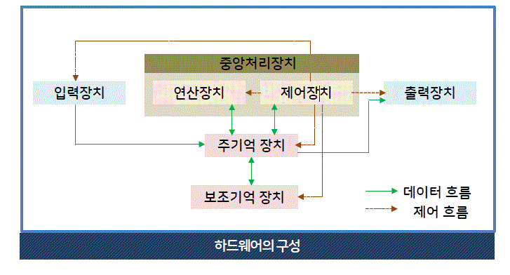

### 1. 하드웨어

- 하드웨어의 구성  

  - 중앙 처리장치, 입출력 장치, 저장 장치로 구성

- 중앙처리장치  

  - 연산 장치, 제어 장치, 레지스터로 구성  
  - 주기억 장치로부터 데이터를 읽어온 뒤 처리

- 기억 장치(저장 장치)

  - 주기억장치 : RAM, ROM  
  - 보조 기억장치 : 하드디스크, usb 메모리 등

- 시스템 버스
  - 하드웨어 구성 요소를 물리적으로 연결하며, 구성 요소들 사이의 통로를 제공한다.

  - 주소버스 (mapping)

    - cpu가 maim memory나 I/O 장치에 주소를 전달하는 통로  
    - 주소 선의 수는 시스템의 기억장치 용량을 나타냄  
    ❕ 아마도 기억장치는 64bit, 32bit cpu를 뜻하는 듯 하다.  

    - 주소선의 수 = 8bit 256(=2^8)개 16bit 65,536(=2^16)개
    - 전송유형: 단방향

  - 데이터버스 (data)

    - cpu가 기억장치와 I/O 등 사이에서 데이터를 전달하는 통로
    - 전송유형: 양방향

  - 제어버스  (controll)

    - cpu가 다양한 시스템 모듈에 제어신호를 전달하는 통로
    - 전송유형: 양방향

### 2. 소프트웨어

 - 시스템 소프트웨어  

    - 컴퓨터 시스템의 효율적인 운영, 제어를 담당
```
os
언어 번역 프로그램(compiler, inerpreter etc)
유틸리티 (video player, file management, vacine ,,) 
라이브러리 프로그램 ( 비휘발성자료로
소프트웨어 개발에 쓰이는 자원, 작성된 코드,클래스 값 자료형, 펌웨어 등)
```
 - 응용 소프트웨어  

    - 응용 분야의 업무를 처리하기 위해 사용됨

```
문서 작성 프로그램
자료관리 프로그램
그래픽 프로그램
통신 프로그램
게임 프로그램
교육용 프로그램 등..
```
---
### 요약  
컴퓨터 하드웨어는 중앙 처리 장치, 저장장치, 입출력 장치 등으로 구성  
컴퓨터 소프트웨어는 펌웨어, 운영체계(시스템 소프트웨어), 응용 소프트웨어로 구성

## 📌중앙처리장치(CPU)

🏳🏳 이 부분은 수업 자료를 참고해야 함, 양이 많고 어려움 🏳🏳

### 1. 중앙처리장치의 구성

- 중앙처리장치  

  - 주기억장치로부터 받은 명령어, 데이터를 처리하고  
수행 순서를 제어함(LIFO,FIFO,동기화 등 OS 수업자료 참고)

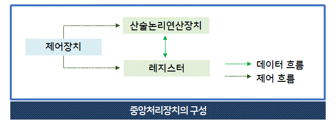

- 레지스터 | 특수 목적 레지스터의 용도와 기능

-  - 주소 저장 레지스터

```js
- MAR (Memory Address Register, 메모리 주소 레지스터)
  읽기와 쓰기 연산을 수행할 주기억 장치의 주소 저장

- PC (Program Counter, 프로그램 카운터)
  다음에 수행할 명령어의 주소 저장

- SP (Stack Pointer, 스택 포인터)
  스택의 최상위 주소 저장(FIFO,피포!)

- IX (Index Register, 인덱스 레지스터)
  인덱스 주소지정 방식에서 인덱스 저장(class 같은 거임)
```

-  - 명령어 저장 레지스터

```js
- IR   (Instruction Register, 명령어 레지스터)
    현제 실행중인 명령어 저장
```

-  - 데이터 저장 레지스터

```js
- MBR (Memory Buffer Registor, 메모리 버퍼 레지스터)
    주기억 장치에서 읽어오거나 보낼 데이터를 임시 저장

- AC (Accumulator, 누산기)
    연산 결과 임시 저장
```

-  - CPU 상태 저장 레지스터


```js
PSR (Program Statue Registor, 프로그램 상태 레지스터)
    cpu의 현재 상태 정보 저장
```

### 2. 명령어 처리 과정(Instruction)

- 명령어 사이클
```go

     ➡️    인출    ↘️   
인터럽트      ↕️       간접
     ↖️    실행    ⬅️ 

```

인출, 실행 사이클 = 항상 수행
간접, 인터럽트 사이클 = 주소지정 방식, 인터럽트 요구에따라 수행

- 인출 사이클

    - 주기억 장치에서 명령어 인출
    - 다음 명령어 인출하기 위해 PC값 증가

```js
1   PC 저장된 명령어 주소 -> MAR 전달
2-1 MAR에 저장된 명령어 주소로 main memory에서 명령어 인출
2-2 MBR에 저장
3   제어 장치에서 PC값 증가시킴(다음 명령어 인출 하기 위해)
4   MBR에 저장된 명령어를 IR로 전달
```
- 실행 사이클

    - 안출한 명령어 해독 (IR)
    - 해독 경과에 따라 제어 신호 발생시켜 명령어 실행

- 간접 사이클

    - 직접 주소방식

      - 명령어의 주소 필드가 주기억 장치의 유효한 주소를 가르킴

    - 간접 주소방식

      - 명령어의 주소 필드가 주가억 장치의 주소를 가르킴  
그리고 주기억 장치의 주소가 데이터 주소를 가르킴

> 명령어의 주소 필드 구성은 다음장에 있음!

- 인터럽트 사이클

  - 인터럽트란?

cpu가 프로그램을 수행하는 동안 컴퓨터 시스템의 내부 외부에 발생하는 사건을 말함

```
         | 인출사이클 | 실행 사이클 |        인터럽트 사이클       |    
시작    -> 명령어 인출 -> 명령어 실행 -> 인터럽트 발생 -> 예    -> 인터럽트 처리 -> 다시시작
시작    -> 명령어 인출 -> 명령어 실행 -> 인터럽트 발생 -> 아니오 -> 다시시작
       
```

### 3. 명령어의 형식

- 명령어의 형식

  ` 연산코드(Operation code) + 주소필드(Operand)`

- 명령어 기능

  - 연산코드

    - 연산 기능     :  사칙연산, 시프트, 보수, 논리 연산(and,or,not)
    - 데이터 전달기능 : 레지스터 -> 레지스터, 레지스터 -> 주기억 장치
    - 제어 기능     : 조건 분기, 무조건 분기 명령어로 실행순서 제어
    - 입출력 기능    : 연산결과 -> 출력장치, 데이터 -> 주기억 장치

  - 주소필드

    - 기억장치의 주소, 숫자, 문자, 논리 데이터 등 저장

### 3. 명령어 집합 (instruction set arichitectire,명령어 세트)

- 주소 필드 수에 따른 명령어 분류
- 기계어에 가까움 011011 이런것들이 들어있는 캡슐을 cpu가 더하고 뺴고 하는 거임

  - 0 주소 명령어 = 연산코드
  - 1 주소 명령어 = 연산코드 + 주소1
  - 2 주소 명령어 = 연산코드 + 주소1 + 주소2 
  - 3 주소 명령어 = 연산코드 + 주소1 + 주소2 + 주소 3

- **주소 필드 수에 따른 명령어 분류 | 0 주소 명령어**

  - 연산 코드만 존재며, stack 구조 컴푸터에서 사용, FIFO

ex) x = a + b
```
1. Push a  // 스택의 TOP mapping[a]
2. Push b  // 그 위에 mapping[b]
3. add a+b // 스택의 Top a+b
4. Stroe X // 스택의 Top mapping[x]
```
- **주소 필드 수에 따른 명령어 분류 | 1 주소 명령어**

  - 단일 누산기 라고 부름

`AC --연산수행--> 데이터 연산(주기억장치, 누산기 데이터) --결과저장--> AC`

ex) x = a + b

```
1. Load a   // AC <- mapping[a]   a의 위치를 ac로 보냄
2. Add b    // AC <- + mapping[b] B의 위치를 ac로 보냄
3. Store x  // mapping[x] <- AC 누산 결과를 mapping함
```
- **주소 필드 수에 따른 명령어 분류 | 2 주소 명령어**

  - 2개의 주소필드를 가지는 가장 일반적 형태

ex) x = a + b
```
MOV R1, a // R1 <- mapping[a]
Add R1, b // R1 <- R1 + mapping[b]
MOV x, R1 // mapping[x] <- R1
```
MOV R0,R1은 어셈블리어에서 R0,R1위치로의 이동을 뜻한다고 함

- **주소 필드 수에 따른 명령어 분류 | 3 주소 명령어**

  - 3개의 주소 필드, 주소필드에 레지스터 번호, 주기억장치의 주소를 지정함

ex) x = a + b

`1. Add x, a, b // mapping[x] <- mapping[a] + mapping[b]`

---
### 요약  
주기억 장치로부터 프로그램 명령어와 데이터를 읽어와
처리하고 명령어의 수행 순서를 제어

## 기억 장치

### 1. 기억 장치의 계층 구조

- 속도, 가격이 오르면 용령이 줄어듬

보조기억장치 -> 주기억장치 -> 캐시 메모리 -> 레지스터(Fastist)

✨ 기억 장치의 정보의 흐름 

```
Register -> Cash Memory -> Main Memory -> sub Memory
Register ----------------> Main Memory -> sub Memory
```

### 2. 주기억 장치

맨날하는 기억장치 파트!

- RAM(Random Access Momory)

  - 전원공급 중단시 정보가 지워짐!
  - 저장위치 상관없이, 일정한 시간 내에 읽고 쓸 수 있다.(주소 지정을 말하는 듯)

  - DRAM(Dynamic) : 트랜지스터

    - Positive: 저렴, 전력 소비 적음, 동속 빠름, 집적도 높음
    - Nagetive: 시간 지나면 방전
    - Feature : 대용량 매모리

  - SRAM(Static) : 플립프롭 기억소자

    - Positive: 주기적 재중전 필요 없음
    - Nagetive: 복잡한 회로, 전력소모 큼
    - Feature : 캐시 메모리

- ROM(Read Only Memory)

  - ROM, PROM(Programable, 한번만 쓸 수 있음), EPROM(Erasable), EEPROM(Electronic Erasable)이 있음
  - Positive : 전원공굽x 영구적 보존,
  - Feauter : 프로그램, 데이터 저장에 쓰임(부팅할떄, 라이브러리 시스템,,,)

- Flash Momory

  - 비휘발성 메모리, 전력소모 적음
  - usb type, sd card,

### 3. 캐시 메모리

- CPU와 Main Memory의 속도 차이로 인한 성능 저하를 막아줌
- 캐시 적중률(H) = 캐시 적중 횟수/ 전체 기억 장치 참조 횟수
- 유효 접근시간 = (H x 캐시메모리 접근시간) + ((1-H) x (캐시 메모리 접근시간 + 기억장치 접근 시간)
- unit = ns

```
메모리 접근시간이 20ns, 주기억장치 접근시간 100ns, 캐시 적중률 95%, 유효 접근시간은? 

유효 접근시간 = (0.95 x 20) + (0.05 x 120) = 25ns
```

---
요약  
접근 속도, 기억 용량의 크기, 용도에 따라 레지스터, 캐시
메모리, 주기억 장치, 보조 기억 장치로 구분


### 4. 보조 기억 장치

- 프로그램, 데이터를 반영구적 저장, 대용량
- 순차 접근 기억장치와 직접 접근으로 나뉨

  - 순차 접근 기억 장치 => 자기 테이프, 레코더
  - 직접 접근 기억 장치 => 자기 디스크, 광 디스크, 하드 디스크

❗️️️️️️️️️️️️❗️ 이 부분이 시험에 나올지 모르겠지만 진짜 쓸모 없는 거 같아서 안적음 ㅋㅋㅋ
대충 순차접근 -> 0,1 직접접근 광 레이저, 디스크 트렉 섹터 플랙터 이런 거임 이제 안 씀

## 입출력 장치

### 1. 입력 장치

- 카보드

- 마우스

- 터치스크린

- 스캐너

### 2. 출력 장치

- 모니터

  - LCD
  - OLED

- 프린터

- 플로터

  - 대형 출력 장치

- 햅틱 인터페이스

  - 촉감 감지 조이스틱

---
### 요약  
입력 장치 중 대표적인 장치로 마우스는 화면 위의 특정  
위치를 지정하거나 선택하기 위해 사용하며 조이스틱,  
스캐너 등도 사용됨  
출력 장치 중 대표적인 모니터는 컴퓨터에서 처리된 정보를  
화면으로 출력하는 장치로, CRT, PDP, LCD, OLED 등이 있음


## 컴퓨터 시스템 성능 향상 기법

### 1. CPU의 구조 변화

- RISC (Reduve Instruction Set Computer, 축소 명령어 세트 컴퓨터)

- CISC (Complex Instruction Set Computer, 복잡한 명령어 세트 컴퓨터)

  - 많은 프로세서가 CISC를 모데로 구축 되어 있어서 바꾸기엔 비용문제가 있음
  - 일부 파이프 라인을 사용함으로, 직접도 높이고 보완성을 올림, 호환성이 좋음

|특징|CISC|RISC|
|:--:|:--|:--|
|명령어 세트의 크기|명령어 수 많음|레지스터 기반의 명령어, 수가 적음|
|명령어 형식|가변 형식(명령어당 16~64bit)|고정 형식(32bit)
|주소 지정 모드|복잡함(12~24개)|간단함(3~5개)|
|범용 레지스터 수|적음(8~24개)|많음(32~192개)|
cpu 제어 방식|제어 메모리(ROM)사용|하드 와이어드 방식 사용|

[CISC와 RISC의 구조,특징과 차이점](https://frontalnh.github.io/2018/04/17/%EC%BB%B4%ED%93%A8%ED%84%B0-%EA%B5%AC%EC%A1%B0-risc-%EC%99%80-cisc-%EA%B5%AC%EC%A1%B0/)

### 2. 파이프라인 기법

- 하나의 작업을 다수의 단계로 분할하여 중첩 실행, 컴퓨터 성능 향상을 시킴(비동기 같은 느낌이네)

1. FI (Fetch Instruction, 명령어 인출)
2. DI (Decode Instruction, 명령어 해독)
3. FO (Fetch Operand, 피연산자 인출(주소 인출))
4. EI (Execute Instruction, 명령어 실행)

1-4 단계로 작업 수행 a,b,c,d라는 작업이 동시에 수할 경우

```
task order 
a   1 -> 2 -> 3 -> 4
b     -> 1 -> 2 -> 3 -> 4
c          -> 1 -> 2 -> 3 -> 4
d               -> 1 -> 2 -> 3 -> 4
d
```
### 3. 병렬 처리 시스템

- 병렬 처리 시스템의 특징

  - 처리 능력이 뛰어난 컴퓨터 시스템의 구현 방법으로

    - 고성능 단일 프로세서로 시스템 구성
    - 다수의 프로세서로 많은 **연산 동시 수행**
    - 다수의 프로세서가 동시에 정보를 처리하는 **병렬처리**

- 마이클 플린의 분류법

single instuction stream, multiple instruction stram, single data, multi data

- 단일 명령어 흐름, 단일 데이터 흐름

  - SISD, 하나의 데이터 처리, 폰노이만 구조에 해당

- 단일 명령어 흐름, 다중 데이터 흐름

  - SIMD, 하나 명령어 다수 데이터, 백터 프로세서, 배열 프로세서 시스템에 해당
  - 다중 처리기 시스템을 가짐

- 다중 명령어 흐름, 단일 데이터 흐름

  - MISD 다수의 처리장치가 동일 데이터에 대해 서로 다른 명령어를 실행함
  - 파이프라인 구조, 결함 허용 시스템이 해당

- 다중 명령어 흐름, 다중 데이터 흐름

  - MIMD 서로다른 데이터에 대해 상이한 명령어를 동시 처리함
  - 공유 메모리 시스템, 분산 메모리 시스템

---
### 요약  
RISC, CISC 파이프라인기법, 병렬처리 시스템 등

# 컴퓨터 소프트웨어 (1주차 2차시)

🥕🥕🥕🥕

컴퓨터 소프트웨어에 대해 설명할 수 있다.  ( 종류, 라이센스)
시스템 소프트웨어에 대해 설명할 수 있다. ( os, os 종류, os사용 언어, translators, os 관리(process management 등,, ), os interface,)   
응용 소프트웨어에 대해 설명할 수 있다.   (배포방식 )

## 소프트웨어란?

### 1. 컴퓨터 프로그램

- 소프트웨어
 
  - 컴퓨터 관련 장치를 동작 시키는데 사용되는 여러 종류의 프로그램

- 펌웨어 (Firmware)

  - ROM에 기록되어 변경할 필요없이 하드웨어처럼 사용하능 한 것
  - BIOS(Basic Input Output System) -> 휴대폰이나 lot에서도 찾아볼 수 있음
  - 윈도우 파일 손상시 펌웨어가 작동해서 파일을 찾을 수 없다고 알려줌
  - 한 번 저장되면 변경이 불가능하기 떄문에 하드웨어와 같은 특성을 지니지만, 물리적인 특성이 없기에 하드웨어는 아님

- 소프트웨어의 분류

  - System Software
  
    - 사용자를 보조, 기본적 운영을 담당
    - Language Transfiler , OS, Utility, File Management
    
  - Application software 
   
    - 작업 수행, 문제 해결
    - Education, Game, Graphic, Medical program
 
- 명령문과 프로그램
  
  - 명령문 : 컴퓨터의 처리 절차
  - 프로그램 : 컴퓨터가 이해하고 처리할 수 있는 언어
 
 ### 2. 컴퓨터 소프트웨어
 
  - 컴퓨터에서 사용하는 소프트웨어
    - 시스템 소프트웨어, 응용 소프트웨어가 모두 포함되는 개념인 듯 함
    
  - 개인용 소프트웨어
  
    - 대부분의 소프트웨어 해당, 개별적 업무 처리
    - excel, word 등
    
  - 그룹웨어(Groupware)
  
    - 스케줄관리, 문서 상호 공유, 그룹간 통신 작업을 지원하는 응용 소프트웨어
    
  - 미들웨어(Middleware)
  
    - 매개역할 연결을 도와줌
    - 서로다른 기종간의 서버, 클라이언트를 연결해주는 소프트웨어
    - 기업내 다양한 하드웨어, 네트워크 프로토콜, 응용프로그램, 근거리 통신망환경, 운영체제 호환 소프트웨어 등이 이에 해당
    
### 3. 소프트웨어 사용권 (Softeware License)

- Copyright(저작권)에 의해 보호

 - 종류
 
   - Shareware, Freeware, Liteware
   - Postcardware, Expireware
   - Public Domain Software, Demo-Version 
 
 - 셰어웨어
 
   - 구매 전 일정기간 사용후 마음에 들면 돈을 내고 사용자 등록
   - 정품과 같은 사용환경을 일정 기간 제공하는 프로그램
 
- 프리웨어

  - 저작권은 있으나 사용료를 지불하지 않아도 되는 프로그램
  - 무단 수정, 상업용도로 사용이 금지됨

- 라이트웨어

  - 몇 가지 해김 기능을 제거한 채 무료로 배포되는 소프트웨어, 일종의 견본
  - V3 Lite 가 유명함

- 포스트카드웨어

  - 우편엽서 한 장 보내면 쓸수있는 무료로 프리웨어
  - 자신의 소프트웨어가 사용되고 있다는 마케팅용

- 공개 소프트웨어 (Public Domain Software), Open Source

  - 저자가 권한을 포기한 소프트웨어, 저작권을 주장할 수 없음
  - 최근 Open Source (MIT Richard Stallman에 의한)운동으로 전환
  - Linus B. Torvalds가 만든 Linux Kernel, Apache Web Server가 이에 해당 됨

- 데모 버전

  - 정품 판매 촉진을 위한 맛보기 버전, 꼭 필요한 기능에 제약을 둠

- 베타버전

  - 정식 공개 전 테스트를 위해 한정된 사람에게 공개하는 버전(베타 테스트가 이에 해당)

## 시스템 소프트웨어 ❗️❗️❗️ 자료가 많이 구닥다리임!

### 1. 운영체제(Operation System) 불드체만 외우자
- 시스템 소프트웨어의 구성

```
소프트웨어 -> 시스템 소프트웨어 -> 프로그래밍 언어, 유틸리티, OS, Firmware, 언어 처리기, 장치 드라이버
           -> 응용 소프트웨어  -> 매우 다양 excel, 각종 게임, 그래픽 등 
```

- 목적 

  - 컴퓨터의 하드웨어와 응용 프로그램 간의 인터페이스 역할을 함
  - cpu, main memory, I/O 장치 등 자원 관리를 행함
  - UX, 컴퓨터 성능 향상
  
 - 정의
 
  - 컴퓨터의 운영 관리
  
 - 기능
 
  - 유저, 컴퓨터 간 상호작용
  - 컴퓨터 동작 구동, 실행제어
  - 데이터 파일의 저장 관리
  
- 디스크를 사용하는 컴퓨터에서의 운영체제 (읽어만 두자)

  - 제어 프로그램
    - Supervisor program
    - Data managment prigram
    - Job constrol program
  
  - 처리 프로그램
    - Langauge Translator 
    - Service program
    -  Problem Program
---

- **사용자 인터페이스 제공**
 
 - CLI (Command Line Interface) 
 
   - 키보드로 명령어 입력을 요구함
   - DOS, LINUX, UINX가 대표적 (아닌 것도 있음 우분투처럼)
   
 - MDI (Menu Display Interface?)
 
   - 방향키로 메뉴를 움직여서 명령어 선택
   - 옵션의 목록에서 선택
 
 - GUI (Graphic User Insterface)
   
   - 그래픽으로 표시
   - Click, Darg등 
   - window에서 지원
   
 - 저장 공간의 관리
   - 메인 메모리와 보조 기억장치 감시
   - 데이터, 프로그램의 일부를 메인메모리 하드디스크간 상호 교환, 가상화
 - 파일 관리
   - 파일 탐색 접근 기능
 - 기본 I/O 관리
   - 입출력 장치 제어, 주변 장치에서 제공되거나 이동되는 데이터 호출 
 - 시스템 자원 할당
   - CPU기 시간, 메모리 공간, 파일 기억 장치, 입출력 장치등을 가지고, OS가 이런 자원을 할당하는 역할을 함
   - 여러 알고리즘에 의해 자원을 할당함
   
 - **프로세스 관리**
   - 다중 테스킹(Multi Tasking)
     - 한 사용자가 하나 이상의 프로그램을 동시에 실행 시킬 수 있는 환경
     - cpu가 한 번에 한 프로그램씩 정해진 시간만큼 수행시키도록 함
     - 동시에 실행되는 것 처럼 보일 뿐임
     - 1유저 멀티 프로그램
   - 다중 프로그래밍(Multi Programming)
     - 다수 사용자를 위해 여러 사용자들의 프로그램을 병렬로 실행 시키는 환경
     - 다중 테스킹 처럼 cpu가 일정 시간을 두고 각 사용자의 프로그램을 실행시킴
     - 동시에 실행되는 것 처럼 보일 뿐임
     - 멀티 유저 멀티 프로그램
   - 시분할 (Time-Sharing)
      - 여러 사용자 프로그램을 한 번에 하나씩 돌아가면서 실행
      - 네트워크를 통해 한 대에 컴퓨터에 여러 사용자가 접속시 사용 
      - 라운드 로빈방식, 시분할로 나눠 하나씩 처리하는 거임
   - 다중 처리기(Multi processing)
     - 두 개 이상의 프로그램을 다수의 컴퓨터로 동시에 처리하는 시스템 환경
     - 두 대 이상으 컴퓨터 또는 프로세서가 연결되어 있음
     - Multi core가 이에 해당됨 
     - ex)Intel Core Quad =  cpu안에 연산 과정을 담당하는 칩이 4개 장착 => 4개의 일을 동시 처리
 - 운영체제의 종류
     - MS-DOS(Microsoft-Disk Operation System)
       - Microsoft사 PC초기 OS
       - window 95, 98, 2000의 기반임
     - OS/2
       - 286 컴퓨터를 위한 설계
       - 응용 프로그램이 없어서 외면, GUI
     - Unix
       - AT&T 연구소 켄 톰슨 만듬 -> 데니스 리치가 C언어로 다시 작성
       - 대부분 컴퓨터 이식가능
     - Linux
       - Linus Torvalds가 UNIX를 기반으로 한 open source OS를 만듬
       - PC, work station에서 주로 사용
     - 윈도우 NT
       - 비즈니스 pc용 운영체계
       - 이후 윈도우 2000 프로페셔널 및 서버, 윈도우 Vista, 2003, 2008 서버 제품군의 모체가 됨
     - 윈도우 95
       - 초기 모델 1개 파티션당 2GB까지 인식
     - 윈도우 98
       - AGP그래픽 카스 슬롯 지원
       - 다중모니터 기능, FAT32지원, Plug&Play 강화
     - 윈도우 XP & 7
       - 윈도우 NT 커널을 기반으로 하는 마이크로소프트사 최초 소비자 지향 운영체제
     - 윈도우 7
       - 2009년 출시, Vista, 윈도우 서버 2008의 모체가 됨
     - 윈도우 8
       - 2012년 출시, 스마트폰, 태블릿 PC를 연상시키는 새로운 UI도입
     - 윈도우 10
       - 2015년 출시, 시작메뉴, Edge Browser, 내장 앱, 윈도 스토어, 다중 바탕화면, 알림, 스마트폰 pc통합
       - 음성비서 코타나, x박스원 게임 스트리밍 지원, 컨티뉴엄 기능(컨버터블 피시를 키보드랑 연결시 데스크탑 ui 지원)
       
 ### 2. 프로그래밍 언어
 
 - 정의
   - 의사전달이 가능한 형태의 명령문, 컴퓨터 신호체계로 자료를 처리
 - 의미
   - 알고리즘이나 자료 서술을 위한 표준화된 기호
 ---
 
 - 🖥 Machine Language === Low-Level Language
   - 전자 계산기는 고유의 하드웨어를 가지고 이 구조에 의해 수행되는데 이와 같은 **고유 명령형식을 기계어**라고 함
   - Binary Digit(2진 숫자) 로 구성, 이해하기 어려운 언어
   - 하드웨어에 대한 지식이 요구됨
 - Assembly Language 
   - 기계어에 해당되는 명령을 기호를 이용해 나타낸 **기호 언어**
   - 기본적으로 **기계어와 일대일 대응**
   - 상징어 (symbolic language)라고도 함
   - 시스템 소프트웨어를 작성할 떄 이용됨 (os, labrary system, language counter)
   - 초기에 모두 어셈블리어를 사용
   - 현재 대부분 c언어, 고급언어사용, 처리속도가 중요하거나 고급언어 미지원 기능은 어셈블리어 사용 (전문화)
  - 📱 고급언어
   - 인간위주로 작성된 명령문, 기호로 구성된 프로그래밍 언어
   - 기계에 대한 전문 지식 x, **문제 중심적 언어**(문제 해결 능력)
   - 고급언어는 컴파일러 인터프리터로 기계어 버ㅓㄴ역
  - 고급언어의 종류
   - Fortran
     -  최초 프로그래밍 언어, 과학기술 계산언어
     -  분석, 시뮬레이션에 사용
   - Cobol
     - 사무 처리용 언어 작성, 수정 용이
     -  일부 금융권 메인 프래임 컴퓨터에 사용 
     -  듣기로는 거의 죽었다고 함
   - Pascal
     - ALGOL 후속 언어, 체계적 프로그래밍 지식 슥듭, 안정된 소프트웨어 효율적 프로그램 작성을 위해 개발됨
     - Delphi라는 프로그램 도구에서 파스칼 지원함
   - C language
     - 수식 제어 및 데이터 구조를 마련하고 있는 범용 프로그래밍 언어
     - UNIX 운영체제 중심 언어, 가장 널리 인정받고 사용되는 언어 중 하나
   - BASIC
     - 65년 교육을 위한 대화형 시분할 방식 언어
     - 현 Visual Basic.NET으로 쓰임
   - C++
     - C언어 체계에 객체 지향(OOP, Object Oriented Programming)개념 추가
     - 생산성 좋고, JAVA언어를 태동시키는 역할을 함
     - Visual C++, Borland C++로 쓰인다함
   - LISP
     - 함수형 프로그램이 가능한 언어
     - 인공지능 분야 언어
     - 대표적으로 리차드 스톨만이 만든 EMACS가 있음
   - JAVA
     - 제임스 고슬링, 연구원이 만든 객체 지향적 프로그래밍 언어
     - 95년 출시 무료 제공
     - C++의 메모리 관리 문제 상당부분 해결됨
     - OS, hardware 상관없이 모든 환경 지원되는 독립적 플랫폼
     - .NET, C#의 촉매재 역할
   - .NET & C#
     - net은 마소의 플랫폼, 자바의 독립적 특성을 반영함
     - C#은 닷넷을 직적접 반영, 닷넷에 의존적이고, 문법은 자바와 유사함
   - 스크립트 언어
     - 컴파일 없이 실행, 이해가 쉽고 빠른 작성가능
     - 텍스트 파일이라 수정, 디버깅 용이 이해도 쉬움
     - 상위 응용프로그램이 필요하고 **독립적 실행 불가**
     - Ex) HTML로 작성시 web browser에서만 작동하는 거 ( html은 프로그래밍 언어가 아뉩니다 )
     
     |고급언어|스크립트언어|
     |:-:|:-:|
     |컴파일 과정을 거쳐서 DLL or COM or EXE 형태의 이진 파일로 생성된 상태로 실행|요청이 올 때마다 재실행, 컴파일 후 실행|
   - 스트립트 언어의 종류
     - JavaScript
       - 넷스케이프에서 만듬, 인터프리터형 스크립트 언어
       - 구굴어스가 Ajax로 만들어짐
     - PHP, ASP, JSP
       - 인터넷 보급오로 인터넷 전문 언어 출시
       - 공개 소프트웨어 => PHP
       - 마소 => ASP  
       - JAVA인터넷판 => JSP
       
### 3.언어처리기

- Translator(언어처리기)
  - 프로그랭 언어를 기계어로 번역해 주는 프로그램
- 번역기
  - Compiler
  - Assembler
  - Interpreter
  - Preprocessor
  - Linked editer
  - Loader 등
  
- 번역 방법
  - 번역 기법과 인터프리터 기법
  
  ❓아래 표가 뭐냐면 번역기 설명을 같이 보면 암
  
  |원시언어(source language)|원시 프로그램(source program|목적 언어(object language)|목적 프로그램(object program)
  |:-:|:-:|:-:|:-:|
  |번역기에 입력되는 언어|입력되는 프로그램|출력되는 언어|출력되는 프로그램|

- 번역기 설명 
-  - compiler
     - 고급 언어로 작성한 프로그램이 수행되기 전 컴퓨터가 직접 이해할 수 있는 언어로 바꾸어주는 프로그램
     - Cross-Compiler : 기종에 맞는 기계어로 번역하는 컴파일러 (성능 엄청 좋을 듯)
    
    ```
    원시언어 : C++,
    목적언어 : 어셈블리어, 기계어 일 경우
    이를 번역해 주는 프로그램을 C++ 컴파일러라 함
    ```
-  - Assembler
     - 기호 언어 (Symbolic Language)
     - 어셈블리어로 작성된 프로그램을 원시프로그램으로 하고, 대응되는 2진 프로그램인 기계어로 바꾸어 목적 프로그램을 생성하는 언어 처리기
    ```
    원시언어 : Assembly language
    목적언어 : 기계언어
    대응되는 2진 기계어 프로그램으로 번역함 -> 어셈블러
    ```
-  - Linkage Editor
     - Linker라고도 함
     - 기계어로 된 여러 개의 프로그램을 묶어 **로드 모듈** 이라는 어느정도 실행 가능한 기계어로 번역해주는 번역기
    ```
    원시언어 : 재배치 형태의 기계어들
    목적언어 : 기계어
    링키지 에디터가 어느정도 실행가능하게 만들어 줌
    ```
-  - Loader
     - 로드 모듈로 된 기계어 프로그램을 실제 실행 가능한 하나의 기계어로 번역해 주는 번역기
   ```
   원시언어 : 로드 모듈 기계어
   목적언어 : 기계어
   로드모듈로 실행 가능한 프로그램을 만듬
   ```
-  - preprocessor
     - 고급언어를 고급언어로 번역해주는 번역기
   ```
   원시언어 : 고급언어
   목적언어 : 고급언어
   이미 구현된 방법을 다른 언어로 실행시켜줌
   ```
-  - Interpreter
      - 소프트웨어 시뮬레이션 기법
      - 언어를 입력받으면 바로 실행함( 목적언어가 없음 )
      - 눙률적, 대화식에 적합함
    ```
    원시언어 : 예를들어 JS
    목적언어 : 없음
    바로 실행함
    ```
    
### 4. 장치 드라이버

정의

- OS, app, HW간의 인터페이스를 담당하는 프로그램
- 장치 제어기 or 구동 드라이버라고도 함
- 하드웨어가 운영체제 환경에서 작동하는데 필수요소임

드라이버

- 하드웨어 제조업체에서 제공
- 설치 프로그램이 제공되고, 설치시 인식, 드라이버 설치, Plug&play 가능 제공

기능

✨✨ 장치 드라이버라고 부르는 것들이 의외로 많고 중요한 것들 이였네.. 하드웨어 연결 장치만 장치 드라이버 인줄

- 백업
  - USB, Zip등 복사
- 데이터 복구
  - 삭제 파일 정보 복구
  - 휴지통
- 파일 모음
  - 삭제 추가 활동
  - Fragmentation 발생, 조각모음으로 재구성
- 디스크 복구
- 바이러스 예방
  - v3, 알약 등 유틸리티
- 데이터 압축
  - 알집

## 응용 소프트웨어

### 1. 응용 소프트웨어의 분류

🖥 응용 소프트웨어 활용 분야

 - 응용 소프트 웨어 === 사용자가 요구하는 특정 업무 처리 프로그램
 - 활용분야는 다양함! 사무, 과학, 기업용, 정보, 산업, 교육, 군사 등

응용 소프트웨어 배포 방식

- Bundied software (번들 소프트웨어)
  - 하드웨어와 묶어서 제공,판매
  - 기종별 소프트웨어 개발
  - PC의 os, 그림판, text editor처럼 미리 설치된 것도 번들 소프트웨어
- package software (패키지 소프트웨어)
  - 응용 소프트웨어를 별도 패키지로 파는 거 
  - wordprocessor, spreadsheet, excel, database management program
  - 응용 소프트 웨어 산업이 비즈니스 모델로 유망해짐 (pc 보급)
- 웹 다운로드 소프트웨어
  - 인터넷에서 다운받아서 실행
- SaaS (Software as a service)
  - google flatform처럼 접속량, 사용시간등으로 비용 청구하는 방식
- custom software (맞춤형)
  - 요구에 맞춘 생산 ( 크몽 ㅋㅋ)

### 2. 사용자 프로그램  ❗️❓ 중복 적용되는 소프트웨어 프로그램들이 있음

생산성 소프트웨어

> 작업을 효율적으로 수행하도록 지원하는 소프트웨어
> 워드프로세서, 스프레드시트, 일정관리 프로그램 등 게임 빼고 대부분이 해당될 듯 함

- 문서작성 소프트웨어 
  - 워드, 한글, 전자출판(DTP) 웹 페이지 제작 프로그램
- 수치분석 소프트웨어
  - 스프레드 시트 소프트웨어 : 엑셀, 로터스 1-2-3
  - 통계 소프트웨어 : SAS, SSPS, R
  - 수치해석 , 분석 프로그램 : MATLAB
- 데이터 관리 소프트웨어
  - 데이터 베이스 소프트웨어: Access, Oracle, MySQL
  - 개인 검색엔진 : Goole Desktop Search, MS Desktop Search
  - 웹 제공 검색엔진 : Google, Naver
- 기업 소프트웨어
  - groupware, ERP, 급여, 회계, 의료비 정산 시스템

통신 소프트웨어
  
  - 기본통신 소프트웨어
    - NIC(네트워크 식별자)와 인터넷으로 다른 컴 연결
  - 원격 제어 소프트웨어 
    - ultraVNC, XP 원격 데스크탑, 등
  - 전자 메일 소프트웨어? 원격 제어 소프트웨어? 
    - 메일 주고받는 기능, MS outlook
  - 웹 브라우저 
    - 웹에 접근할 수 있게 도와주는 프로그램
    - firefox, moz, safari, chrome
    - P2P, VoIP, 화상 연결 등 전부 웹을 활용함
    
교육 및 훈련 소프트웨어  
게임 소프트웨어  
가정 및 참조 소프트웨어 
프레젠테이션 소프트웨어 얘들은 생략..

---
🥕요약  

소프트웨어란?

프로그래머에게 하드웨어, 소프트웨어, 그리고 저장 데이터를 제어 관리할 수 있는 편리한 기능을 제공하여  
컴퓨터의 효율적인 기능을 수행하도록 필요한 모든 작업을 수행하는 프로그램의 총칭  
시스템 소프트웨어는 운영체제, 프로그래밍 언어, 언어처리기, 장치 드라이버, 유틸리티 프로그램 등으로 구성됨  

시스템 소프트웨어  

프로그래머에게 하드웨어, 소프트웨어, 그리고 저장 데이터를 제어 관리할 수 있는 편리한 기능을 제공하여   
컴퓨터의 효율적인 기능을 수행하도록 필요한 모든 작업을 수행하는 프로그램의 총칭  
시스템 소프트웨어는 운영체제, 프로그래밍 언어, 언어처리기, 장치 드라이버, 유틸리티 프로그램 등으로 구성됨

응용 소프트웨어  

사용자가 요구하는 특정 업무를 처리하기 위해 작성된 프로그램을 의미함  
활용 분야로 개인 사무용 소프트웨어, 과학 분석용 소프트웨어, 기업용 소프트웨어 정보시스템 분야 등을 들 수 있음  

# 운영체제 ( 2주차 1차시 )

학습목표
```
운영체제가 무엇인지 설명할 수 있다.
운영체제의 기능을 설명할 수 있다.
운영체제의 서비스에 대해 설명할 수 있다.
운영체제의 구조에 대해 설명할 수 있다.􀀁
```

## 운영체제의 개요

### 1. 운영체제의 정의

- 사용자와 하드웨어 사이의 중간 매개체
  - APP 실행 제어
  - 자원 할당 및 관리
  - 입출력 제어, 데이터 관리
- 운영체제의 역할
  - HW 사용자, APP, 시스템 프로그램 사이의 인터페이스 제공
  - 프로세서, 메모리, 입출력 장치, 통신 장치 등 **컴퓨터 자원**을 효과적으로 활용하기위한 **조정 및 관리**
  - 파일 시스템 검사, 서버 작업 등 응용 프로그램 제어
  - 사용자에게서 입출력 제어 및 데이터 관리 (컴퓨터 시스템 보호)

### 2. 운영체제 발전의 목적

- 편리성
  - GUI
 - 효율성
   - 처리능력
   - 응답시간 (turn around time)
   - 신뢰도
   - 사용 가능도 (가동률,runtime)
 - 제어 서비스 향상
   - I/O 동작관리, 시스템 오류 예방 등 컴퓨터 자원을 효율적으로 할당, 관리함
  
### 3. 운영체제 발전과정

- 1960s
  - 다중 프로그래밍
    - 여러 프로그램을 메모리에 나눠 적제, 프로세서를 번갈아가면서 (연산,제어 장치에?)할당함
  - 시분할 시스템
    - 다중 프로그래밍 + 프로세서 스케줄링 이라는 개념을 더함
    - cpu(프로세서) 스케줄링 os강의에 배웠던 ready state -> run state -> wait state, zombi state 등... 
    - 준비상태일 경우 작업을 할당하는 프로세싱 방식
  - 다중 처리 시스템
    - 하나의 시스템에서 프로세서를 여러게 사용하여 처리 능력을 높임
  - 실시간 처리 시스템
    - 즉시 응답
  - 트랜젝션 처리 시스템
    - 트랜젝션 = 정보 교환, 작업에 대한 일련의 처리 단위
    - 사용자와 컴퓨터 시스템이 대화를 하되, 사용자의 요구에 빠르게 응답함
- 1970 ~ 1990s
  - 컴퓨터 네트워크, 온라인 처리방법사용
  - 개인 컴퓨터 보유로 마이크로 프로세서 등장
  - 70년 = CLI,명령어 중심 시스템 사용
  - 80년 = MDI,메뉴 지향 시스템
  - 90년 = GUI
- 2000s 이후
  - Embedded, virtualize, cloud computing
  - mobile OS
  - IoT
  
### 4. 운영체제의 유형

다중 프로그래밍 시스템

- 일괄처리 시스템의 문제점 ( 프로세스가 작업 수행 중 입출력 작업이 불가능 )을 해결하기 위한 시스템 기법
- 프로세서가 수행할 작업을 항상 가지도록 만듬, 거의 동시에 프로세서를 할당 받는 느낌을 받을 수 있음
- 운영체제가 아주 복잡하고, 여러 작업을 동시에 진행하기 위해 메모리 관리가 필요
- 파이프라인 기법과 유사함

시분할 시스템 (TSS, time sharing system)

- 다중 프로그래밍을 논리적으로 확장함, 프로세서가 다중 작업을 교대로 수행 함
- 다중 프로그래밍과 유사하나 프로세스가 정해진 시간 만큼만 사용하고 교대한다는 점이 다름
- 장점 : 빠른 응답, 소프트웨어의 중복 회피, 프로세서 유휴시간 감소
- 단점 : 데이터 무결성(critical section에 동시 진입할 수 있음), 다수가 피일 접근이 가능해서 보안, 신뢰성의 문제가 있음

다중 처리 시스템 (multiprocessing system)

- 단일 컴퓨터 시스템 내에서 둘 이상의 프로세스를 사용함으로 신뢰성, 가용성을 올림
- processor, system bus, clock, memory, peripharals 등 공유

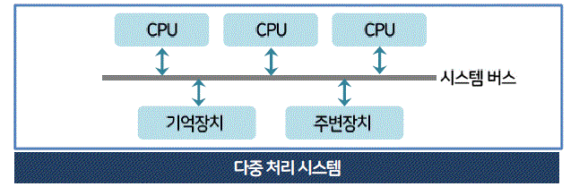

실시간 처리 시스템 (real time processing system)

- 데이터 처리 시스템으로 정의
- 온라인 시스템과 다르게 항상 온라인 상태여야 함
- 적시 응답을 요구, 엄격한 제약, 가벼운 제약 두 가지의 방법이 있음 


분산 처리 시스템 (distributed processing system)

- 시스템마다 독립적인 os, memory로 운영하고 필요시에만 통신하는 시스템
- 최근 컴퓨터 시스템의 대표적인 형태임
- print, file server, db server, web server workstation각기 컴퓨터에서 관리할 때, 필요시 인터넷을통해 데이터를 주거나 받아옴
- 하나의 프로그램을 여러 프로세스에서 실행하게 됨

## 운영체제의 기능

### 1. 자원관리

매인 메모리 관리

- 메인 메모리 : 프로세서가 직접 주소로 지정할 수 있는 유일한 메모리

  - 메모리의 어느 부분을 사용하고, 누가 사용하는지

  - 메모리에 저장할 프로세스를 결정
  - 메모리를 할당하고 회수할 방법을 결정

### 2. 보조 기억 장치 관리

- 메인 메모리의 공간 제약으로 데이터와 프로그램을 계속 저장할 수 없으니까 보조 기억장치를 이요함
  - 빈 공간 관리
  - 할당
  - 메모리 접근 요청 스케줄링
  - 파일 생성,삭제

### 3. 프로세스 관리


- 프로세스
  - **실행 상태의 프로그램**
  - 하나의 프로세스는 프로세서, 메모리, 파일 입출력 장치와 같은 자원으로 구성
  - 자원은 프로세스를 생성할 때 제공하거나, 실행 중에도 할당 가능
- 시스템
  - 프로세스의 집합(실행 상태 프로그램의 집합)
  - 시스템 코드를 수행하는 운영체제 프로세스와, 사용자 코드를 수행하는 사용자 프로세스로 구성
- 프로세스 관리를 위한 운영체제(커널)의 기능
  - 프로세스, 스레드 스케줄링

  - 사용자 프로세스, 시스템 프로세스 생성, 제거
  - 프로세스 중지 실행
  - 프로세스 동기화
  - 프로세스 통신
  - 교착 상태(deadlock)방지를 위한 방법 제공

### 4. 주변 장치(입출력장치)관리

  - 운영체제
    - 장치 드라이버를 사용하여 입출력 장치와 상호작용을 함
  - 장치 드라이버
    - 특정 하드웨어에 종속된 프로그램
### 5. 파일(데이터)관리

  - 입출력 파일의 위치, 저장, 검색관리
  - 물리적 다양한 형태로 저장가
  - os
    - 단일화된 정보 저장 형태 제공실시간 처리 시스템 (real time processing system)

- 데이터 처리 시스템의 정이임
- 온라인 처리 시스템은 신시간이 아니지만, 실시간 처리 시스템은 항상 온라인(실시간 처리가 가능한)상태여야 함
- 프로세서 연산, 데이터 흐름에 엄격한 시간 요구가 있을 때 사용


## 운영체제의 기능

### 01. 자원 관리

자원 = 컴퓨터 시스템의 **메모리, 프로세스, 장치, 파일 등 구성 요소를 말함**

1. 메인 메모리 관리

- 메인 메모리 : 프로세서가 직접 주소로 지정할 수 있는 유일한 메모리
  - 메모리의 어느 부분을 사용하고, 누가 사용하는지
  - 메모리에 저장할 프로세스를 결정
  - 메모리를 할당하고 회수할 방법을 결정
2. 보조 기억 장치 관리
- 메인 메모리의 공간 제약으로 데이터와 프로그램을 계속 저장할 수 없으니까 보조 기억장치를 이요함
  - 빈 공간 관리
  - 할당
  - 메모리 접근 요청 스케줄링
  - 파일 생성,삭제
3. 프로세스 관리
- 프로세스
  - **실행 상태의 프로그램**
  - 하나의 프로세스는 프로세서, 메모리, 파일 입출력 장치와 같은 자원으로 구성
  - 자원은 프로세스를 생성할 때 제공하거나, 실행 중에도 할당 가능
- 시스템
  - 프로세스의 집합(실행 상태 프로그램의 집합)
  - 시스템 코드를 수행하는 운영체제 프로세스와, 사용자 코드를 수행하는 사용자 프로세스로 구성
- 프로세스 관리를 위한 운영체제(커널)의 기능
  - 프로세스, 스레드 스케줄링
  - 사용자 프로세스, 시스템 프로세스 생성, 제거
  - 프로세스 중지 실행
  - 프로세스 동기화
  - 프로세스 통신
  - 교착 상태(deadlock)방지를 위한 방법 제공
4. 주변 장치(입출력장치)관리
  - 운영체제
    - 장치 드라이버를 사용하여 입출력 장치와 상호작용을 함
  - 장치 드라이버
    - 특정 하드웨어에 종속된 프로그램

5. 파일(데이터)관리
  - 입출력 파일의 위치, 저장, 검색관리
  - 물리적 다양한 형태로 저장가능
  - os
    - 단일화된 정보 저장 형태 제공
    - 일반적으로 디렉터리로 구성되어 있음
  - 파일 관리를 위한 운영체제의 기능
    - 파일 생성과 삭제
    - 디렉터리 생성과 삭제
    - **보조 기억 장치에 있는 파일의 매핑**
6. 시스템 보호
  - 컴퓨터 시스템에 의해 정의된 자원에 대해 **프로그램, 프로세스, 사용자 접근을 제어**하는 방법
  - 다른 사용자의 프로그램으로부터 보호되어야 함
  - 여러 프로새스를 동시에 실행할 수 있으므로 상호 보호해야 함
7. 네트워킹(통신)
  - 완전 접속, 부분 접속 방법으로 다른 프로세서들과 연결
  - 경로 설정, 접속 정책. 충돌, 보안 등의 문제를 고려해야 함

### 02. 시스템 관리

명령 해석기 (command interpreter)

- 대화형으로 입력한 명령어를 이해하고 실행하는 사용자와 운영체제의 인터페이스
- 사용자가 입력한 명령은 제어문으로 운영체제에 전달, 명령 해석기가 이 전달을 담당함

## 운영체제의 서비스

### 01. 부팅 서비스

Booting, bootstrapping( 부팅, 부트스트래핑)

- **운영체제를 메인 메모리에 적제하는 과정**
- boot loader or bootstrap loader를 줄인 말로 rom에 저장된 소규모 프로그램

### 02. 사용자 서비스

사용자 인터페이스 제공
- CLI
- MDI
- GUI

프로그램 실행
- 프로긂을 모리에 적재하여 실행
- 정상, 비정상적으로 프로그램 실행을 종료함

입출력 동작 수행
- 사용자 프로그램의 입출력 동장 방법 제공

파일 시스템 조작

- 사용자
  - 파일 열기,저장,삭제등 파일 조작
  - 특정 블록에 파일 할당, 저장
  - 파일 삭제
- os
  - 파일 시스템 조작 서비스 제공

통신(네트워크)

프로세스가 다른 프로세스와 정보를 교환하는 방법

- 공유 메모리를 이용하거나 메시지 전달을 통해 다양한 유형을 프로세스와 통신이 가능하게 지원함

오류탐지

- 시스템 모니터링 오류탐지 기능
  - 메모리 오버플로우
  - 입출력 장치 오류
  - 하드디스크 불량 섹터 문제
  - 부적당한 메모리 접근, 데이터 손상

### 03. 시스템 서비스

의미
- 시스템의 효율적 동작을 보장
- 여러 사용자가 사용하는 시스템에서 **컴퓨터 자원을 공유, 시스템 자체의 효율성을 높임**

자원할당

계정
- 각 사용자가 컴퓨터 자원을 얼마나 많이 사용하는지 파악하기 위해 계정정보 이용

보호와 보안
- 보호
  - 시스템 호출(system call)을 하려고 전달한 모든 매개변수의 타당성을 검사
  - 시스템 자원에 모든 사용자 접근을 제어하도록 보장
- 보안
  - 잘못된 접근 시도에서 외부 입출력 장치 방어, 외부 사용자 인증을 요구하는 것
 
### 04. 시스템 호출( system call )

정의와 역할
- 실행 중인 프로그램과 운영체제 간의 인터페이스로
- API(Application Programming interfaces) 라고도 함
- 사용자 프로그램은 시스템 호출을 통해 운영체제의 기능을 제공 받음
  - 핵심 커널 서비스와의 통신
  - 새로운 프로세스 생성, 실행
  - 하드웨어 관련 서비스

시스템 호출 방법
- 프로그램에서 명령이나 서브루틴의 호출 형태로 호출
- 시스템에서 명령 해석기를 사용해 대화 형태로 호출

운영체제가 제공하는 일반적인 시스템 호출

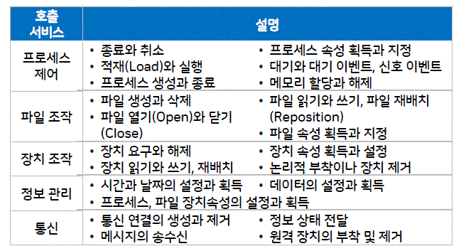

## 운영체제의 구조 

### 01. (단일 구조 운영체제(monolithic structure OS)

- 초기에 생겨난 가장 보편적 형태
- os의 모든 기능을 커널과 동일한 메모리 공간에 적재 후 시스템 호출만으로 사용

특징
- 대부분 긴능 커널에 그룹화해서 구현
- 버그, 오류 구분의 어려움
- 수정 유지 보수 어려움
- 동일 메모리 실행으로 문제 발생시 심각한 영향

### 02. 계층 구조 운영체제 (hierarchical structure OS)

운영체제가 복잡해 지면서 단일 구조만으로 다루기가 어려워 지면서 등장
- 비슷한 기능을 수행하는 요소를 그룹화
- 사용자 프로세스의 요청 수행 시 계층에서 다음 계층으로 데이터를 전달, 추가적 시스템 호출 방생
- 단일 구조보다 성능 우수
- 각 계층이 자신의 하위 계층만 사용할 수 있도록 설계

### 03. 마이크로 커널 운영체제 (micro kernel OS)

- 커널 기능을 대폭 축소
- 커널에 최소 기능만 포함시키고, 기타 기능을 사용자 영역에서 수행되는 서버로 구현
- 하드웨어 초기화, 메모리 관리(주소 공간 관리),프로세스(스레드)관리, 프로세스 간 통신, 프로세스 간 협력 동기화 기능 등 기본 기능만 커널에서 실행
- 대부분의 운영체제 구성 요소는 커널 외부로 옮겨서 구현
- 커널 내부 발생 지역이 적고, 예측이 가능하여 실시간 시스템에서 활용
- 모듈화된 구성 요소 개념을 운영체제에 많이 활용홤

# 프로세스와 스레드 (2주차 2차시)

학습목표
```
프로세스의 개요 및 상태 변화의 과정을 설명할 수 있다.
프로세스의 생성과 종료 등 프로세스 작업에 대해 설명할 수 있다.
스레드의 개념 및 상태 변화의 과정을 설명할 수 있다.
사용자 수준 스레드와 커널 수준 스레드의 장단점을 설명할 수 있다.
```

## 프로세스의 개요와 상태 변화

### 01. 프로세스의 개요

프로세스
- 비동기적 행위
- 실행중인 프로그램
- 실행중인 프로시저
- 절차, 과정
- 운영체제에 들어있는 제어 블록(PCB)
- 프로세서(cpu)에 할당하여 실행할 수 있는 개체 디스패치가 가능한 대상

> 프로세서란?
- 컴퓨터 내에서 프로그램을 수행하는 하드웨어 유닛 (hw 측면)
- 데이터 포멧을 변환하는 역할을 수행하는 데이터 프로세싱 프로그램 (sw 측면)
- 즉 cpu(hw), microprocessor(hw), wordprocessor(sw)를 말함

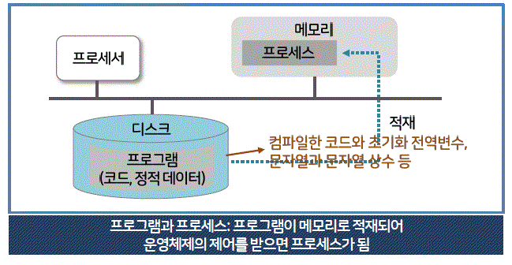

시스템 관점

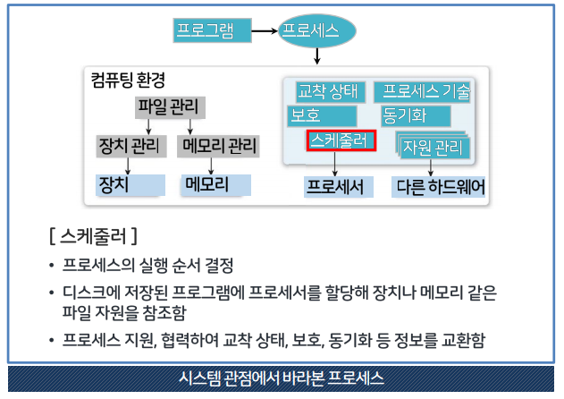


프로세스의 종류
- 역할(호출 서비스)
  - 시스템(커널)프로세스
    - 모든 시스템 메모리와 프로세서의 명령에 액세스할 수 있는 프로세스
    - 프로세스 실행 순서 제어, 보안, 사용자 프로세스를 생성하는 기능 수행
  - 사용자 프로세스
    - 사용자 코드를 수행하는 프로세스
- 병행 프로세스(호출 서비스)
  - 독립 프로세스
    - 다른 프로세스에 영향을 주거나 받지 않고 독립 수행하는 병행 프로세스
  - 협력 프로세스
    - 다른 프로세스에 영향을 주거나 받는 병행 프로세스


### 02. 프로세스 상태 변화와 상태 정보


```
               ->    디스패치    ->
생성 ->   비실행                    실행   -> 종료
               <-     인터럽트    <-
```

프로세스의 상태 변화

- 운영체제가 프로세서 스케줄러를 이용하여 상태 변화를 관리함
1. 작업 스케줄러
- 스풀러가 디스크에 저장한 작업 중 실행할 작업 선정하고 준비 리스트(스케줄러의 준비 큐)에 삽입하여 다중 프로그래밍의 정도를 결정함
- SPOOLER란?
  - SPOOL (Simultaneous Peripheral Operation On-Line)
  - 입출력장치가 CPU와 독릭적으로 작동하는 방식, 입출력 장치와 cpu간의 속도차이 때문에 생기는 대기시간을 줄이고자 고안 됨
2. 프로새스 스케줄러
- 선정한 작업의 상태를 변화시키며 프로세스의 생성에서 종료까지의 과정을 수행함
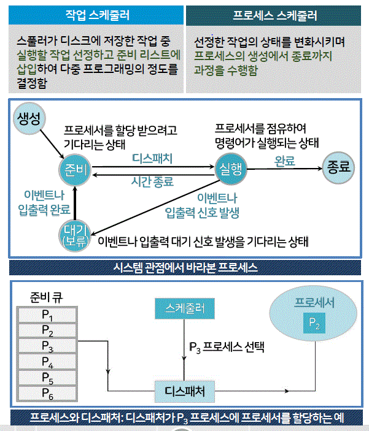

- 프로세스 스스로 하는 것은 대기 뿐이고 나머지는 외부조건으로 발생

상태 변화에 따른 표기법

1. 준비 -> 실행 => Distach(process name)
2. 실행 -> 준비 => Timeout(process name)
3. 실행 -> 대기(보류) => Block(process name)
4. 대기(보류) -> 준비 => wakeup(process name)

프로세스의 상태 정보

- PCB (Process Control Block)
  - PCB는 운영 체제가 프로세스를 표현한 것이라 할 수 있다.
  - 운영체제가 프로세스 스케줄링을 위해 프로세스에 관한 모든 정보를 가지고 있는 데이터베이스를 PCB라 합니다.
  - 특정 프로세스의 정보를 저장하는 데이터 블록이나 레코드
  - 프로세스가 생성되면 메모리에 프로세스 제어 블록이 생성, 종료되면 제어블럭도 삭제됨
 
 PCB (process control block)이 가지고 있는 데이데
```
프로세스 식별자
  - 각 프로세스에 대한 고유 식별자 (숫자, 색인 항목)
프로세스 상태
  - 생성, 준비, 실행, 대기, 중단 등 상태를 표시
프로그램 카운터
  - 프로세스를 실행한 다음 명령의 주소를 표시
레지스터 저장영역
  - 누산기, 인덱스 레지스터, 스택 포인터, 범용 레지스터, 조건 코드 등에 관한 정보
  - 인터럽트가 발생하면 프로그램 카운터와 함께 저장하여 재실행할 때 원래대로 복귀할 수 있게 함
프로세스 스케줄링 정보
  - 프로세스의 우선순위, 스케줄링 큐에 대한 포인터, 기타 스케줄 매개변수 등이 헤당됨
계정 정보
  - 프로세서 사용시간, 실제 사용시간, 사용 상한시간, 계정 번호, 작업이나 프로세스 번호 등
 입출력 상태 정보
  - 특별한 입출력 요구 프로세스에 할당된 입출력장치, 열린 파일 리스트 등
 메모리 관리 정보
  - 운영체제가 사용하는 메모리 시스템에 따른 상한, 하한 레지스터(경계 레지스터), 페이지 테이블이나 세그먼트 테이블 정보 등
 ```
 
프로세스 교환
- 실행중인 프로세스의 제어를 다른 프로세스에 넘겨 해당 프로세스가 실행 상태가 되도록 하는 것
- 쉽게 말해서 cpu가 게임도 하면서 동영상도 봐야하는데, 게임 프로세스를 처리하다가 동영상 프로세스 처리로 넘어가는 과정임

```
1. 게임 프로세스(P1)를 PCB1에 상태 저장
2. PCB2에 저장되어 있는 동영상 프로세스(P2)를 적재 (스케줄러 상에서 적재하는 거임)
3. interrup or systemCall 발생
4. 동영상 포르세스(P2)를 PCB2에 상태 저장
5. 게임 프로세스(P1)을 PCB1에 다시 적재  (스케줄러 상에서 적재하는 거임)
```

## 프로세스의 관리


### 01. 프로세스 구조

- 프로세스는 실행 중에 **프로세스를 생성 시스템을 호출, 새로운 프로세스를 만들 수 있음**
- 생선 순으로 저장, 부모-자식 관계가 유지되고 계층적으로 생성됨

생성하는 프로세스 
- Parent Process
생성되는 프로세스
- Child Process or Sub Process

### 02. 프로세스의 생성, 종료 & 제거

♻️ 프로세스의 생성 시기

- 일괄 처리 환경
  - 작업이 쥰비 큐에 도착할 때 프로세스 생성
- 대화형 환경
  - 새로운 사용자가 로그온(log-on)할 때 프로세스 생성
  - log on = to start using a computer system or program by giving a password 

프로세스의 생성 시 필요한 세부 작업 순서
```
1. 새로운 프로세스에 프로세스 식별자 할당
2. 프로세스의 모든 구성 요소를 포함할 수 있는 주소 공간과 프로세스 제어 블록 공간 할당
3. 프로세스 제어 블록 초기화 (프로세스 상태, 프로그램 카운터 등 초기화)
4. 링크 (해당 큐에 삽입)
```

⌧ 프로세스 종료

- 프로세스가 마지막 명령을 수행, 종료 시 os에 프로세스 삭제 요청
- 일괄 처리 환경
  - 작업 종료 신호로 interrupt, systemcall로 중지 명령 전달
- 대화형 환경
  - log-off하거나 terminal을 닫음
- abort 명령어로 종료 (부모 프로세스만 가능한 방법)

- 부모 프로세스의 자식 프로세스 종료
  - 부모 프로세스 종료시 os가 자동으로 자식 프로세스도 종료시킴(연속 종료)
  - 자식 프로세스가 할당된 자원을 초과하여 상요할 때
  - 자식 프로세스의 작업이 더는 없을 때
- exit : 유닉스에서 프로세스 종료
- wait : 부모 프로세스가 자식 프로세스의 종료를 기다름

> 어떤 경우 프로세스가 종료되는가?
- 정상 종료 : 프로세스가 응용체제의 서비스를 호출한 경우
- 시간 초과 : 프로세스가 명시된 전체시간을 초과하여 살행
- 실패 : 파일 검색 실패, 입출력이 명시된 획수 초과하여 실패
- 오류 : 산술 오류, 보호 오류, 데이터 오류 등
- 메모리 부족, 엑세스 위반 등


⌧ 프로세스 제거

- 프로세스를 파괴함
- 시스템에 사용하던 자원을 반환하고, 프로세스 제어 블록이 회수됨
- 프로그램은 여전히 디스크에 저장되어 있음(작업종료 같은 거 임)
- 부모 프로세스 삭제시 자식 프로세스도 자동 제거(연속 제거)

### 03. 프로세스의 중단과 재시작

프로세스의 중단
- 시스템의 유휴시간 문제를 프로세스 중단(일시 정지) 상태를 이용해 해결 가능
- os는 새로운 프로세스를 생성하여 실행, 실행 중인 프로세스를 중단했다 다시 실행하여 이용 가능

스케줄러에서 실행 -> 대기 가 아니라 실행 -> 중단 상태를 추가하는 경우
- 특정 이벤트의 발생을 기다리면서, 대기 상태가 되어 해당 이벤트가 발생할 때 즉시 실행 상태로 바꿀 수 있음
- 대기 큐에 있는 건 같은데 조건이 추가 됨

다중 프로그래밍에서의 중단
- 자원부족, 엑세스 위반 등 프로세스의 입출력 요구 외의 다른 원인으로 중단한 상태
- 단일 처리 시스템
  - 해당 프로세스가 스스로 중단함
- 다중 처리 시스템
  - 다른 프로세서가 실행 중인 프로세스를 중단함

프로새스의 재시작

- 중단된 프로세스는 다른 프로세서가 재시작하기 전에는 실행 불가
  - 프로세서린 => 하나의 프로세스는 프로세서, 메모리, 파일 입출력 장치와 같은 자원으로 구성

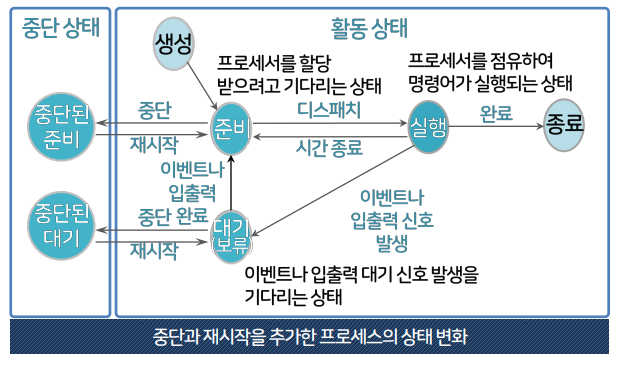

### 04. 프로세스 우선순위

프로세스 스케줄러

- PCB(process control block)의 우선 순위 값을 변경할 수 있음
- PCB 우선순위를 이용하여 준비 라스트의 프로세스를 처리함
- 준비 리스트의 프로세스는 프로세서(cpu) 중심 프로세스(낮은 우선순위)와 입출력(I/O) 중심 프로세스(높은 우선순위)로 구분됨
- 높은 우선순위가 먼저 실행 됨

> 입출력 중심 프로세스 ( 이 부분 읽고 넘기자 잘 이해안됨 )

- 속도가 느리면서 빠른 응답을 요구하는 단말기 입출력 프로세스에 높은 우선순위 부여
  - 시간 할당량을 적게 제공
- 속도가 빠른 디스크 입출력 프로세스에는 낮은 우선순위를 부여
  - 시간 할당량을 많이 제공
- 입출력 중심 프로세스는 프로세스를 짧게 자주 사용하도록 함
- 프로세서 중심 프로세스는 프로세서를 한번에 오래 사용하되 사용 횟수를 줄여 균형을 유지함

### 05. 프로세스의 문맥 교환

오버헤드의 발생

- 메모리 속도, 레지스터 수, 특수 명령어 유뮤에 따라 다름
- 오버헤드는 시간, 비용이 소요되기에 문맥교환 감소는 os설계시 주요 목표힘
- 프로세스가 '준비 -> 실헹','살행 -> 준비', '실행 -> 대기'로 바뀔 때 발생함

context switching  (문맥 교환)

- 레지스터 문맥 교환, 작업 문맥 교환, 스레드 문맥 교환, 프로세스 문맥 교환 등이 가능함

## 스레드의 개념과 상태 변화

### 01. 스레드의 개념

프로세스의 특성인 자원과 제어에서 **제어만 분리한 실행 단위**

- 스레드 = **프로세스 제어**
- 프로세스 하나는 스레드를 한 개 이상으로 나눌 수 있음
- 프로세스의 직접 실행 정보를 제외한 나머지 프로세스 관리 정보는 공유함
- 다른 프로시저 호출, 다른 실행 기록(별로 스택 필요)
- 관련 자원과 함께 메모리 공유도 가능함으로 손상된 데이터나 스레드의 이상동작도 고려해야 함 

light weight process(경량 프로세스)

- 프로세스의 속성 중 일부가 들어 있는 것

heavy weight process(중량 프로세스)

- 스레드 하나에 프로세스 하나의 정통적인 경우

> 같은 프로세스의 스레드들은 **동일한 주소 공간을 공유함!**

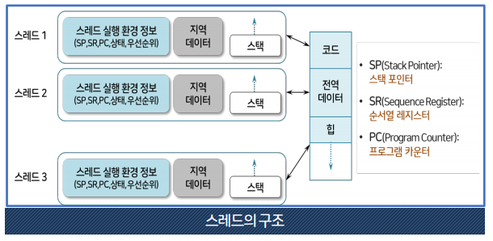

OS에서 프로세스가 바라보는 메모리 영역은 크게 코드(Code), 데이터(Data), 힙(Heap), 스택(stack) 영역으로 나뉘어진다. 
```
Code 영역

프로세스가 실행할 코드와 매크로 상수가 기계어의 형태로 저장된 공간이다.
컴파일 타임에 결정되고 중간에 코드를 바꿀 수 없게 Read-Only 로 지정돼있다.

Data 영역

코드에서 선언한 전역변수 또는 static 변수 등등이 저장된 공간이다. 
전역변수/static 값을 참조한 코드는 컴파일 하고 나면 Data 영역의 주소값을 가르키도록 바뀐다. 
실행 중도에 전역변수가 변경 될 수도 있으니 이 영역은 Read-Write로 지정돼있다.
단, 초기화 되지 않는 전역 변수는 BSS 영역에 할당된다.

Stack 영역 

자료구조로 많이 알려진 Stack은 프로세스의 메모리 공간을 관리하기 위한 알고리즘중 하나이다.
이 영역은 함수 안에서 선언된 지역변수, 매개변수, 리턴값, 돌아올 주소 등등이
저장되고 함수 호출시 기록하고 종료되면 제거한다.

기록하고 종료하는 메커니즘은 자료구조에서 배운 후위선출(LIFO) 방식을 따른다. 
컴파일 타임에 크기가 결정되기 때문에 무한히 할당 할 수 없다.

재귀함수가 너무 깊게 호출되거나 함수가 지역변수를 너무 많이 가지고 있어
stack 영역을 초과하면 stack overflow 에러가 발생한다.

Heap 영역

프로그래머가 필요할 때마다 사용하는 메모리 영역.
Code, Data, Stack 영역과는 다르게 Heap은 런타임에 결정된다.

프로그래머는 malloc, calloc으로 Heap 영역의 메모리를 사용할 수 있다.
데이터 배열의 크기가 확실하지 않고 변동이 있을 때 Heap 영역을 활용해서 메모리를 할당한다.

단 사용하고 난 다음에는 반드시 해제를 해야 한다. 
안그러면 memory leak이 발생한다.

스택보다 할당할 수 있는 메모리 공간이 많다는 것이 장점이지만,
포인터로 메모리 영역을 접근해야 하기 때문에 다른 자료구조에 비해서 데이터를 읽고 쓰는게 느리다. 
```

### 01. 스레드의 개념

> JS가 싱글 스레드로 작동하는 것을 생각해보자
> stack 형식으로 데이터를 쌓기 때문에 한줄씩 다이나믹하게 읽어 들이는 싱글 스레드 작동 방식이지만
> 비동시 실행을 할 경우 web api로 보내서 callbackqeue로 보냄, 비동시 실행시 다시 스택으로 쌓는 방식

스레드의 병렬 수행
- 프로세스 하나에 포함된 스레드들은 병렬로 수행됨
- 프로세스가 하나인 다른 프로세서에서 다른 부분의 프로그램을 동시에 실행시켜 줌

스레드의 병렬 수행 이점
- 사용자 응답 속도 증가
- 프로세스의 자원과 데이터(메모리)의 공유가 가능해짐
- 경제성
- 멀티 프로세싱으로 효율성이 향상 됨

### 02. 단일 스레드와 멀티 스레드

단일 스레드
- 개념이 불확실함

다중 스레드
- 프로그램 하나를 여러 실행 단위로 쪼개어 실행한다는 측면에서 다중 프로세싱과 비슷한 의미를 가짐(윈도우 nt, 솔라리스)


```
코드 => (스레드 실행 환경정보, 지역 데이터 스택)
전역 데이터 => (스레드 실행 환경정보, 지역 데이터 스택)
힙 => (스레드 실행 환경정보, 지역 데이터 스택)
```
- 이렇게 스레드 별로 실행 환경 정보를 가지고 있음  
- 한 프로세스의 자원과 상태를 공유함
- 동일한 프로세스의 스레드에 프로세서를 할당할 경우 스레드 간의 문맥 교환이 훨씬 경제적임

스레드를 이용하여 프로그램의 비동기적 요소를 구현한 예

다중 스레드를 이용한 워드 프로세서
```
                                        🗒(워드 문서) 
                                           ^
                                   이미지나 텍스트를 보여주는 스레드
                                           ^
⌨️(키보드)  <- 사용자의 키 입력에 응답하는 스레드 <- 🔄(스레드)  ->   지정된 시간에 디스크에 저장하는 📀(디스크)
                                                           정기적인 백업 스레드
                                                          (비동기적 요소 구현)

```

### 03. 스레드의 상태 변화와 제어 블록

#### 스레드의 상태 변화

- 스레드는 프로세서를 함께 사용하고 항상 스레드 하나만 실행 됨
- 한 프로세스에 있는 스레드는 순차적으로 실행 됨
- 프로세스를 생성하면 해당 프로세스의 스레드도 함께 생성됨
- 스레드의 생성과 종료는 프로세스의 생성과 종료보다 **오버헤드가 훨씬 적음**

|프로세서|스레드|
|:-:|:-:|
|여러 사용자가 생성하여 서로 경쟁적으로 자원을 요구함|사용자 한 명이 여러 스레드를 가짐|
|프로세사 간 서로 다른 관계를 유지해야 함|여러 스레드로 이루어진 개인 프로세스 하나를 소유(정보 문제가 덜 심각함)|


#### Thread Control Block, TCB (스레드의 제어 블록)

- 정보 저장
- PCB(프로세스 제어 블록)는 TCB(스레드 제어 블록)의 리스트임!
- 스레드 간에 보호하지 않음


## 스레드의 구현

#### 스레드의 운영체제에 따른 구현

사용자 수준 스레드
- 다대일(n:1) 매핑
  - 스레드 라이브러리를 이용하여 작동, 속도가 빠름
  - 사용자가 직접적으로 스레드를 처리

커널 수준 스레드
- 일대일(1:1) 매핑
  - 커널(os)에서 지원

혼합형 스레드
- 다대다 (n:m) 매핑
  - 사용자 수준, 커널 수준 스레드의 혼합 형태


### 01. 사용자 수준 스레드

> 안쓰는 방식인 듯 하고, 위의 스레드를 설명하는 내용들과 다름!
> 읽을 떄 마다 개념이 헷갈리니까 주의


장점
- 이식성이 높음
  - 커널에 독립적 스케줄링, 모든 운영체제에 적용
- 오버헤드 적음
  - 스케줄링, 동기화를 위해 커널을 호출하지 않음으로 커널영역 전환 오버헤드가 적음
- 유연한 스케줄링 가능
  - 커널이 아닌 스레드 라이브러리에서 스레드 스케줄링 제어함으로 응용 프로그램에 맞게 스케줄링 가능
단점
- 시스템의 동시성을 지원하지 않음
  - 스레드 단위가 아닌 프로세스 단위로 프로세서를 할당함
  - 떄문에 다중 처리 환경(프로세스를 한 번에 두개 이상의 프로세서로 돌림)을 갖춰도 스레드 단위로 다중 처리가 불가능 함
  - 동일한 프로세스의 스레드 한 개가 대기상태가 되면 이하 다른 스레드는 실행이 불가능함
- 확장 제약이 따름
  - 커널이 한 프로세스에 속한 여러 스레드에 프로세서를 동시에 할당할 수 없어서 다중 처리 시스템에서 분산처리가 되지 않음
    - 시스템 규모확장이 어려움
- 스레드 간 보호 불가능

### 02. 커널 수준 스레드


사용자 수준 스레드의 한계를 극복하는 방법,**커널이 스레드관련 모든 작업을 관리함**

특징
- 한 프로세스에서 다수의 스레드가 프로세서를 할당 받아 병행 수행
- **스레드 한 개가 대기 상태가 되면 동일 프로세스의 다른 스레드로 교환 가능**
- 커널이 직접 스케줄링, 실행 함 **사용자 수준 스레드의 커널(동시성 문제) 지원 부족 문제를 해결할 수 있음**
- 커널이 각 스레드를 개별적 관리함으로 **동일 프로세스의 스레드 병행 수행이 가능함**
- 동일한 프로세스에 있는 스레드 중 한개가 **대기 상태가 되어도 다른 스레드의 실행이 가능함**
- 단점으로, 오버헤드가 커짐

### 03. 혼합형 스레드 

시스템 호출을 할 때 다른 스레드를 중단하는 사용자 수준 스레드와  
스레드 수를 제한하는 커널 수준 스레드의 문제 극복 방안으로 제시

특징
- **스레드 라이브러리**가 최적의 성능을 지원
  - 커널이 경량 프로세스를 수동저거으로 조절함
  - 사용자 수준 스레드와 커널 수준 스래드가 다대다(n:m)으로 매핑
- 응용 프로그램이 커널 영역에서의 병렬 처리 정도를 결정할 수 있음
  - 병행 의미가 없다면 다대일 매핑도 사용 가능
- 스레드 폴링 이용 일대일 매핑으로 오버헤드 감소 가능

- Thread pooling 이란

시스템이 관리하는 스레드의 pool을 응용프로그램에 제공  
스레드를 효율적으로 사용할 수 있게 하는 방법임

```
1. 미리 생성한 스레드의 재사용으로 스레드 생성 시간을 줄여 시스템의 부담을 경감

2. 동시 생성 가능한 스레드 수를 제한하여(스레드를 프로세서에 얼마나 할당할지 제한을 둔다는 뜻)
시스템 자원의 낭비를 줄이고, 응용 프로그램의 전체 성능을 일정 수준 유지함
```

❗️❗️❗️❗️❗️
> 일단 적긴 하는데 리눅스 환경 설정이나 개요는 직접 해봐야 알아서 외우는 건 아님!
> 이해가 안되지만 그냥 그려려니 읽고, 중간고사 치기 전에 다시 외울 부분만 추가, 삭제하고
> 정리 노트말고 강의 파일을 보도록하자!

# 유닉스 및 리눅스 개요 ( 3 주차 1 차시 ) 

학습 목표
```
유닉스, 리눅스의 탄생과 구성을 말할 수 있다.
유닉스 프로세스 관리와 시스템 호출과 시스템 호출 인터페이스에 대해 설명할 수 있다.
유닉스에서의 메모리 관리 방법을 설명할 수 있다.
유닉스의 파일 시스템에 대해 설명할 수 있다.
```
## 유닉스, 리눅스의 탄생과 구성
### 01. 유닉스의 탄생과 발전과정

🍎 유닉스의 탄생

- 1969s 캔 톰슨 & 데니스 리치가 최초로 os 개발
  - 어셈블리어 -> c 언어로 작성
- 개발 후 **소스 코드를 공개** 다양한 연구가 이루어짐
- 이후 각각 상업용 유닉스와 BSD(berkeley Software Distribution)로 분리
- 두 계열의 장점을 결합한 형태로 개발, 유닉스를 기반으로 한 제품들 (솔라리스 같은)이 나오기 시작함

### 02. 리눅스의 개요

- multi user, multi tasking을 지원하는 유닉스와 비슷한 운영체제
- 리누스 토발즈에 의해 독립적 개발된 공개용 운영체제
- 자유로운 배포 가능
- 안정성, 보안성, 실속한 기능의 보강 가능

> 리눅스의 발전 과정
```
1985년(유닉스는 69년임 ㅎ)
리차드 톨스만 GNU(gerneral public license,약자가 다르네..) Manifesto를 발표 = 반저작권 주장

1991년
리누즈 토발즈 리눅스 개발 ( 리눅스 = 리누스 + 유닉스 )

2000년 이후
사용자 급속 증가
```
🍎 GNU 프로젝트

- 리차드 스톨만 84년 창설
- 소프트웨어 무료 공개를 주장
- 현 free software foundation으로 활동중
- 누구나 copying, mofiication, distribution

🍎 멀티 유저, 멀티 테스킹 운영체제

- 멀티 유저
  - 여러 사용자가 동시 접근 가능
- 멀티 테스킹
  - 여러 개의 테스크를 동시에 사용할 수 있음
  - cpu가 자원을 교대로 사용함
- 높은 신뢰성과 퍼포먼스를 가짐
- CUI, GUI 지원
- 관련 소스 공개
- 다양한 파일 시스템 지원 (ext2, minix-1, Xenix)
- shell 기능
  - os와 user를 이어줌 (terminal)
  - CLI 지원
  - 작업 관리기능 지원, I/O 흐름 제어
- hw 효과적 사용
  - 적은 메모리, Swap 방식
- 모든 인터넷 기능 지원

### 03. 유닉스의 구성 요소

🍎 유닉스의 특징

- 대화형 시스템
- 다중 사용자 시스템
- 다중 작업용 시스템
- 높은 이식성 확장성 제공
  - 모듈을 다른 하드웨어로 이식
  - 모듈 개발로 새로운 기능
- 계층적 파일 시스템 구조 (계층적인 트리 구조)

🍎 유닉스 프로세스의 종류

- 사용자 프로세스
  - 단말기의 사용자와 관련된 프로세스
- 커널 프로세스
  - 커널 모드에서 실행되는 프로세스
- 데몬 프로세스
  - 전역 함수, 네트워크 제어, 관리 등 **시스템을 지원하는 프로세스**

## 유닉스 프로세스 관리와 시스템 콜

### 01. 유닉스 프로세스 개요

🍎 윺닉스 프로세스의 상태

- 유닉스는 사용자 프로세스에서 실행되므로 사용자모드, 커널모드가 필요함
- 유닉스는 시스템 프로세스, 사용자 프로세스가 사용됨

시스템 프로세스

- 커널 모드에서 작동, 시스템 관리작업 수행, 운영체제 코드 실행, **프로세스 스케줄링, 메모리 할당, 프로세스 교환 등이 여기에 해당 됨!**
- 작업 실행을 위해 프로세스 테이블을 유지함

사용자 프로세스
- 사용자 모드에서 실행, 사용자 프로그램, 유틸리티를 수행
- 인터럽트 발생 시 시스템 호출을 하여 커널모드 진입함

🍎 사용자 테이블과 프로세스 테이블

프로세스 테이블

- 메인 메모리에 상주, 정보를 프로세스마다 유지함
- 공유 코드가 들어 있는 테이블 === 프로세스 테이블을 유지하고 있음
- 프로세스 테이블 안에는 어떤 정보가?
  - 프로세스 식별자PID, 사용자 식별자UID
  - 사용자 영역 포인터
  - 프로세스 상태 필드(준비, 실행, 수면 대기 등)
  - 프로세스 크기, 스케줄링 매개변수 등등..

사용자 테이블

- 프로세스가 대치되지 않고 메모리애 있을 때 필요한 정보 보관
  - 해당 프로세스가 실행 중이라면 메인 메모리의 임시 영역에 적제 시킴
- 커널의 가상 데이터 영역으로 매핑

🍎 각 프로세스의 사용자 영역

- 텍스트, 데이터, 스택으로 구분

텍스트 사용자 영역

- 프로그램의 명령어 저장, 읽기만 가능

데이터와 스택 사용자 영역

- 항상 같은 주소 공간에 있지만 반대 방향으로 늘어남

- 각 프로세스의 사용자 영역에 커널을 실행할 때 필요한 추가 정보가 들어 있음
  - 프로세스의 테이블 포인터
  - 시스템 호출 매개변수
  - UID, 사용시간
  - 시스템 호출 오류ㅡ 반환값
  - 신호 수신시 프로세의 수행 동작 기술 
  - 입출력 파일 매개변수 등

### 02. 유닉스 프로세스 스케줄링

🍎 특징

- 시분할 시스템에서, 커널은 각 프로세스에 시간 할당량을 주고, 초과시 그 프로세스를 중단 다른 프로세스를 스케줄링 함
- 프로세스들은 우선순위 알고리즘(=순환 할당 알고리즘)으로 프로세서의 시간일부를(시분할 시스템이니까) 할당받음
- 유닉스 스케줄러는 다단계 피드백이 있는 **순환 할당 스케줄러**에 속함

🍎 우선순위를 갖는 다단계 큐 구조를 가짐

(표 생략)

🍎 프로세스  A, B, C 스케줄링

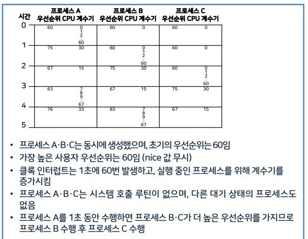

우선순위 부여

@ 큰 번호는 낮은 우선순위를 나타냄  
@ 디스크 입출력이나 다른 중요한 디스크들을 수행하는 프로세스에는  
@ 음수의 우선순위 부여하여 시그널로 중단할 수 없도록 함  
@ 프로세스가 프로세서 시간을 많이 사용할수록 번호는 크고 우선순위는 낮아짐  


### 03. 파일 조작

- 유닉스에서 파일은 바이트의 연속이지만, **커널 측면에서는 어떤 구조도 없음**
- 파일은 **트리 구조의 디렉터리에서 생성**
- '/'로 절대 경로면 시작
- 현제 디랙토리에서 상대 경로명 시작
- '.'로 디렉터리 자신을 가르킴
  - ./index.js

> 하드링크(물리적 링크)와 파일 복사(copy)

- 디랙터리를 직접 복사하지 않고 기존 디렉터리를 실제로 복사한 파일처럼 사용할 수 있도록 연결하는 기능 ( 바로 가기랑 완전 같은데? )
- 원본 파일 복사하여 사본을 생성 ( 바로가기랑 다른 점이네 )
- 원본 삭제해도 원본과 동일한 내용이 있어서 데이터 공유해도 안전함

파일 복사
- i 노드 함께 복사
하드 링크
- 여러 파일이 i노드 하나 공유

🍎 유닉스 주요 디렉터리

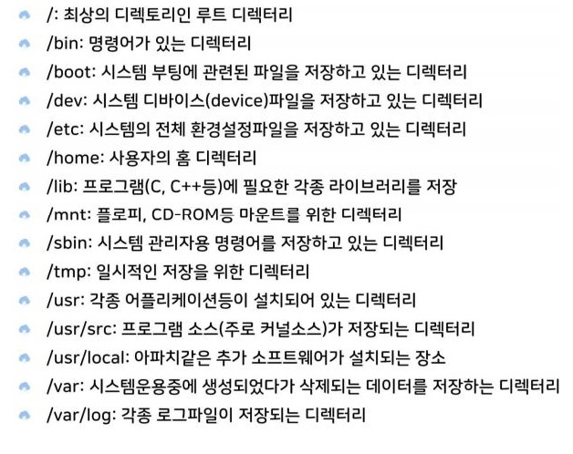


### 04. 프로세스 제어 및 시그널

🍎 프로세스 제어

- 새로운 프로세스는 **fork 명령어로** 만듬
- execve 명령어
  - 가상 메모리에 새로운 프로그램 대치, 부모 자식 프로세스 중 하나 생성 후 사용
- exit 명령어로 종료
  - wait 명령어를 통해 부모 프로세스가 자식 프로세스의 종료까지 기다림
- 자식 프로세스 에러 -> exit 으로 빠져 나옴
- 부모를 자식보다 먼저 종료시킴 -> 자식은 좀비 프로세스가 됨

🍎 시그널

- 프로세스에게 어떤 이벤트의 발생을 알리기 위해 전달되는 **소프트웨어 인터럽트**
- 시그널 = 소프트웨어 인터럽트
- 시그널이 어떤 상태를 가질 때마 어떤 이벤트가 발생함
- 지금 적어도 이해 못하니까 os 만저보고 작성하자,,

## 유닉스의 메모리 관리

### 01. 유닉스의 메모리 관리 개요

🍎 유닉스의 매모리 관리

- 처음은 단일 사용자를 위해 개발 되었지만, **다중 사용자 환경에 적합하도록 발전**
- **다중 프로그래밍 유닉스**에서는 메모리 관리 기법으로 **대치, 페이징을 사용**
- 크기가 작은 작업
  - 대치 사용
- 다수의 큰 작업
  - 페이징 사용
> 메모리 관리자의 역할은
> 프로세스를 메모리에 저장하는 동안 중첩이 일어나지 않게 보호하고
> 커널이 여러 프로세스가 메모리에 동시에 있도록 메모리 경계를 설정함

### 02. 대치

🍎 대치 공간을 자유 공간으로 변화

|주소|자원수|
|:-:|:-:|
|251|9750|

251번지 시작 자유공간 할당

|주소|자원수|
|:-:|:-:|
|101|50|
|251|9750|

101번지 시작 자유공간 할당

|주소|자원수|
|:-:|:-:|
|1|150|
|251|9750|

1번지 시작 자유공간 할당  
이런 식으로 대치 공간을 자유공간으로 변화

🍎 프로세스의 대치장치로 매핑과 복귀


🍎 대치 작업의 순서

이 부분도 강의 자료를 참고,

### 03. 페이징

단점
- 페이징 사용시 메모리의 외부 단편화를 해결할 수 있지만 내부 단편화가 발생함
- 오버헤드 증가, 스래싱 현상을 야기함
  - 스래싱 : 메모리 영역에 접근하게 될 때, 메모리에 페에지 부재하여 페이지 폴트(page fault)율이 높은 상태
장점
- 가상 메모리 기능을 제공함
- 효과적 메모리 관리 가능

🍎 페이지 대치 알고리즘

🍎 페이징 구현과 프로세스
> 작업 집합

🍎 프로세스의 작업 집합

### 01. 디스크 블록의 구조

🍎 디스크 블록의 기본 구조
🍎 유닉스 디스크 블록 구조

> 부트 블룩
> 슈퍼 블록
> 데이터 블록

🍎 유닉스 디스크 블록의 구조
🍎 i노드 구조

###  02. 유닉스에서 연속 파일 할당

🍎 연속 파일 할당과 자유 공간의 단편화
🍎 다중 블록 인덱스 파일 할당

### 03. 유낙스의 디렉터리

🍎 유닉스에서 파일과 디렉터리 구현할 떄 차이
🍎 디렉터리 내의 파일 리스트

### 04. 유닉스의 디스크 구조

🍎 유닉스의 디스크 구조
🍎 논리적 장치로 매핑된 파일 시스템 분할 과정
🍎 장점

# 리눅스와 유닉스 환경 구축 ( 3주차 2차시 )

학습 목표
```
가상 머신 유닉스, 리눅스의 개요 및 특징에 대해 설명할 수 있다.
리녹스의 설치과정을 설명할 수 있다.
유닉스의 설치과정을 설명할 수 있다.
```

## 가상 머신과 유닉스, 리눅스

### 01. 가상머신이란?

🍏 가상 머신

- host OS에 가상의 머신(시스템)을 생성한 후 (다른 운영체제)guest OS를 설치할 수 있도록 해주는 응용 프로그램
- VMWare 제품군이 가장 널리 사용중임
  - player, pro version이 있음

🍏 가상 머신의 종류

|가상 머신|호스트 OS|게스트 OS|
|:-:|:-:|:-:|
|VMWare|윈도 계열 OS, 대부분의 리눅스, MAC OS|윈도 계열 OS, 대부분의 리눅스, 솔라리스, MAC OS|
|버추얼 PC|윈도 계열 운영체제|윈도 계열 OS, 대부분의 리눅스, 솔라리스|
|버추얼 박스|윈도 계열 OS, 대부분의 리눅스, 솔라리스, MAC OS|윈도 계열 OS, 대부분의 리눅스, 솔라리스, MAC OS, OpenBSD|

### 02. 유닉스의 개요

🍏 유닉스가 널리 쓰이는 이유

- c언어로 개발, 이식성이 뛰어남
- 다양한 유틸리티의 개발이 쉬움
- 안정성
- hw호환성
- DB, network etc 주요 app SW 지원

🍏 대표적 유니스 상표

|제품명|제조회사|
|:-:|:-:|
|솔라리스|오라클|
|AIX|IBM|
|HP-UX|HP|
|MAX OS X|apple|
|레드헷,페도라,데비안,우분투|리눅스 밴더, 커뮤니티|
|freeBSD,netBSD,openBSD|BSD계열 오픈 소스 커뮤니티|

🍏 솔라리스의 발전
..

### 03. 리눅스의 개요

🍏 리눅스의 시작

- 91년 리누즈 토발즈가 개발
- 소스 코드 무료 공개
- 지원자에 의한 기능 추가, 확장
- 무료 os

🍏 리눅스의 특징
- pc, workstation, server에서 주로 사용
- GNU 소프트웨어와 함게 배포
- 다양한 하드웨어 지원

🍏 리눅스의 장점
- 놀라운 안정성
- 강력한 네트워크 구축
- 다양한 응용 프로그램 개발

🍏 리눅스의 종류

- 데비안
  - GNU의 공식 후원을 받는 유일한 배포판
  - 안정성, 보안에 중점으로 다른 리눅스 배포판들의 기반으로 사용됨
- 레드햇
  - 가장 인기많은 배포판중 하나
  - 지원 없이 사용 or 기술 지원을 받을 수 있는 배포판임
  - 유료 기술 지원을 하는 레드헷(레드헷 엔터 프라이즈 리눅스), 페도라(페도라 프로젝트)로 구분
- 페도라
  - RPM(Redhat package manager)기반의 리눅스 배포판
  - 개인, 기업등 다양한 환경 사용
  - 6개월 간격 새로운 버전이 나오고 각 버전은 13개월씩 지원함
- 우분투
  - 가장 인기있는 리눅스 배포판
  - 고유 데스크툽 환경인 유니티를 사용
  - 6 개월 간격으로 새로운 버전이 배포
- CentOS
  - 무료 기업용 컴퓨팅 플랫폼을 제공하기 위해 만들어진 리눅스
  - 레드헷 엔터 프라이즈 리눅스의 소스 코드를 그대로 빌드, 상표만 centOS를 씀
  - 단, 레드헷 기술 지원을 받지않고 자체 커뮤니티에 의해 관리됨
  - 플랫폼 : 컴퓨터 시스템의 기본이 되는 특정 프로세서 모뎀과 하나의 컴퓨터 시스템을 바탕으로 하는 운영체제

## 리눅스 설치
- 리눅스-> 우분투 설치
## 유닉스 설치
- 오라클 -> 솔라리스에서 다운

# 리눅스 사용명령 (4주차 1차시)

학습목표
```
리눅스 사용명령에 대해 설명할 수 있다.
파일의 종류와 디렉터리 계층구조에 대해 설명할 수 있다.
디렉터리 관련 사용명령에 대해 설명할 수 있다.
```

## 리눅스 기본명령

### 01 명령행 편집

프롬프트
- 배시셀 $, 시스템관리자 # 표시

기본 디럭터리
- user1@localhost:~$:user1
- user1 = 사용자 계정이름, locahost=호스트 ~는 user1의 홈 디렉터리임

### 02 명령 사용법

- command [option] [argument]
- date man is cp mv 등 수백가지 COMMAND가 있음,
- 옵션 = 명령의 세부적 기능 선택
- 인자 = 파일명, 디렉터리명으로 주로 사용

> for instance 
 
`ls` 입력 (명령어만 사용)  
`ls -a ` 입력 (명령어 + 옵션)   
`ls /tmp` (명령어 + 인자)  
`ls -a /tmp` (명령어 + 옵션 + 인자)  

> 기본 명령


```js
date : 현재 시간, 날짜
clear : 화면 지우고 커서 좌축상단 이동
man : 각종 명령 사용법 알려줌
passwd : 사용자 계정 비밀번호 변경
exit, Ctrl+d : 터미널 종료
```
## 파일과 디렉터리

### 01 리눅스 파일의 종류
#### 파일의 종류

- 파일 : 관련있는 정보의 집합
  - 리눅스는 디렉터리를 사용하여 파일을 효과적으로 관리함
- 파일 시스템 : 디렉터리와 파일로 구성된 전체 집합

- 파일의 종류
  - 일반 파일, 디렉터리, 심벌릭 링크, 장치 파일

#### regular file 일반 파일

- .txt, .jpg, .exe 등 대부분의 파일이 여기 해당
> 바이너리 파일이란?
> 실행파일, 이미지 파일의 경우 바이너리 형태로 데이터가 저장됨, 이런 애들을 바이너리 파일이라 부른다.

#### directory 디렉터리

- 리눅스는 디렉터리도 파일로 취급함!
- 해당 디렉터리, 하위 디렉터리에 대한 정보가 저장됨 /C/USER1/DONWLOAD 이런 형식의 루트 정보를 가지고 있는 듯

#### symbalic link 심벌릭 링크
- 원본 파일을 대신해 다른 이름으로 파일명을 지정한 것
- 윈도우의 바로가기 키와 비슷함

#### 장치파일
- 하드디스크나 키보드같은 peripharals 도 파일로 취급함
- 장치 관리를 위한 특수 파일임 


#### 파일 종류 확인 file 명령

`file .bash_profile` 
결과 = .bash_profile : ASCII text
`file donwload`
결과 = download : Derectory
`file /usr/bin/gcc`
결과 = /usr/bin/gcc : ELF 64bit LSB executable, x86-64,ver 1 (STSV)... 

#### 디렉터리 계층 구조

트리 구조 형식으로, ROOT 디렉터리는 / 로 표시함
/ 아래의 하위 디랙토리(서브) 가 있고   
../ 으로 상위 디렉터리를 표시  
(js import form "../여기"랑 같ㄴㅔ)


### 02 디렉터리의 특징
```
[user1@localhost ~]$  ls  -F
bin@    dev/  home/  lib64@      media/  opt/   root/   sbin@  sys/
usr/
boot    etc/   lib@    lost+found/  mnt/   proc/  run/    srv/     tmp/   
var/
[user1@localhost ~]$
```
@ = 심벌릭 링크
/ : 해당 파일이 디렉터리임을 표시


#### 디렉터리의 주요 기능들

```js
dev 장치 파일이 담긴 디렉터리

home 사용자 홈 디렉터리가 생성되는 디렉터리

media CD-ROM이나 USB􀀁같은 외부 장치를 연결(마운트라고 함)하는 디렉터리

opt 추가 패키지가 설치되는 디렉터리

root
root계정의 홈 디렉터리
[주의]루트(/)디렉터리와 혼동하지 않도록 해야 함

sys 리눅스 커널과 관련된 파일이 있는 디렉터리

usr
기본 실행 파일과 라이브러리 파일,􀀁헤더 파일 등 많은 파일이 있음
[참고]usr는 ‘Unix􀀁System􀀁Resource’의 약자

boot
부팅에 필요한 커널 파일을 가지고 있음

etc
리눅스 설정을 위한 각종 파일을 가지고 있음

lost+found
파일 시스템에 문제가 발생하여 복구할 경우,􀀁문제가 되는 파일이
저장되는 디렉터리로 보통은 비어 있음

mnt
파일 시스템을 임시로 마운트하는 디렉터리

proc
프로세스 정보 등 커널 관련 정보가 저장되는 디렉터리

run
실행 중인 서비스와 관련된 파일이 저장됨

srv 
FTP나 Web􀀁등 시스템에서 제공하는 서비스의 데이터가 저장됨

tmp
시스템 사용 중에 발생하는 임시 데이터가 저장됨
[주의]이 디렉터리에 있는 파일은 재시작하면 모두 삭제됨

var
시스템 운영 중에서 발생하는 데이터나 로그 등 내용이 자주 바뀌는
파일이 주로 저장됨
```


#### 작업 디렉터리

`pwd`로 확인  
현제 사용하고 있는 디렉터리를 의미   
current Deriactory, working derectory라고도 함  

#### 홈 디렉터리

~로 표시 
~user1 이렇게 표시됨
처음 사용자 계정을 만들때 지정, 사용자 아래 서브 디렉터리, 파일을 생성하게 됨


