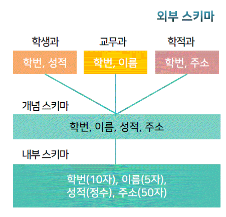
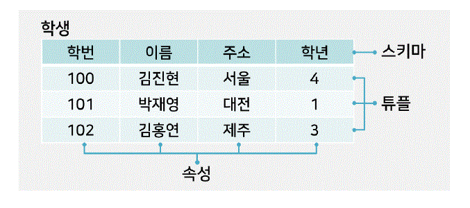

# 데이터베이스의 개념 ( 1주차 1차시 )

학습목표  
```
정보처리 시스템에 대하여 설명할 수 있다.
데이터 베이스에 대하여 설명할 수 있다.
```

## 정보처리 시스템

### 데이터와 정보

#### 1. 데이터와 정보의 차이점

- 데이터
  - 사실, 또는 값이 특정 기준에 의해 정리된 것
  - 연간 강수 일수 109일(목적이 없는 데이터)
- 정보
  - 어떤 목적에 의해 데이터를 해석하거나 가공한 형태
  - 강수 확률 평균 30%(오늘의 강수 정보)

#### 2. 정보의 개념

유효한 지식, 유효한 해석, 데이터 상호 간의 관계를 의미
```
데이터 -> 컴퓨터 시스템( 가공, 해석 ) -> 정보
```

### 정보 처리 방식

#### 1. Information Processing (정보 처리)

- 의사결정을 위한 정보를 컴퓨터가 생성하기 위헤 **데이터를 처리하는 작업**

#### 2. Decision Marking (의사 결정)

- 정보를 바탕으로 문제를 해결하는 지능 활동

#### 3. 정보의 특정

의사 결정에 반영, 유요한 결과를 유발함 ( 정확성, 현제성 )

#### 4. 정보 관리의 중요성

- 정확한 정보를 적시에 얻기 위해 **효율적으로 관리 필요** 

#### 5. 정보 시스템 (method)

- 필요한 데이터를 수집, 필요 시 처리하여 의사결정에 유효한 정보를 제공

- Batch processing (배치 처리)
  - 데이터를 수집, 분류
  - 유사한 작업을 모아서 한꺼번에 처리 
  - 장점 : 컴퓨터 효율성이 좋음 (컴퓨터 중심 처리)
  - 단점 : 처리 결과를 얻기까지 대기 필요
  - 응용분야 : 고지서, 공과금 계산, 이자 계산 등
- Online processing (온라인 처리)
  - 곧바로 데이터 처리
  - 장점 : 대시기간이 없음 (사용자 중심 처리), 보안 비용이 적게 듬
  - 단점 : 컴퓨터가 항상 가동되어야 함 **테스트, 유지보수가 어려움**
  - 응용 분야 : 실시간 데이터 사용량, 버스 위치, 실시간 서비스
  - 최근 온라인 처리가 많아지는 추세
- Centralized processing (중앙집중 처리)
  - 범 조직적 자료를 한 곳에 모아 처리
  - 장점 : 전산 요원, 업무, 보안 등에 있어서 효율적 통제 가능
  - 단점 : 해킹, 지해 등 피해규모가 큼
- Distributed processing (분산 처리)
  - Globalization에 따라 데이터가 지리적, 시간적으로 분산됨
  - 처리기를 데이터 발생 위치에 배치하여 처리
  - 장점 : 실세계 데이터의 발생, 관리의 유용한 대처 가능, 해킹, 재해 피해가 적음
  - 단점 : 데이터 보안에 많은 비용이 듬
  
### 다양한 정보 처리 시스템 ( software )

#### 1. 정보처리 시스템의 유형

```
1. 정보 시스템
2. 의사 결정 지원 시스템
3. 고객관리 시스템
4. 정사적 자원 관리 시스템
5. 기타 정보 처리 시스템
```

정보 시스템

> 회사, 직원, 고객, 관리자에게 필요한(위한) 시스템을 하나씩 생각해보면 됨

- 조직 활동에 필요한 데이터를 수집,조직,저장 했다 필요시 처리, 정보 생성 분배하는 시스템
- MIS (Management Information System)
  - 정보 시스템의 일종
  - 기업 업무의 기획, 운용, 통제에 필요한 **의사 결정에 필요한 최신 정보를 제공하는 시스템**

의사 결정 지원 시스템 (DSS : Decision Support System)

- 의사결정 목적으로 통합적인 기능을 제공하는 정보 시스템
- 데이터 웨어하우스
  - 다양한 데이터 근원들로부터 발생되는 **데이터를 한 곳에 추출하여 관리하는 시스템**
- 데이터 마이닝
  - 데이터 웨어하우스(데이터를 한 곳에 추출 관리)의 규모가 커짐으로
  - 유의미한 정보 또는 지식을 효율적으로 생성하는 과정

CRM (Customer Relationship Managment,고객관리 시스템)

- 고객 특성에 맞게 마케팅 활동을 계획,지원,평가하는 시스템
- 고객 성향, 취향 분석 -> 제품 생산 -> 마케딩 전략 개발
- CRM은 행동, 소비 패턴 등 배경 지식을 많이 요함

ERP (Enterprise Resource Planning, 전자석 자원 관리)

ERP의 구축 배경
```
정보 시스템이 피요시마다 기업에 도입됨 -> 각 기업마다 상이한 업무에 시스템을 사용
-> 부서별 연관 업무처리에 있어서 상이한 업무 시스템이 업무처리에 불편을 야기함
-> 시스템 연꼐, 통합의 필요성이 대두됨 -> ERP 방식이 대두
```

- 기업내 생산, 물류, 회계 등 프로세스를 통합 연계관리, 새로운 정보 생성 빠른의사결정을 도와주는 시스템

> 기타 정보처리 시스템 유형

- 제어 시스템
  - 사건을 감지 처리, 자동보고
  - 공정 제어, 수치 제어, 항공 제어
- 내장 시스템
  - 데이터 처리가 주기능이 아닌 시스템의 구성 요소임
  - 비행기 내 유도 시스템, 실시간 레이더 추적 시스템

### 데이터 베이스의 정의

#### 01. 데이터베이스의 정의(DB, Database)

`데이터를을 통합하여 저장한 운영 데이터의 집합`


#### 02. 데이터베이스 정의에 함축된 개념

- 공용 데이터
  - 여러 사용자가 서로 다른 목적으로 공유
- 통합된 데이터
  - 여러 부서 데이터의 통합, 공동관리
  - 최소한의 중복, 통제된 중복 필요
  - ex) 학사관리 시스템 (교무, 학적, 학생과 공동 사용)
- 저장된 데이터
- 운영 데이터
  - 운영에 필요한 기본적 데이터

### 데이터베이스의 특징

```
1. 실시간 접근성 (Real-time Accessibilities)
2. 계속적인 변화 (Continuous evolution)
3. 내용에 의한 참조 (Content Reference)
4. 동시 공용 (Concurrent Sharing)
```

- 실시간 접근성
  - 질의에 대한 실시간 처리, 응답
- 계속적인 변화
  - 시간의 흐름에 따른 지속적, 동적 변화
- 동시 공용
  - 공용을 위한 구축(사용처는 다를 수 있음)
- 내용에 의한 참조
  - 대이터 내용에 따라 검색됨

### 파일 시스템과 데이터베이스

> 파일 시스템이란 무엇이고, 장점 단점을 알아보고
> 왜 파일 시스템을 쓰지 않고 데이터베이스를 구축하는지 이유를 알아봄

#### 01. 파일 중심의 자료 처리 특징

각 응용 기능마다 프로그램을 개발함, 사용자 마다 데이터파일을 만들어서 관리함

|계좌 생성 프로그램|잔고 조회 프로그램|이자 계산 프로그램|...|입출금 프로그램|
|:-:|:-:|:-:|:-:|:-:|
|데이터 파일 1|데이터 파일 2|데이터 파일 3|...|데이터 파일 n|
|계좌 기본 정보|잔고 정보|이자 정보|...|입출금 정보|

#### 02. 파일 중심 자료 처리의 문제점

> data nesting, Inconsistency (데이터 중복, 비일관성)

- 각 파일이 다른 포멧일 경우 존재
- 중복 저장으로 저장 공간 낭비, 비일관성 유발

> 데이터 고립

- 데이터 포멧이 다른경우 조건에 맞는 검색을 개발하기 어려움

> 무결성 문제

- 저장된 정보의 제약조건을 만족시키기 어려움
- 새로운 제약 조건 추가시, 모든 응용 프로그램에 적용시키기 어려움
- Ex) 3개월 입출금 없으면 휴면계좌 지정으로 변경

> 원자성 문제

- 하나의 트랜잭션(논리적 일의 단위)은 논리적 표현이 가능해야 함
- EX) 계좌이체 -> A 통장 출금, B통장 입금

> 동시 접근 문제

- 동기화 오류가 생김
- 파일 공유 시스템에서 자주 발생됨

> 보안 문제

- 보안 제약 사항을 응용 프로그램마다 추가해야해서 보안성 유지가 어려움

#### 03. 파일 중심처리의 가장 근원적 문제 ( 위의 내용과 중복이 있음 )

> 각 응용 파일마다 자신이 사용할 데이터를 파일로 관리
  - 데이터 중복발생 ( 데이터의 비일관성 )
> 각 파일마다 다른 형식으로 내용 구성
  - 데이터 종속성의 문제가 발생함
  - 파일 형태에 따른 프로그램 작성
  - 파일 형태 변경시 응용프로그램을 바꿔야 함
> 데이터 종속성(data dependency)
  - 위치에 의한 참조 떄문에, 파일 정보의 구조가 바뀌면 프로그램을 재작성 해야 함..

#### 04. 데이터베이스의 장점과 단점

장점

- 데이터 중복의 최소화
- 데이터의 일관성 유지
- 데이터의 공용
- 무결성 유지
- 보안 보장
- 표준화 용이
- 전체 데이터 요구의 파악 조정( 조정이 쉽다 )

단점

- 운영비 오버헤드
  - DBMS는 고가의 소프트웨어이고 자원을 많이사용함
- 자료처리의 복잡성
  - 웅용 프로그램의 구조나 로직이 복잡해질 가능성이 있음
  - DBMA가 있는 이유
- 백업 회복의 어려움
  - 공유, 공동 사용으로 장애 발생시 정확한 사유, 상태파악의 어려움이 있음
  - 정교한 백업, 회복 기업이 필요
- 시스템의 취약성
  - 통합 환경으로 일부 장애가 전체 시스템 정지를 일으킬 수 있음

# 데이터 베이스 관리 시스템 (1주차 part 2)

학습목표

```
데이터베이스
관리 시스템의 정의 , 기능 , 발전과정에
대하여 설명할 수 있다 .
데이터베이스
관리 시스템의 특징을 설명할 수 있다 .
```

## 데이터베이스 관리 시스템의 개요

### 정의

#### 01. 데이터베이스의 정의

- 관련있는 데이터의 집합

#### 02. 데이터베이스 관리 시스템

- 데이터베이스를 생성, 관리해주는 기능을 제공하는 소프트웨어 패키지/시스템

#### 03. 데이터베이스 시스템

- 데이터베이스 + DBMS + 응용 프로그램 = 데이터베이스 시스템

### 기능

#### 01. 데이터베이스 관리 시스템의 기능

- 데이터 정의
- 데이터 조작
- 데이터 제어 기능
  - Consistency, Integrity, Security
  - 백업과 파손 회복기능
  - 인증, 보안 (Authorization, Security)
  - 병행 제어(Concurrency Control)

### 발전

#### 01. IDS(Integrated Data store)

- 최초 범용 목적의 DBMS
- **네트워크 데이터 모델**(=mesh structure data model)에 기반
- 데이터 모델을 명시할 수 있는 **데이터 구조도**를 제안

#### 02. IMS(Information Management System) DBMS

- 1960s IBM에서 제시
- **계층 데이터 모델**(=tree structure data model)이라는 또 다른 데이터 표현의 기반이 됨

#### 03. 1세대 DBMS
Cancel Changes
- 1970 컴퓨터 제조사들이 DBMS 제작 판매하기 시작
- 네트워크 모델, 계층 모델에 기초를 둠

#### 04. 2세대 DMNS

- 1980년대 관계형 모델(Relational data model)에 기반한 DBMS들이 개발됨
```
Commercial DBMS
-> ingress
-> Oracle
-> DB2
-> Sybase
-> Infomix

PC기반 DBMS
-> MS-Access
-> dBase
-> FoxPro
```
> 커며설 bd중 oracle, pc기반은 ms access만 봤는데 뭐가 많네!

#### 05. 제 3세대 DBMS

- 데이터 구조의 복작성이 증가함 : image, video, 시공간 데이터 등

`객체지향 데이터 모델 -> 객체지향 데이터 베이스`
> 이미지, 텍스트 그래픽 같은 데이터 타입을 저장관리, 복잡한 질의를 처리할 수 있도록 기능이 확장됨

#### 06. 현제 DBMS

- oriented rerational database managment system(객체 관계형 데이터베이스 관리 시스템)

`2세대 DBMS(관계형 데이터베이스) + 3세대 DMBS(객체 지향 데이터베이스) = 객체 관계형 데이터베이스 관리 시스템 (ORDBMS)`

### 목적

#### 01. 데이터베이스 시스템의 구성 요소 중 하나 

` user <-> DBMS <-> database`

### 02. 데이터베이스의 구조

논리적 구조
- 사용자 입장, 가상의 구조

물리적 구조
- 시스템(저장장치)입장
- 저장되어 있는 데이터의 실제 구조

#### 03. 데이터 독립성(data independency)제공

데이터 독립성 ==> DMBS의 궁극적 목적임  
데이터의 논리, 물리적 구조의 변화에도 응용 프로그램이 영향을 받지 않는 것  

#### 04. 데이터 종속성과 중복성

데이터 종속성
- 응용 프로그램과 데이터 간호 상호 의존 관계
- 데이터의 구성, 구조 변경시 응용프로그램도 같이 변경해야 함

데이터 중복성
- 유사한 내용의 데이터가 중복 저장관리됨
- 일관성, 보안성, 경제성, 무결성 등 문제점 야기

#### 05. 데이터 독립성과 종속성

#### 06. 논리적 데이터의 독립성
#### 07. 물리적 데이터의 독립성

> DBMS의 목적 파트는 추상적이고 외울 내용은 아닌 거 같음
> 대충 흐름만 이해하고 넘어가면 될 듯

### 구성요소

1. 3단계 데이터 베이스  
2. 데이터베이스 언어  
3. DBMS  
4. User  

#### 01. 3단계 데이터베이스

데이터 베이스에 대한 사용자(외부,external), 조직(conceptual,개념), 저장 장치(internal,내부)에 따른 관점

> Schema

- 데이터베이스의 논리적 정의 즉, **데이터베이스의 구조와 제약조건에 대한 명세(specfication)를 기술한 것**
- 데이터 구조를 나타내는 개체
- 개체를 구성하는 속성
- 이들 간의 관계에 대한 정의
- 이들이 유지해야 할 제약 조건

Sub Schema(외부,서브스키마)

- 사용자, 응용관점에서의 데이터베이스 스키마

Conept Schema

- 범조직 관점에서의 데이터베이스 스키마
- 모든 외부 스키마에 대한 통합된 스키마

internal Schema

- 저장장치 관점에서 정의한 데이터베이스 스키마

#### 03. DBMS



각 단계별 스키마의 도표화(mapping)

#### 03. 시스템 카탈로그

- Data Dictionary
  - DB에 저장되어 있는 모든 개체들에 대한 정의나 명세에 관한 정보를 유지/관리하는 시스템
  - API 문서랑 같은 느낌임 (Oracle을 쓸려면 오라클 API document를 읽어야하는데 이걸 data dictionary 라고 하는 듯 함)
- system database
  - 사용자가 저장하는 데이터와 별개의 데이터 베이스에 저장된 정보로 **데이터에 관한 데이터**가 여기에 있음
- Mata Data 
  - system database에 저장된 데이터를 meta data라고 함
  - system databse에 mata data라 적혀 있으면 **데이터에 관한 데이터**라는 의미임


#### 04. 데이터베이스 언어

DDL (Data Definition Language)
  - Create, Alter, Drop

DML (Data Manipulation Language)
  - Insert, Delete, Update, Select

DCL (Data Control Language)
  - Grant, Revoke, Commit, rollback 등

> 컴퓨터 언어

1세대
- 기계어
 
2세대
- 어셈블리 언어
  - 기계어 몇 개의 예약어 단순 대응


3세대 
- 절차적 언어
  - what, how 순서적 기술


3.5세대
- 절차적언어 + 객체 지향 개념
  - 3세대 + 객체지향 개념
  - C++, java

4세대
- 비절차적 언어
- 고급언어
  - What만 기술 ,how는 시스템에 위임


#### 05. 데이터베이스 사용자

일반 사용자
- 비절차적 DML을 통해 db에 접근

응용 프로그래머
- 일반 사용자를 위한 db기반 응용 프로그램을 개발하는 개발자
- 프로그램언어와 비절차적 dml을 통해 db에 접근

DBA (DB administrator)
- db운영의 모든 책임을 지는 사람
- DDL, DCL을 통해 DB정의하고 제어함
- DB 설계자와 관리자를 나누기도 함

> DBA의 업무

db 설계와 운영
- 저장 구조, 접근 방법 설꼐
- 보안 및 권한 부여 정책, 데이터 유효성 검사 수립
- 백업 및 회복 절차 수립
- 무결성 유지 대책 수립
- 시스템 성능, 새로운 요구 대응하기 위한 튜닝
- 시스템 카탈로그 유지, 관리

행정 관리 및 불만 해결
- 데이터 표현, 문서화 표준을 정하고 시행
- 사용자 요구,불만을 청취 해결

시스템 감시, 성능 분석
- 시스템 자원 이용도, 병목현상, 장비 및 시스템 성능 감시
- 종합적 분석 진행
  - 데이터 접근, 저장구조
  - 재구성의 요인이 되는 사용자의 요구 변화
  - 데이터 이용 추세 각종 통계 등

### 데이터베이스의 역사

#### 01. DB 용어의 기원

63년 SDC사 개최 1차 심포지엄의 제목
`development and management of a compute-centered data base`
에서 시작됨

#### 02. 데이터베이스 시스템 용어의 기원
65년 SDC사 2차 심포지엄의 제목
`computer-centered data base systems`
에서 시작됨

#### 03. 주요 사건들

> Relational data model등장 (70s)
> System R 등장 (IBM, 74s 최초 관계형 DB)
> Oracle 등장 (SDL 79s-> 83s Oracl 개명)


#### 04. 최근

- big data 등장(특징- v3 , volume, velocity, variety)
- data minning (정보 추출, 의사결정에 사용)
- sns
- 분산 병렬 처리 (mapReduce, Spark 등장)
  - 데이터량이 증가, 일반 컴퓨터로 나눠서 데이터 처리 제안
 
# 관계형 데이터 모델 (2주차 1차시)

학습목표

```
데이터 모델의 구성 요소를 설명할 수 있다 .  
관계형데이터 모델의 개념을 설명할 수 있다 .  
```

## 데이터 모델의 개념

### 데이터 모델

1. 구조(structure), 개체 타입간 관계
2. 연산(operation), 데이터 처리 기법 작업의 명세
3. 제약조건(constraint), 논리적 제약

```
for instance integer
structure = ... -2,-1,0,1,2 ...
operation = +,-,x,/
constraint = {
interger = ture, 
float = false, 
string = false
}
```

### 데이터 베이스 구성 요소

|개념적 구조|논리적 구조|물리적 구조|
|:-:|:-:|:-:|
|사용자 입장,db={개체,관계)|컴퓨터가 처리할 수 있는 데이터모델|저장 미디어에서보는 데이터의 물리적 배치,구성|

#### 1. 개념적 구조

>개체 (entitiy)

- 유무형의 객체
- column 맨위에 아니면 왼쪽 한 줄에 적을 타이틀 말하는 거임 드럽게 어렵게 말하네
- column맨 윗줄 첫칸들 or 왼쪽 한 줄에 적는 거 = attribute
- attribute(속성) = 가장작은 논리적 단위, 물리적 단위는 bit에 해당

> entity type (개체 타입)

- 개체 집합에 속한 개체 인스턴스(하나하나의 벨류)들이 공통으로 가지는 특정

> relationship

- 개체 사이의 연관성(무결성 유지할려고 관계 설정하는 거)

#### 2. 논리적 구조

- 데이터의 논리적 배치 구성을 말함

과거 계층적 모델(tree),네트워크 모델(mesh)이 현제 객체 관계 모델로 바뀜

#### 3. 물리적 구조

- hard disk, ssd, dvd
- user, programer는 인지, 파악하지 못함
- 논리적 구조와 물리적 구조이의 mapping(데이터의 저장위치를 도표화 하는 것)은 DBMS가 지원함
- 데이터의 독립성(data independency)를 가짐 (data depenpency을 해결해줌)

### 관계형 데이터 베이스

#### 1. 관계형 데이터 모델 (relational data model)

- db에서 가장 많이 쓰이는 논리적 모델임

1. 단순한 구조
2. 집합론(set theory)에 기반한 모델
3. sql이라는 비절차적 언어로 간단히 데이터 처리

> **집합 (set function)**

- Collection
  - 동일한 type의 원소가 모여있는 군집

|set|bag(multi-set|list|array|
|:-:|:-:|:-:|:-:|
|원소들의 중복 불가|원소의 중복 가능|원소의 중복 불가|원소의 중복 가능|
|원소들 간 순서 없음|원소들 간 순서 없음|원소들 간 순서 있음|원소들 간 순서 있음|


> **관계형 데이터 모델의 구성 요소**

- structure : relation(table)
- operation : relational algebra, relational calculus (대수, 해석)
- constraint : integrity

### 릴레이션 (relation)

#### 01. 관계형 데이터 모델의 구조(structure)

- 2 차원 테이블 구조
- 튜플 (tuple) : 테이블의 행 (Row): 
- 속성 (attribute) : 테이블의 열 (column)  
- 도메인 (domain) : 하나의 속성이 취할 수 있는 값들의 집합
- 



R(A1,...,Ai,...,An) 일때
R(A1,...,Ai,..,An) = relation schema(릴레이션 이름 + n개의 속성)
Ai과 대응되는 Di = domain
각각의 Ai = attribute
tuple = set of attrubutes
domain = type (Ai 와 대응하는 Di를 말하며, tpye을 뜻함, 정수만 받는다던가, 문자열만 받는다던가)
schema = 속성들을 대표하는 이름 ( 학생, 성적, 일과, = category)

⚡ column, row와는 개념이 다름! ⚡
이미지와 대조해서 설명 하고 있지만  
schema(속성을 대표하는 이름)가 첫번쨰 row에 올 수도, 첫번쨰 column에 올 수도 있음  
이런 문제 떄문에 구성 요소가 이해가 안 되는 경우가 있었음!!

#### 2. 수학적 정의

-> 강의를 보고 정리하자 너무 어렵다..

#### 3. 릴레이션의 특성

- 튜플의 유일성
  - 릴레이션은 튜플의 집합
  - 집합은 중복을 허용하지 않음
- 튜플의 무순서성
  - 집합에서 원소들 간의 순서는 없음
- 속성의 무순서성
  - schema는 속성들의 집합
- 속성의 원자성 (atomicity)
  - 논리적 최소 단위임
  - 정규화 릴레이션(nomalized relation) : 반복 그룹을 허용하지 않는 릴레이션(json처럼 하나의 객체에 여러 값을 넣을 수 없음)
  - 관계형 데이터 모델은 이 정규화 릴레이션만 취급함
 
# 관계 대수 ( 2주차 차시 )

학습목표

```
관계대수와 관계 해석의 차이를 설명할 수 있다 .
관계 연산자에 대한 분류를 할 수 있다 .
```
## 관계 대수와 관계 해석

관계 해석 (Relational Calculus)
- query(질의)에 대한 검색 조건을 기술
- what에 대한 선언적 명시

관계 대수 (Relational Algebra)
- 질의 수행에 대하여 어떻게 하는지를 기술(수행 절차를 기술)
- what을 how할지 명시

### 관계 해석

####  01. 관계 해석 (relational calculus)
- 관계 해석으로 명시할 수 있는 요구는 관계 대수로 명시할 수 있고 그 역도 성립이 됨
- RDB 표준 쿼리 언어 => SQL
  - SQL은 튜플의 **관계 해석**을 기반으로 만들어짐
- RDB 내에서 SQL을 처리할 땐 관계 대수를 기반으로 함
- 튜플의 관계 해석
  - 튜플 기반의 해석 -> 행 기반
- 도메인 관계 해석
  - 도메인 기반의 해석 -> 열 기반
#### 02. 튜플 관계 해석

- 튜플 변수를 명시
- 튜플 변수의 범위 : 릴레이션
  - **튜플 변수는 주어진 릴레이션의 어떤 튜플도 값으로 가질 수 있음** (이거 너무 당연한 얘기들인데 말을 꼬와놨)
> 튜플 관께 해석식에서 명시해야 하는 것
- 각 튜플 변수 t의 범위 릴레이션
- 튜플들을 특정 조합으로 선탁하기 위한 조건(= 조건은 well formed fomula로 표기)
- 검색 속성(attribute)의 집합

형태
```
{t | COND(t)}
- t: 튜플 변수
- 왼쪽 t의 범위 (t1~tn)은 t의 속성(열)
- COND(t) : t를 포함하는 condition
- cond(t)의 t는 튜플 변수
```

- COND() : WFF (Well Form Formula)
  - COND() 이 부분에 올 수 있는 조건을 WFF (Well Form Formula)=논리식 이라 함
 
- WFF
  - 원자(atom)들로 구성된 식
- atom(원자)
  - R(t)형태 : 튜플 변수와 대응되는 범위 릴레이션
  - 예를 들어 table1에 성적 릴레이션을 가르킬 때, table1.성적 op table2.성적 (op는 비교 연산자,=,<,>,>=,<=,!=)
  - table.성적 op c (c는 상수, op는 비교연산자, table1.성적이 table1안의 성적 릴레이션의 원자들을 가르킴)

- 자유 변수(Free Variable)와 한정 변수(Bounded Variable)
  - 자유 변수
    - 정량자로 한정되지 않은 변수
    - 조건에 만족하는 튜플이 연속적으로 선택되는 경우 
    - t.성적 > 3.5 일 경우 3.5이상의 성적을 모두 불러 옴(연속적으로)
  - 한정 변수
    - 정량자로 한정된 변수
    - **전체 정량자 for all 이나, 존제 정량자 there exsist가 한정 변수이다.**
    - ∃)t.성적 = 3.5 일 경우 성적이 3.5점이라면 True 아니라면 False를 나타 냄
- 전체정량자, 존재 정량자
  - 전체 정량자 (Universal Quantifier)
    - ∀ 로 나타냄 (for all)
  - 존제 정량자 (Existential Quantifier)
    - ∃ 로 나타냄 (there exists)
  
 > 자유 변수와 한정 변수의 예시
 
 - 자유 변수
`{ t| 학생(t) AND t.성적 > 3.5 }`
 
 위의 관계를 가질 경우 튜플 t는 자유 변수가 됨(quantifier, 정량자가 안 나와서)   
 결과의 값으로 성적이 3.5 이상인 튜플들이 연속적으로 불러오게 된다.
 
 - 한정 변수
` (∃d)(d.snum = 50)`
 
위의 관계는 존제 정량자를 사용한 것으로  
변수 d는 50이라는 값일 경우 true, 아닐경우 false를 반환하게 된다.

`(∀s)(학생(s) and s.성적 > 1.0)`

위의 관계는 전체 정량자를 사용한 것으로  
변수 s는 1.0 학생(s)의 튜플들의 성적이 1.0이상일 경우 true, 1.0이하가 한 명이라도 있을 경우 false를 반환하게 된다.

#### 03. 도메인 관계 해석 (Domain relational calculus)

튜플 관계 해석을 기반으로 한 언어인 SQL은 IBM 산 호세 연구소에서 개발  
도메인 관계 해석을 기반으로 한 QBE(Query By Example)가 IBM왓슨 연구소에서 개발  

> query의 결과로 차수가 n인 relation을 생성하기 위해서는
> 각 속성(열)마다 하나씩 총 n개의 도메인 변수(domain variable)가 필요
> 변수의 유형만 다를 뿐 비슷함

- SQL vs QBE

|SQL|QBE|
|:-:|:-:|
|Structured Query Language|Query By Example|
|튜플 관계 해석에 기반을 둠|도메인 관계 해석에 기반을 둠|
|IBM 산호세 연구소 개발|IBM 왓슨연구소 개발|

- Domain Relational calulus example

```
{X1,X2,,,Xn|COND(X1,X2,,,Xn+1,,,Xn+m)} 으로 구성
X1,X2,,,Xn+1,,,Xn+m = 속성의 도메인을 변수로 가지는 도메인 변수
COND() = 도메인 관계 해석의 조건

{학번|(∃ 학번)(학생(학번,이름,주소) and 학번 = 100)}
학번이 존제하면(true)학생(학번,이름,주소)필드를 가져옴, 학번이 = 100 인 경우에만

```
> domain relational calculus의 WFF는 생략, tuple relational calculus랑 비슷 함 

### QBE

#### 01. QBE (Query By Example)

- 2차원 그래픽 터미널을 이용해서 표현함

|학생|학번|이름|학년|학과|
|:-:|:-:|:-:|:-:|:-:|
|-|P._STX|-|2|-|


