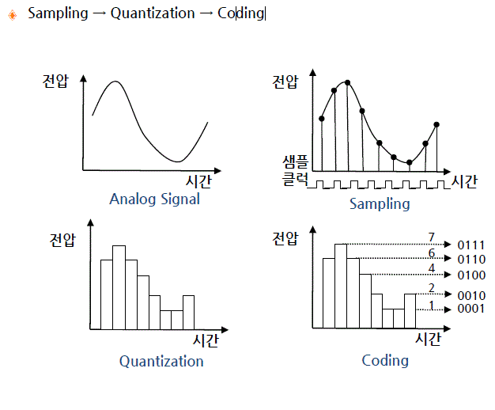
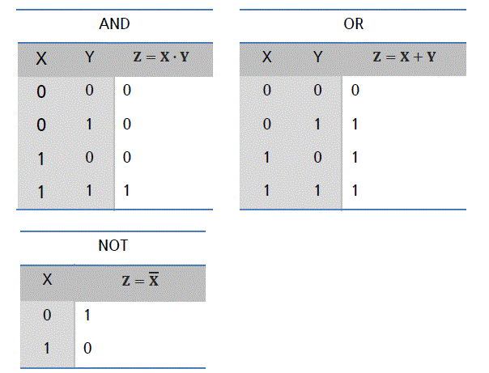
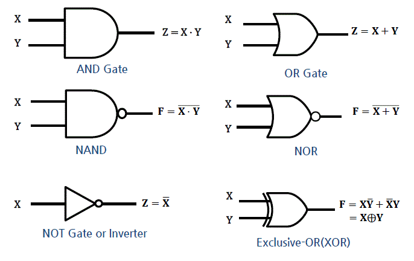

# 전자계산기 소개 (1주차 PART 1)

학습목표

- 전자계산기의 발전과정, 기능, 응용분야에 대해 설명하기
- 컴퓨터의 기능 구성요소에 대해 설명하기
- 컴퓨터의 데이터 처리 방식과 사용목적 등에 따라 분류하기 (세대별, 컴퓨터의 데이터 처리 방식, 마이크로 프로세서에 따른 분류)

##  1. 전자계산기 소개

### 1. 전자 계산기의 정의와 진화과정

- 기계식 계산기에서 -> EDSP(Electronic Data Processing System) -> AI 까지 진화
- 현대 전자 계산기는 컴퓨터로 총칭

```
Abacus -> Difference Engine -> Electronic Calculator -> Computer ->
-> Mobile Device -> Internet of Things (IoT) -> Artificail Intelligence(AI)
```

### 2. 컴퓨터의 기능

- 데이터 입출력 기능
- 데이터 저장 기능
- 데이터 처리 기능

### 3. 컴퓨터 응용 분야

- 범용 컴퓨터 (General-Purpose Computer)
  - PC, Workstation, Main-fram
  - Getnerality, Flexibility 강조
- 특정 용도 컴퓨터 (Applicaion-Specific Computer)
  - Embedded Sysyem(특정 용도에 맞게 SW/HW가 최적화 되어 있음)
  - 실생활에서 보면 가정용 전자제품, 공장 자동화, 항공, 우주 , 군자 장비 등이 포함

## 2. 컴퓨터의 구성
### 1. 컴퓨터의 구성

- HW/SW로 구성

### 2. 컴퓨터 하드웨어

- cpu, memory, bus(구성요소 상호 연결), Peripherals

### 2-1 마이크로 프로세서

- CPU를 내장한 IC(Integrated Circuit)

|CPU/Memory|
|:-:|
|Peripherals|

CPU + Mem + Peripherals가 단일 Chip으로 구성되어 있다면? => one-chip computer  
CPU가 하나의 IC로 구현 되어있다면? => Micro-processor  

### 3. 소프트웨어

소프트웨어

- 특정 목적을 달성하기 위해 순서적으로 배치된 CPU명령어들의 집합

- 시스템 소프트웨어, 응용 소프트웨어로 구성

### 3-1 System Software

- 하드웨어 관리, 프로그램 개발에 필요한 프로그램
- 초기화 프로그램 (botloader)
- OS
- Translator 

### 3-2 Application software
- APP
- bundle, package, SaaS, web download, 등 있음

### 3-3 Platform
- 실행 환경을 제공하는 HW/SW
- HW Platform 
  - 윈도우, 리눅스, 모바일 플랫폼
- SW Platform
  - java Platform
  - BREW :모바일 실행 횐경
  - IDLE (Integration Develpment Language Envinorment)
### 3-4 Middle-Ware
  - 소프트웨어 프레임 워크
    - 추상화된 소프트웨어 구조체
    - EX) API, Labrary program, Utility program
### 3-5 Firm-Ware
  - ROM memory
  - BIOS
  - 소프트웨어보다 유연성 부족

### 3-6 공조설계(co-design)
  - HW/SW 특성, 최적의 시스템 설계, 고수준 설계자 필요

## 3. 컴퓨터의 분류 

### 1. 분류법
- 세대별
- 데이터 처리방식
- 마이크로 프로세서의 유형

### 2. 세대별 분류

- 1세대 : 진공관 컴퓨터
- 2세대 : 트랜지스터를 사용한 컴퓨터
- 3세대 : IC 컴퓨터 
- 4세대 : LSI (Large Scale Integration)
- 5세대 : VLSI (Very Large Scale Integration)
- 6세대 : ULSI (Ultra Large Scale Integration)

### 3. 데이터 처리 방식에 따른 분류

- 일괄 처리 방식 (Batch Processing)
- 시분할 처리 방식 (Time Sharing)
- 실시간 처리 방식 (Real-time Processing)
- 시간 제약 여부의 따른 처리방식 
  - Hard Real-time System : 미사일 제어
  - Soft Real-time System : 동영상 제어

### 4. 마이크로프로세서 유형에 따른 분류 

- MPU (Micro Processing Unit)
  - 계산용 프로세서 (Computation oriented)
  - 고속의 연산 및 데이터 처리 : 여러 개의 고성능 ALU , H/W 곱셈 , FPU (Floating Point Unit)…
  - x86 (Intel ), MIPS(MIPS Technologies), SH (Hitachi)…
- MCU (MIcro Controller Unit)
  - 제어용 프로세서 (Control oriented)
  - 제어에 특화된 마이크로 프로세서 
  - 비트 단위 (bit wise) 연산 지원 , 빠른 인터럽트 처리 , 다양한 입출력 포트 제공 …
  - 주로 On chip/ SoC Micro processor, 8 bit 프로세서 AVR , 8051, PIC
- DSP (Digital Signal Processor)
  - 디지털 신호처리 (Audio, Video) 전용 프로세서 (DSP specific)
  - MAC(Multiply Accumulator ), FPU , Multi port 메모리 인터페이스 , etc
  - TMS320C6xxx (Texas Instruments), MSC81xx (Freescale), SHARC (Analog Devices)…
- ASP (Application Specific Processor)
  - 특정 용도에 최적화된 프로세서
  - Graphics Processor: GeForce( nVidia ), HD(Intel), Radeon(
  - Java Processor: ARM926EJ (ARM), picoJava (Sun
  - Network Processor: IXP (Intel), PowerQUICC NXP
  - Crypto Processor: C29x NXP ), SC300 (
- Embedded Processor
  - 소형, 소비전력 최적화 프로세서
  - 임베디드 시스템 전용 프로세서
- Mobile AP (Application Processor)
  - CPU 뿐만 아니라 시스템 구현에 필요한 주변장치들을 SoC(system on a chip) 형태로 집적화한 모바일 디바이스용 프로세서
  - GPU , 모바일 통신 모듈 ( HSDPA , WCDMA ) 내장
  - Snapdragon(Qualcomm ), Exynos (Samsung), TEGRA Nvidia ), Helio MediaTek ), A10 (Apple), Atom Z(Intel), OMAP (TI) ....
- GPGPU (General Puerpose Computiong on Graphic Processor Unit)
  -그래픽 전용 프로세서 ( 를 일반 응용프로그램 실행에 활용하는 기법
  - 많은 코어를 내장하고 있어서 병렬 처리가 가능 )
  - Radeon (AMD), Quadro Telsa / nVidia
  - CUDA , openCL , DirectCompute API 를 사용하여 프로그래밍함
  - Graphic card가 여기 해당됨!


# 컴퓨터 구조의 개요 (1주차 Part 2)

```
컴퓨터 구조와 조직에 대해 설명할 수 있다(별로 외울게없음..)
컴퓨터 하드웨어 구조에 대해 설명할 수 있다
폰 노이만 구조에 대해 설명할 수 있다 .  
프로그램이 실행되는 순서와 명령어 사이클에 대해 설명할 수 있다  
```
## 1. 컴퓨터 구조와 조직 (외울게 없음 큰 틀이랑 흐름만 이해하자)

### 1. 컴퓨터 구조 

컴퓨터 구조 (Computer Architecture)

- SW 측면에서 바라보는 컴퓨터 특성
- **프로그램의 논리적 수행에 직적접 영향을 주는 시스템 특성**

컴퓨터 구조적 특성 

- 명령어 구조 세트(ISA : Instruction Set Architecture)
  - Register에서 명령어를 받아오거나 데이터 주소를 받아와서 처리하는 것
- 데이터 표현에 사용되는 비트 수
  - 8,16,32,64-bit 등
  - 문자열 ascii나 utf, unicode, 숫자나 문자 모두 다양한 비트 표현
- 메모리 어드레싱 방법
  - 메모리 저장공간에 대한 접근법
  - MAR이 maim mem에 접급해서 MBR로 보내는 과정을 생각해보면 됨
 - I/O 데이터 처리 방법
   - 입출력 데이터 처리 방법

### 2. 컴퓨터 조직

컴퓨터 조직 (Computer Organization)

- HW 측면에서 바라보는 컴퓨터 특성
- **Computer Architecture를 구현한 HW 구성품**, 그들의 연결 방식
- 프로그래머에게 보이지 않는 세부 하드웨어

컴퓨터의 조직적 특성

- 구성품의 제어신호
  - 컴퓨터 하드웨어 구성품을 제어하기 위한 제어신호
- 컴퓨터와 주변기기(peripherals) 사이의 인터페이스 방식
  - 데이터 전달 방식 및 데이터 흐름제어
- 컴퓨터에서 사용하는 메모리 기술
  - 전기적 특성 및 제어 방법
## 2. 컴퓨터 하드웨어 구조 
### 1. 컴퓨터 하드웨어 구성요소

- CPU : 데이터 처리, 컴퓨터 동작 제어
- 메모리 : 프로그램, 데이터 저장
- 주변장치(peripherals) : 컴퓨터 외부와의 데이터 입출력
- 버스 : 구성요소 상호 연결 통로

🚗🚗 하드웨어 구성요소에 대한 다른 설명은 컴퓨터 시스템 강의 하드웨어 파트를 참조

## 2. CPU

CPU (Central Processing Unit)

- 중앙 처리장치, 컴퓨터 핵심 구성품

> ALU, Reg, CU에 대한 설명을 아래에 시작함 
> 특수 용도로 사용하는 Register와 CU (control Unit)이 어떻게 동작하는지는 
> 컴퓨터 시스템 하드웨어 CPU에서 볼 수 있음

```
| ALU | Reg |  Memory |
|    CU     |  Memory |
--------------------------- BUS
|      Peripherals    |
|      Peripherals    |
```
## 2-1 ALU

ALU (Arithmetic & Logical Unit)

- 산술, 논리 연산을 실행하는 Functional Unit
- 여러 산술/논리 연산을 선택 실행함
- 제어신호 === Function Select

ALU 보조 연산장치

- 시프터(Shifter)
- HW 곱셈기/나눗셈기
- FPU: Floating Point Unit (부동 소숫점 연산 유닛)

```
              ( Register )↓        ↓( Register )
                          ↓        ↓
Fuctnion Select ==>    |     ALU     |         ==> Status
                              ↓
                        (  Register )   
```

### 2-2 Register(레지스터)

Register

- ALU 연산에 필요한 데이터와 연산 결과 값을 임시 저장

레지스터 유형

- 범용 레지스터 : 다양한 용도로 사용하는 일반 레지스터
- 특수 기능 레지스터 : 특정 목적을 위해 사용하는 레지스터
  - ACC(Accumulator) : 연산 결과 저장
  - SR (State Register) : 연산 결과에 대한 상태 정보
  - PR (Pointer Register) : 어드레스 정보를 저장
  - SP (Stack Register) : 스택의 최상의 정보를 저장
  - LR (Link Register) : return 어드레스를 저장(결과 값을 말하는 듯..?)
  - 레지스터는 이외에도 엄청 많고 알고리즘이 복잡함 (한번 외워보면 이름보고 어떤 뜻이겠구나 하면 맞음!)
### 2-3 제어유닛(CU)

CU(Control Unit)은  명령어, 상태 정보를 해석하여 컴퓨터 구성 요소에 필요한 제어 신호를 발생시킴

인출 사이클 =>  명령어 + 상태 정보 => CU => 제어신호 발사

```
인출 사이클↓                                    ->   제어신호
(MAR->Main Memory->MBR->IR)| => 명령어  =>| CU |->   제어신호
Program state Register(PSR)| => 상태정보=>| CU |->   제어신호
                                                ->   제어신호...

```
 
### 3. 메모리

데이터 저장장치

- 자기(magnetic) 광학(Optical) 저장 매체를 사용한 데이터 저장

### 3-1 주기억장치

- SRAM, DRAM
- CPU main mem 속도차이극복 -> Cash mem사용
- CPU <-> registor <-> cash <-> main mem <-> secondary mem

### 3-2 보조 기억장치

- maginetic을 사용 : HHD, CD/DVD, magnetic tape
- Semiconductor를 사용 : Flash Mem SSD

### 3-3 메모리 계층 구조 
```
고속,저용량,비쌈                            저속,고용량,쌈
CPU -> Register -> Cash -> main mem -> secondary mem
```

### 4. peripherals (주변 장치쓰)

cpu와 메모리 주변에 위치, cpu보조, I/O 데이터를 관리하는 장치

- 시스템 동작에 필요한 회로
- 데이터 입출력 장치
- cpu보조 장치

### 4-1 시스템 동장에 필요한 주변장치

- 시스템 동작에 필요한 회로
- 클럭 발생 장치 
- 전원 제어 장치
- 리셋 장치 ( 리셋 신호를 생성 )
- 타이머
  - 이벤트 발생, 카운트, 시간 간격 측정

### 4-2 데이터 입출력 관련 주변장치

- 신호 변환장치
  - ADC/DAC: 디지털 -아날로그 신호 변환
- 디바이스 컨트롤러
- 통신 장치
  - router

### 4-3 cpu 보조 장치

- 연산 작업 부담을 덜어주는 회로
- 보조 프로세서(Co-processor)
- FPU (Floating Poing Unit)
- MMU (Memory Management Unit)
- MPU (Memory Protection Unit)
- 등등.. 

### 5. 🚌🚌 버스

cpu, mem, periphrals 상호 연결하는 배선 집합쓰

- 버스를 통해 데이터, 제어신호 송수신
- 벼스 유형
  - Adress bus : 주소 정보를 I/O, cpu 전달 (단방향)
  - Data bus : 데이터 정보를 I/O, cpu 전달 (양방향)
  - Control Bus : 제어신호를 모두 전달 (양방향)


### 5-1 시스템 버스 

cpu, 주변장치, 메모리를 연결하는 주요 버스 (고속)

### 5-2 I/O 버스

주변장치, 주로 입 출력 장치를 연결하는 버스, (고속/저속)


## 3. 📱폰 노이만 구조

### 1. 마이크로 아키텍쳐

- 주어진 명령어 세트에 최적화된 구조(ISA)
- 동일한 명령어 세트에 여러 가지 마이크로 아키텍쳐를 설게할 수 있음 이게 머선 말이냐면
- 컴퓨터 구조 = 명령어 세트 구조(ISA) + Mico-Arichitecture 라는 것임

### 1-1 마이크로 아키텍쳐의 구성

데이터 경로와 제어 유닛으로 구성


### 2 Stored-Program 방식 컴퓨터 

`1945s 이전 ENIAC에서 프로그램 입력과 변경할 땐 수작업으로 스위치, 케이블을 연결해서 함`

폰 노이만이 Stroed-Program 방식을 제안 함  
주요 개념은
- 프로그램 데이터를 저장해서 실행 
- 프로그램 입력 : 메모리 저장
- 프로그램 변경 : 매모리에 저장된 내용을 변경

### 2-1 IAS computer

폰 노이만이 Princeton의 IAS(Institute for Advenced Studies)에서  
Stored-Program 방식 전자 컴퓨터를 설계 현대 범용 컴퓨터의 원형이 됨
- Von Neumann Machine, Von Neumann 구조로 알려짐
```
메모리와 I/O 장치가 CPU를 거쳐서 전달되는 구조를 가짐 (양방향 통신)
CPU는 Arichmetic Logical Unit(CA)와 Program Contorl Unit(CC)로 구성
```

### 2-2 IAS 컴퓨터 구조

- 1000 x 40bit의 메모리 공간 ( 완전 작음 )
- 데이터
  - 1 bit 부호 비트, 39-bit의 데이터값
- 명령어
  - 8 bit Op-code, 12 bit Address 로 구성
```
메모리 1 워드에 하나에 39bit 데이터 2개의 명령어를 저장할 수 있음
```

- MAR : Memory Address Register
- MBR : Memory Buffer Register
- PC : Program Counter
- IR : Instruction Register(Op-code,Operation말하는듯)
- IBR : Instruction Buffer Register(Right Inst.)
- AC : Accumulator
- MQ : Multiplier Quotient
  - 보조 누산기 (Multiplier : 제곱의 승수를 기억하고, Quotient : 나누기 몫을 기억함)

 구조

- 프로그램 코드와 데이터가 묶여있던 메모리 구조를 따로 분리한 메모리로 바꿈
- 명령어 병렬 실행이 가능해짐 => 파이프라이닝을 통한 성능 향상까지!


## 4. 프로그램 실행

### 1. 프로그램 실행

프로그램이란
- 순서적으로 나열된 명령어 들의 집합!
- 메모리에 저장된 순서대로 실행됨
- 재어 명령어 if, loop문을 사용해 실행 흐름을 변경


### 2. 명령어 사이클 (instruction cycle)

- instruction cycle
  - one instruction cycle consist of Operation cycles

### 3. 명령어 사이클 구성

> computer system 강의에 명령어 사이클, interrupt, 간접 직접 인출에 대한 상세한 내용 
> operaion system 강의에 구조, 알고리즘 상세한 내용

Instruction Fetch(FI) : 프로그램 메모리에서 명령어 가져오기
Instruction Decode : cpu 제어장치에서 명령어 해독
Operand Fetch : 명령어 실행에 필요한 데이터를 데이터 메모리에서 가져오기
Excute Instruction(EX,Ei) : ALU에서 데이터 처리
Write Back(WB): 데이터 처리결과를 레지스터나 메모리에 저장

### 3-1 컴퓨터 기본 모델


### 3-2 명령어 사이클 실행 흐름


# 컴퓨터의 성능 ( 2주차 1차시 )

학습목표
```
컴퓨터 성능 평가 기준과 방법에 대해 설명할 수 있다
컴퓨터 성능 향상 방법에 대해 설명할 수 있다 .
```

## 1. 컴퓨터의 성능 평가

### 1. 컴퓨터 평가 요소

컴성능 : 프로그램 실행 속도, 실시간성
가격
크기
소비전력
신뢰성
보안성

### 1-1 컴퓨터 성능

프로그램 실행 속도에 영향을 주는 요소
- cpu
- isa
- 컴퓨터의 하드웨어 구조 : 프로세서 구조, 캐시 및 메모리 계층 구조
- 운영체제 성능
- 컴파일러 효율
- 프로그램 구현에 사용된 프로그래밍 언어 및 프로그래밍 기술

아래 네 가지가 제일 중요!
```
컴퓨터 구조, 운영체제, 컴파일러, 프로그래밍 기술
```

### 2. 컴퓨터 성능 표시
성능 표시 방법
- CPU 클럭 속도
- CPI
- MIPS
- MFLOPS

### 2-1 클럭 속도
cpu 클럭 속도
- 클럭 주파수
일반적cpu 성능은 cpu 클럭 속도에 비례
- cpu클럭 = 시스템 클럭
- cpu 클럭 속도는 cpu hw 설계, 구현 방법에 따라 결정됨

### 2-1-1 시스템 클럭

system clock
- 컴퓨터에서 사용하는 기본 클럭
- 컴퓨터 구성 요소들의 모든 동작을 동기화 하는 신호
- 클럭 주파수로 표시
memory clock
- 메모리가 사용하는 클럭으로 시스템클럭보다 저속임
- 일반적으로 사용되지 않고 동기화 메모리 클럭의 경우 사용한다고 함

### 2-1-2 클럭 주파수

클럭 주파수 (clock frequncy)
- 초당 클럭 신호 변화율 : 초당 클럭 펄스 수 (pulses per second)
- hertz로 표시(50MHz, 4GHz)

### 2-1-3 Clock Cycle Time

Clock Cycle
- Clock Pulse Period
Clock Cycle Time(CCT)
- 클럭 사이클 사이의 시간 간격


### 2-1-4 cpu time
cpu time
- 명령어 실행에 cpu가 소모한 시간
- cpu time = cpu clock cycles x clock cycle time
- cpu time = cpu clock cycles / clock frequency

프로그램 실행 속도 향상 방법
- 클럭 주파수를 높임
- 프로그램 실행에 필요한 클럭 사이클 수를 

명령어 처리 병렬화로 하나의 cpu 클럭 사이클 동안 여러 개의 명령어를 실행 가능
- cpu 클럭 속도가 프로그램 실행 속도를 표현하기에 불충분함


> CPI, MIPS. MFOLPS는 이미지와 공식이 추가되지 않았음!!!
> CPI, MIPS. MFOLPS는 이미지와 공식이 추가되지 않았음!!!
> CPI, MIPS. MFOLPS는 이미지와 공식이 추가되지 않았음!!!
> CPI, MIPS. MFOLPS는 이미지와 공식이 추가되지 않았음!!!


### 2-2 CPI (Cycle Per Instruction)

명령어 하나를 실행하는데 필요한 클럭 사이클 수


평균 CPI = 시그마 n, i=1 (CPIi x Ii) / Ic

i = 명령어 유형, n개의 명령어가 있다 가정
Ii = i 번째 유형 명령어의 수
CPIi = i 번째 유형 명령어의 CPI
Ic = 프로그램이 포함하고 있는 전체 명령어 수             

### 2-3 MIPS (Millions of Instruction Per Second)
### 2-4 MFLOPS (Millions of Floating-Point Operations Per Second)


### 3. 벤치마크 (Benchmark)

3. 벤치마크

벤치마크(Benchmark)
- **서로 다른 프로세서의 성능을 상대 비교하는 방법**
- 벤치마크 테스트 (BMT: BenchMark Test)
- 벤치마크에 사용되는 프로그램 : 벤치마크 프로그램

 벤치마크 프로그램의 특성
- 고급 언어로 작성되며, 서로 다른 기계들에서 호환성을 유지
- 시스템 프로그래밍, 수치적 프로그래밍, 또는 상용 프로그램과 같은 특정 응용 분야에서 대표성을 보이는 프로그램이어야 함
- 성능 측정이 쉬워야 함
- 널리 보급될 수 있어야 함

### 3-1 벤치마크 스위트

벤치마크 스위트(Benchmark Suite)
- **특정 응용 분야 프로그램이나 시스템 프로그램을 벤치마크하는데 사용되는 프로그램 집합**
- 고급 언어로 정의된 프로그램들의 집합

주요 벤치마크 스위트

- **BAPCo(Business Application Performance Corporation)**
  - 범용 OS(Windows, Android, iOS) 및 응용 프로그램기반 PC 벤치마킹 - MobileMark, SYSmark, TabletMark
- **EEMBC(Embedded Microprocessor Benchmark Consortium)**
  - 임베디드 시스템의 하드웨어 및 소프트웨어 성능 평가를 위한 벤치마킹 - CoreMark, IoTMark
- **SPEC(Standard Performance Evaluation Corporation)**
  - 컴퓨터 성능 평가에 필요한 표준 테스트 세트를 관리하는 단체 - SPECint, SPECfp

### 3-2 SPEC 벤치마크 스위트
  
SPEC 벤치마크 스위트
- SPEC CPU2006: 프로세서 중심(Processor-intensive) 성능 평가
- CINT2006: 정수 연산 성능 평가
- CFP2006: 실수 연산 성능 평가
- SPECjvm2008: JVM 클라이언트 플랫폼의 하드웨어 및 소프트웨어 결합 성능 평가
- SPECjbb2013:서버측 자바 기반상 거래 응용프로그램 성능 평가 
- SPECapc: 3D-intensive 프로그램 성능 평가
- SPECweb99:웹 서버들의 성능 평가
- SPECmail2001:메일 서버 성능 평가

### 3-3 Synthetic 벤치마크
Synthetic 벤치마크
- 많은 응용프로그램들을 통계 분석한 결과를 바탕으로 인위적으로 작성된 프로그램을 사용하여 성능을 평가하는 방법
- 대표적 Synthetic 벤치마크
  - 웻스톤(Whetstone): 1972년 Algol 언어로 작성. 주로 실수 연산을 포함
  - 드라이스톤(Dhrystone): 1984년 Ada 언어로 작성. 주로 정수 연산을 포함

## 2. 컴퓨터의 성능 향상

### 1. 컴퓨터 성능 향상 방법

- cpu 처리속도 향상을 통한 성능 향상
- 컴퓨터 구성 요소들의 성능 불균형 해소(perfomance balancing)를 통한 성능 향상
  - cpu, mem, peripharals 처리속도 차이 해결
- 컴퓨터 동작속도 향상 및 구조 개선을 통한 성능 향상

### 1-1 cpu 처리속도 향상

- branch prediction (분기예측)
- data flow analsis (데이터 흐름 분석)

### 1-1-1 branch prediction

- 분기 명령어 다음에 실행해야 할 명령어를 예측, 실행할 명령어의 사전 실행 가능

### 1-1-2 data flow analsis

- 명령어들 사이의 데이터 의존성(data dependency)을 분석해서 최적의 실행 순서르 도출함
- 의존성이 없는 명령어들끼리의 순서를 변경함(더 빠르게 실행할 수 있는 쪽으로)

### 1-2 성능 불균형 해소

cpu, memory, peripherals 처리 속도 차이를 해결하여 성능 향상할 수 있음

아래 두 가지의 불균형 해소가 성능에 영향을 미침

- cpu의 데이터 처리속도와 메인 메모리 엑세스 속도 차이
- cpu와 주변 입출력 장치 사이의 데이터 처리의 속도 차이
  - buffer 사용
  - 고속 버스 사용하여 연결함

### 1-2-1 cpu의 데이터 처리속도와 메인 메모리 엑세스 속도 차이

해결방법

- cpu와 메모리 **사이의 데이터 버스 폭(data bus width)을 확장**함
  - ex) 데이터 버스 폭이 16-bit였다면 32-bit로
- **연결 대역폭(bandwidth)를 확장**함
  - 고속 버스, 계층적 버스를 사용함
  - ex) 16MHz 였다면 33MHz로 확장
- cache를 사용해서 메모리에 접근함(cache memory)

### 1-3 컴퓨터의 동작 속도 향상

- 시스템 클럭 속도를 증가시켜서 동작 속도를 올릴 수 있음
  - 소비 전력이 증가하는 단점이 있음,
  - RC Delay 증가 : 동작 주파수가 올라감으로 RC에 의한 전압 강하 심화됨
  - clock skew(클럭 왜곡): 클럭 전달 경로의 길이 차이로 왜곡 현상 증가함


> 소비전력 파트는 공식이랑 이미지가 삽입되지 안았음!!! (나중에 추가)
> 소비전력 파트는 공식이랑 이미지가 삽입되지 안았음!!! (나중에 추가)
> 소비전력 파트는 공식이랑 이미지가 삽입되지 안았음!!! (나중에 추가)
> 소비전력 파트는 공식이랑 이미지가 삽입되지 안았음!!! (나중에 추가)


### 1-3-1 소비전력

- 주파수 증가 -> 소비 전력 증가
- 소비전력 : 정적 소비전력 + 동적 소비전력
- 정적 소비전력 : 논리 레벨 0 or 1 을 유지하는 상태의 소비 전력
- 동적 소비전력 : 논리 레벨 변동에 따른 소비 전력

### 1-3-2 RC Delay

- RC Delay 증가 : 동작 주파수가 올라감에 따라 RC에 의한 전압 강하가 심화

### 1-3-3 Clock Skew

- RC Clock Skew 발생
  - 클럭 전달 경로 길이 차이로 인한 클럭 신호의 전달 시간 차이 발생
    - 클럭 왜곡
    - 동작 타아밍 편차로 인한 회로의 오동작 가능성


### 1-4 컴퓨터 조직 및 구조 개선

컴퓨터의 실행 하드웨어 구조 개선
- 여려개의 명령어를 병렬로 동시 실행함으로 성능 개선

1. 파이프 라이닝(pipelining) : 명령어의 중첩 overlapped 실행
2. 슈퍼 스칼라 (super scalar) : 여러 명령어들이 동시 concurrent 실행
3. Multi-core or Multi-processor

### 1-4-1 pipelining

파이프라이닝 : 명령어의 중접 실행
컴퓨터 시스템에서 파이프 라이닝 실행 예시가 있음! 기억 안나면 참고


원래 파이프 라이닝은 아래의 순서대로 진행되는데
```
FI (Fetch Instruction, 명령어 인출)
DI (Decode Instruction, 명령어 해독)
FO (Fetch Operand, 피연산자 인출(주소 인출))
EI (Execute Instruction, 명령어 실행)
```

arm processor는 아래 순서인 듯 잘 모르곘네 ^)^
```
IF (instruction fetch)
OF (operand Fatch)
EX (excute instruction)
WB (??)
```

- pipeline
  - 하나의 명령어가 한 단계를 마치면 바로 뒤를 이어서 다음 명령어가 실행
- super-pipeline 
  - 명령어가 시작하고 그 단계가 끝나지도 않았는데 바로 다음 명령어를 중첩해서 실행 시켜버림
  - 시작을 늦게 하는 방식

### 1-4-3 multi-core

- 동일 칩 상에 여러개의 cpu 코어들을 직접한 프로세서
- 여러 개의 cpu 코어가 큰 용량의 캐시를 공유함
- 클럭 속도 높이지 않고 성능 개선이 가능해짐
- 프로세서 내부 성능 향상은 복잡도 증가의 제곱근에 비례한다고 알려짐
- 프로그램이 여러 프로세서에 효과적으로 분산되면, 프로세서 수 2배 = 성능도 거의 2배


GPGPU(General Purpose Computing on Graphic Processor Unit)
- 병렬 처리 효과적음 feat.💰bit-coin
- 그래픽 처리 전용 프로세서를 범용 응용 프로그램 실행에 활용

CPU + GPU 혼용 프로세서
- 순차 처리 -> CPU
- 병렬 처리, 많은 계산량 -> GPU


> 아래 두 개도 공식이 너무 복잡해서 걍 넘김 ^)^
> 아래 두 개도 공식이 너무 복잡해서 걍 넘김 ^)^
> 아래 두 개도 공식이 너무 복잡해서 걍 넘김 ^)^


### 2. Amdahl의 법칙
### 3. Moore의 법칙

# 논리 회로의 개요 ( 2주차 2차시 )

학습 목표
```
아날로그와 디지털의 차이를 설명할 수 있다
컴퓨터에 사용하는 2 진법 , 8 진법 , 16 진법 연산에 대해 설명할 수 있다
부울대수와 진리표 , 논리 게이트를 이해하고 , 논리회로를 표현할 수 있다
```
## 1. 아날로그와 디지털

### 1. Analog Signal
- 아날로그 신호
- 시간에 따라 연속적으로 변하는 신호
- 물리량 표현에 사용 ( 전압, 전류, 온도..)
### 2. Digital Signal
- 시간에 따라 불연속적인(discrete) 값
- 특정 값으로면 표현 가능
- 장점
  - 신호처리 용이
  - 잡음에 강함
  - 시스템 구현이 쉬움
- 단점
  - 아날로그 신호를 완벽하게 표혈할 수 없음(변환 오류가 필연적 발생)

### 3. 아날로그 신호의 디지털 변환

ADC (Analog-to-Digital Converter)
- 연속적으로 변하는 아날로그 전기 신호를 불연속적인 디지털 신호로 변환하는 회로

DAC (Digital to Analog Converter)
- 디지털 신호를 연속적인 아날로그 신호로 변환하는 회로```
```
analog signal => ADC => DP(Digital Processor) => DAC => Analog Signal
analog signal => ADC => DP(Digital Processor) => Digital Data
```

### 3-1 아날로그 신호의 디지털 변환 과장

Sample & Holding
- 연속적으로 변하는 아날로그 신호를 sampling하여 일정 시간동안 유지(Holding) 시키는 방법

양자화 및 부호화 (Quantization & Coding)
- 샘플링한 신로를 디지털 데이터로 표현

`Analog Signal ->  Sample & Holding -> Quantization & Coding -> Digital Data`

### 3-2 ADC 동작 예시



### 3.3 ADC 방법

> 그래프가 너무 많이 나오고 굳이 외울 필요는 없는 거 같아서 이미지는 생략 ! 
#### 1. Direct-conversion ADC
- 병렬로 ADC를 수행함
- 가장 빠른 변환 방법
- 가장 많은 하드웨어 사용
- 높은 전력 소모
- Flash ADC or Parallel ADC로 알려짐

#### 2. Successive-approximation ADC
- DAC 와 비교기를 사용하여 MSB 부터 LSB 까지 추정하면서 변환
- 연속적 관계 ADC
- EOC : end of conversion
- SAR : SA Registor
- S/H : Sample & Holder
- 비교적 간단한 회로
- 긴 변환 시간

#### 3. Ramp-compare ADC
- Free running 이진 카운터와 DAC , 비교기로 구성
- CTR : Binary Counter
- DAC : Digital to Analog Converter
- SRG : Shift Register
- Stairstep Ramp 또는 Counter ADC 로 알려짐

### 3-4 ADC 변환 에러

- 양자화 에러(Quantization Error)
  - 연속적인 아날로그 신호를 비연속적인 디지털 코드로 양자화 함으로 생기는 에러
- 절대 에러 (Absolute Accuracy)
  - 실제 값과 변환 값의 최대 차이의 값
  - Offset Error. Gain Error, Integral/Differential Non-lineraity(적분/미분 비선형)error 로 표시 

### 3-4-1 offset error

- 첫 번째 변환(0x00 에서 0x01) 시 , 실제 값과 변환 값 사이의 오차
- 실제 값과 변환 값 사이의 오차가 일정


### 3-4-2 Gain error

- 마지막 변환 (0xFE 에서 0xFF) 시 , 실제 값과 변환 값 사이의 오차
- 처음엔 오차가 거의 없다가 마지막 으로 갈수록 변환 값이 커짐

### 3-4-3 INL error
- intergral Non-linearity
- 변환 과정에서 발생한 실제 값과 변환 값의 최대 차이 값
- 지그재그로 변환 값이 바뀜

### 3-4-4 DNL error
- differential Non-linearity 
- 실제 코드 변환폭과 변환 시 발생한 변환폭의 최대 차이 값
  - 변환폭 : 다음 변환까지의 입력 신호 변동폭
- 계단 모양으로 변환 값을 받음, 다음 신호가 올 떄 까지 변환된 ADC 그래프가 앞으로 기어감

### 3-5 ADC 선택 기준
- 변환 속도 : 100us이상->고가
- 해상도 : 8,10,12bit가 이상적
- 출력레벨: TTL, CMOS
- 안정도: 온도변화 안정성
- 아날로그 입력 극성(polarity) : Unipolar, Bipolar

## 2. 진법 표현

> 진법 변환은 시험 시간에 한 번만 연습해보자 매번 적기 귀찮음
> 진법 변환은 시험 시간에 한 번만 연습해보자 매번 적기 귀찮음
> 진법 변환은 시험 시간에 한 번만 연습해보자 매번 적기 귀찮음

### 1. 바이너리

- Binary : (0 or 1 ) 2개의 상태로 표현되는 숫자  
- Binary Digit : 바이너리로 표현되는 숫자  
- 전자회로의 전압 값(high,low)로 구분

## 2. 2진법

- 두 개의 숫자 (0 , 1)로 표현되는 수 체계 
```
10진수(decimal) 표현
𝟕𝟐𝟒.𝟓 = 𝟕×𝟏𝟎^𝟐+𝟐×𝟏𝟎^𝟏+𝟒×𝟏𝟎^𝟎+𝟓×𝟏𝟎^−𝟏
2진수 (bynary) 표현
(𝟏𝟏𝟎𝟏𝟎𝟏.𝟏𝟏)𝟐bi = 𝟑𝟐+𝟏𝟔+𝟒+𝟏+𝟎.𝟓+𝟎.𝟐𝟓 = (𝟓𝟑.𝟕𝟓)𝟏𝟎dec
```

### 2-1 2진 소수점
- bynary point(2진 소수점)
- MBS ( Most Significant Bit )
  - 2진 표현 값중 가장 최상위 자리 수
- LSB ( Least Significant Bit )
  - 2진 숫자로 표현된 값의 최하위 자리의 수

### 2-2 2진 표시 단위
- 1k = 1024, 10진과 다르게 표기함

### 2-3 2진법 변환
### 2-4 2진법 연산
### 3. 8진/16진법

- octal (base 8), Hexadecimal(base 16)
- 프로그램 에서의 진법 표시
  - bynary : b, b00001010
  - decimal : 5594312
  - octal : 0, 0045676765
  - hexadecimal : 0x, 0x90BBFDA9

### 3-1 진법 변환

## 3. 논리 회로 표현

### 1. Boolean c (부울 대수)

- 부울 대수
  - 변수 값이 true or false, 1 or 0으로 정의 되는 대수
### 1.1 boolean operation
- 부울 연산
  - 부울 대수에서 정의한 연산
  - 기본 연산(basic operation) 2차 연산 (secondary operation)으로 구성

- 기본 연산
  - AND(conjunction) ^로 표기
  - OR(disjunction) v로 표기
  - NOT(negation) ㄱ로 표기(기역아님..)
 
 |X|Y|Y^X|XvY|ㄱX(NOT)|
 |:-:|:-:|:-:|:-:|:-:|
 |0|0|0|0|1|
 |1|0|0|1|0|
 |0|1|0|1|1|
 |1|1|1|1|0|
 
- 2차 연산
  - material implication : x가 1 이면 결과는 y, x가 0이면 결과는 1
  - exclusive OR (XOR) : x,y가 서로 다른 값을 가지면 1
  - equivalence(XNOR) : x,y가 같은 값을 가질 때 1
  
  |x|y|x->y|x⊕y|x≡y|
  |:-:|:-:|:-:|:-:|:-:|
  |0|0|1|0|1|
  |1|0|0|1|0|
  |0|1|1|1|0|
  |1|1|1|0|1|
  
### 1-2 부울 법칙
### 1-2-1 드 모르간의 법칙
### 1-3 부울 방정식
### 2 진리표

진리표 Truth Table

- 논리 변수 값들의 조합과 각 변수 값 조합에 대한 논리연산 결과 값을 정의한 표


### 3. 논리 게이트

Logic gate
- 기본 울 연산을 구현한 전자회로
- 트렌지스터를 사용한 집적회로 형태로 구현



### 3-1 타이밍 다이어그램

시간에 따른 입력신호, 출력신호의 변화를 보여주는 그래프


### 3-2 전파 지연

- 입력신호 변화에 따른 출력신호의 변화가 발생하는 시간 차이
- 게이트 지연(gate delay) 또는 전파 지연(propagation delay)이라고 함
- 0 -> 1, 1 -> 0으로 갈때 그래프가 수직 상승, 하강하는게 아니라 시간에 따라 하강, 상승하는 곡선을 그림
- 그 차이가 아주 작아서 보통은 수직으로 그림

### 4. 논리 회로 표현

논리 회로 logic circuit
- 논리회로 구성요소들과 그들간의 상호 연결 관계를 표현한 회로
  - 논리 회로의 구성 소요로는 조합 회로, 순차 회로가 있음

논리 회로의 표현 방법
1. boolean qeuation : 부울 방정식으로 표현
2. schematic : 그래픽 심볼로 표현
3. HDL description : HDL(Hardware Description Language)를 사용하여 논리회로 표현


### 4-1 논리회로의 shcematic 표현
 - symbol(and,or,xor gate logic gate)과 net(심볼을 연결하는 bus)로 표현

### 4-2 논리회로의 HDL 표현
- 텍스트를 사용하여 표현
  - 대표적 HDL로 VHDL, verilog, HDL
> 내용이 많지만 나한테 중요하지 않은? 관계로 패스!


### 5. 논리회로 간략화

- 논리회로 간략화
  - 로직 게이트 줄이기
  - 전파 지연 감소
- 간략화 방법
  - boolean algebra를 사용한 간략화
  - karnaugh map(카르노 맵)을 사용한 간략화
    - 입력 변수 4개 이하 적용 용이
  - quine-macluskey 알고리즘
    - 입출력 변수 개수에 제한
  - ECAD toll을 사용한 간략화
    - ESPRESSO 알고리즘
### 5-1 카르노 맵(karnaugh map)

- 진리표의 2차원적 표현 방법
- 논리 표현식을 맵 형태로 표현한 후
- 상호 연관관계를 패턴으로 분석하여 논리를 단순화해 나가는 방법
- 이산 수학강의에 잘 설명되어 있음!

# 기본 조합 회로 ( 3주차 1차시 )

학습목표
```
조합 회로에 대해 이해하고 멀티플렉서, 인코더, 디코더, 버퍼에 대해 설명할 수 있다.
가산기에 대해 이해하고, n-bit 가산기와 덧셈-뺄셈기에 대해 설명할 수 있다.
조합회로 설계 방법을 이해하고 적용할 수 있다.
```

## 1. 기본 조합 회로

### 1. 조합 회로의 개요

#### 조합 회로 (combinational circuit)

- 논리게이트의 조합으로 이루어진 회로

#### 조합 회로의 특성

- 입력 신호의 변화가 지연시간 후에 출력에 그대로 변영됨  
- 기억 소자가 없음

#### 대표적 조합 회로

- 멀티플렉서(multiplexer)
- 인코더/디코더(encoder/decoder)
- 반가산기/전가산기(half/full adder)
- 버퍼(buffer)

### 2. 멀티 플렉서 

- n개의 입력신호중 1개만을 선택해서 출력(하나만 true면 ture)

|S|I0|I1|=Y|
|:-:|:-:|:-:|:-:|
|0|0|0|0|
|0|0|1|0|
|0|1|0|1|
|0|1|1|1|
|1|0|0|0|
|1|0|1|1|
|1|1|0|0|
|1|1|1|1|

S가 0 일때, I0의 값을 Y로 반환
S가 1 일때, I1의 값을 Y로 반환

### 3. 인코더

인코더
- 입력 신호를 2진 값으로 변환하는 회로
  - 2n개의 입력 신호 중 활성화된 1개의 신호의 위치를 n-bit로 표현
- 4-to-2 인코더 : 4개의 입력을 2-bit로 표현

priority Encoder
- n개의 입력 신호 중 최상위 비트의 위치를 2진 값으로 표현


### 4. 디코더

- 이진 값을 해석해서 하나의 출력 신호만을 활성화 시키는 회로
- 입력이 n-bit 라고 할 떄, 출력은 2n개가 됨(입력2개 출력 4개)
- 2-to-4, 3-to-8 디코더


### 4.1 7-segment 디코더

이진 값을 7개의 led가 배치된 장치에 십진수로 표현할 수 있도록 이진값을 디코딩하는 회로  
(와 이거 개신기햌ㅋㅋㅋㅋ 이렇게 작동하는구나)


### 5. 버퍼

버퍼
- 입출력 로직 값의 변화가 없음
버퍼의 용도
- 구동 전류의 증폭
  - 전압 레벨을 변경할 떄 사용함
  - ex) 3V -> 5V, 5V -> 3V로

### 5-1 3-state buffer
### 5-2 schmitt-triger buffer

## 2. adder (가산기)

### 1-1 Half-Adder (반 가산기)
### 1-2 Full-Adder (전 가산기)
### 2. n-bit가산기
### 2-1 Riple Carry Adder (RCA)
### 2-2 Carry Look-agead Adder(CLA)
### 2-3 Carry Select Adder(CSL)
### 2-4 Carry Save Adder(CSA)
### 2-5 Carry Skip Adder(CSK)
### 2-6 오버 플로우 검사
### 3. 덧셈-뺄셈기

## 3. 조합회로 설계


