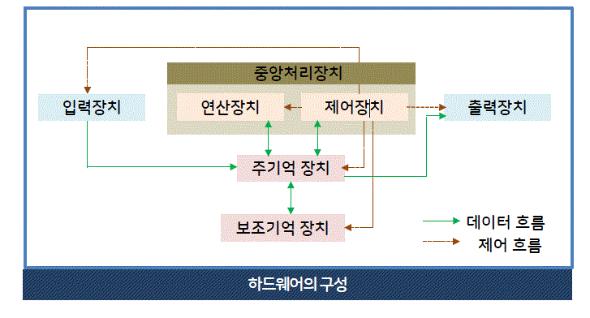

# 컴퓨터 시스템 ( 1주차 1차시 )

학습내용

1. 컴퓨터시스템의 구성을 설명할 수 있다.
2. 중앙처리장치를 설명할 수 있다.
3. 기억 장치를 설명할 수 있다. 
4. 입출력 장치를 설명할 수 있다.
5. 컴퓨터시스템의 성능 향상 기법을 설명할 수 있다.

## 📌컴퓨터 시스템의 구성



### 1. 하드웨어

- 하드웨어의 구성  

  - 중앙 처리장치, 입출력 장치, 저장 장치로 구성

- 중앙처리장치  

  - 연산 장치, 제어 장치, 레지스터로 구성  
  - 주기억 장치로부터 데이터를 읽어온 뒤 처리

- 기억 장치(저장 장치)

  - 주기억장치 : RAM, ROM  
  - 보조 기억장치 : 하드디스크, usb 메모리 등

- 시스템 버스
  - 하드웨어 구성 요소를 물리적으로 연결하며, 구성 요소들 사이의 통로를 제공한다.

  - 주소버스 (mapping)

    - cpu가 maim memory나 I/O 장치에 주소를 전달하는 통로  
    - 주소 선의 수는 시스템의 기억장치 용량을 나타냄  
    ❕ 아마도 기억장치는 64bit, 32bit cpu를 뜻하는 듯 하다.  

    - 주소선의 수 = 8bit 256(=2^8)개 16bit 65,536(=2^16)개
    - 전송유형: 단방향

  - 데이터버스 (data)

    - cpu가 기억장치와 I/O 등 사이에서 데이터를 전달하는 통로
    - 전송유형: 양방향

  - 제어버스  (controll)

    - cpu가 다양한 시스템 모듈에 제어신호를 전달하는 통로
    - 전송유형: 양방향

### 2. 소프트웨어

 - 시스템 소프트웨어  

    - 컴퓨터 시스템의 효율적인 운영, 제어를 담당
```
os
언어 번역 프로그램(compiler, inerpreter etc)
유틸리티 (video player, file management, vacine ,,) 
라이브러리 프로그램 ( 비휘발성자료로
소프트웨어 개발에 쓰이는 자원, 작성된 코드,클래스 값 자료형, 펌웨어 등)
```
 - 응용 소프트웨어  

    - 응용 분야의 업무를 처리하기 위해 사용됨

```
문서 작성 프로그램
자료관리 프로그램
그래픽 프로그램
통신 프로그램
게임 프로그램
교육용 프로그램 등..
```
---
### 요약  
컴퓨터 하드웨어는 중앙 처리 장치, 저장장치, 입출력 장치 등으로 구성  
컴퓨터 소프트웨어는 펌웨어, 운영체계(시스템 소프트웨어), 응용 소프트웨어로 구성

## 📌중앙처리장치(CPU)

🏳🏳 이 부분은 수업 자료를 참고해야 함, 양이 많고 어려움 🏳🏳

### 1. 중앙처리장치의 구성

- 중앙처리장치  

  - 주기억장치로부터 받은 명령어, 데이터를 처리하고  
수행 순서를 제어함(LIFO,FIFO,동기화 등 OS 수업자료 참고)


- 레지스터 | 특수 목적 레지스터의 용도와 기능

-  - 주소 저장 레지스터

```js
- MAR (Memory Address Register, 메모리 주소 레지스터)
  읽기와 쓰기 연산을 수행할 주기억 장치의 주소 저장

- PC (Program Counter, 프로그램 카운터)
  다음에 수행할 명령어의 주소 저장

- SP (Stack Pointer, 스택 포인터)
  스택의 최상위 주소 저장(FIFO,피포!)

- IX (Index Register, 인덱스 레지스터)
  인덱스 주소지정 방식에서 인덱스 저장(class 같은 거임)
```

-  - 명령어 저장 레지스터

```js
- IR   (Instruction Register, 명령어 레지스터)
    현제 실행중인 명령어 저장
```

-  - 데이터 저장 레지스터

```js
- MBR (Memory Buffer Registor, 메모리 버퍼 레지스터)
    주기억 장치에서 읽어오거나 보낼 데이터를 임시 저장

- AC (Accumulator, 누산기)
    연산 결과 임시 저장
```

-  - CPU 상태 저장 레지스터


```js
PSR (Program Statue Registor, 프로그램 상태 레지스터)
    cpu의 현재 상태 정보 저장
```

### 2. 명령어 처리 과정(Instruction)

- 명령어 사이클
```go

     ➡️    인출    ↘️   
인터럽트      ↕️       간접
     ↖️    실행    ⬅️ 

```

인출, 실행 사이클 = 항상 수행
간접, 인터럽트 사이클 = 주소지정 방식, 인터럽트 요구에따라 수행

- 인출 사이클

    - 주기억 장치에서 명령어 인출
    - 다음 명령어 인출하기 위해 PC값 증가

```js
1   PC 저장된 명령어 주소 -> MAR 전달
2-1 MAR에 저장된 명령어 주소로 main memory에서 명령어 인출
2-2 MBR에 저장
3   제어 장치에서 PC값 증가시킴(다음 명령어 인출 하기 위해)
4   MBR에 저장된 명령어를 IR로 전달
```
- 실행 사이클

    - 안출한 명령어 해독 (IR)
    - 해독 경과에 따라 제어 신호 발생시켜 명령어 실행

- 간접 사이클

    - 직접 주소방식

      - 명령어의 주소 필드가 주기억 장치의 유효한 주소를 가르킴

    - 간접 주소방식

      - 명령어의 주소 필드가 주가억 장치의 주소를 가르킴  
그리고 주기억 장치의 주소가 데이터 주소를 가르킴

> 명령어의 주소 필드 구성은 다음장에 있음!

- 인터럽트 사이클

  - 인터럽트란?

cpu가 프로그램을 수행하는 동안 컴퓨터 시스템의 내부 외부에 발생하는 사건을 말함

```
         | 인출사이클 | 실행 사이클 |        인터럽트 사이클       |    
시작    -> 명령어 인출 -> 명령어 실행 -> 인터럽트 발생 -> 예    -> 인터럽트 처리 -> 다시시작
시작    -> 명령어 인출 -> 명령어 실행 -> 인터럽트 발생 -> 아니오 -> 다시시작
       
```

### 3. 명령어의 형식

- 명령어의 형식

  ` 연산코드(Operation code) + 주소필드(Operand)`

- 명령어 기능

  - 연산코드

    - 연산 기능     :  사칙연산, 시프트, 보수, 논리 연산(and,or,not)
    - 데이터 전달기능 : 레지스터 -> 레지스터, 레지스터 -> 주기억 장치
    - 제어 기능     : 조건 분기, 무조건 분기 명령어로 실행순서 제어
    - 입출력 기능    : 연산결과 -> 출력장치, 데이터 -> 주기억 장치

  - 주소필드

    - 기억장치의 주소, 숫자, 문자, 논리 데이터 등 저장

### 3. 명령어 세트

- 주소 필드 수에 따른 명령어 분류

  - 0 주소 명령어 = 연산코드
  - 1 주소 명령어 = 연산코드 + 주소1
  - 2 주소 명령어 = 연산코드 + 주소1 + 주소2 
  - 3 주소 명령어 = 연산코드 + 주소1 + 주소2 + 주소 3

- **주소 필드 수에 따른 명령어 분류 | 0 주소 명령어**

  - 연산 코드만 존재며, stack 구조 컴푸터에서 사용, FIFO

ex) x = a + b
```
1. Push a  // 스택의 TOP mapping[a]
2. Push b  // 그 위에 mapping[b]
3. add a+b // 스택의 Top a+b
4. Stroe X // 스택의 Top mapping[x]
```
- **주소 필드 수에 따른 명령어 분류 | 1 주소 명령어**

  - 단일 누산기 라고 부름

`AC --연산수행--> 데이터 연산(주기억장치, 누산기 데이터) --결과저장--> AC`

ex) x = a + b

```
1. Load a   // AC <- mapping[a]   a의 위치를 ac로 보냄
2. Add b    // AC <- + mapping[b] B의 위치를 ac로 보냄
3. Store x  // mapping[x] <- AC 누산 결과를 mapping함
```
- **주소 필드 수에 따른 명령어 분류 | 2 주소 명령어**

  - 2개의 주소필드를 가지는 가장 일반적 형태

ex) x = a + b
```
MOV R1, a // R1 <- mapping[a]
Add R1, b // R1 <- R1 + mapping[b]
MOV x, R1 // mapping[x] <- R1
```
MOV R0,R1은 어셈블리어에서 R0,R1위치로의 이동을 뜻한다고 함

- **주소 필드 수에 따른 명령어 분류 | 3 주소 명령어**

  - 3개의 주소 필드, 주소필드에 레지스터 번호, 주기억장치의 주소를 지정함

ex) x = a + b
`1. Add x, a, b // mapping[x] <- mapping[a] + mapping[b]`

---
### 요약  
주기억 장치로부터 프로그램 명령어와 데이터를 읽어와
처리하고 명령어의 수행 순서를 제어

## 기억 장치

### 1. 기억 장치의 계층 구조

- 속도, 가격이 오르면 용령이 줄어듬

보조기억장치 -> 주기억장치 -> 캐시 메모리 -> 레지스터(Fastist)

✨ 기억 장치의 정보의 흐름 

```
Register -> Cash Memory -> Main Memory -> sub Memory
Register ----------------> Main Memory -> sub Memory
```

### 2. 주기억 장치

맨날하는 기억장치 파트!

- RAM(Random Access Momory)

  - 전원공급 중단시 정보가 지워짐!
  - 저장위치 상관없이, 일정한 시간 내에 읽고 쓸 수 있다.(주소 지정을 말하는 듯)

  - DRAM(Dynamic) : 트랜지스터

    - Positive: 저렴, 전력 소비 적음, 동속 빠름, 집적도 높음
    - Nagetive: 시간 지나면 방전
    - Feature : 대용량 매모리

  - SRAM(Static) : 플립프롭 기억소자

    - Positive: 주기적 재중전 필요 없음
    - Nagetive: 복잡한 회로, 전력소모 큼
    - Feature : 캐시 메모리

- ROM(Read Only Memory)

  - ROM, PROM(Programable, 한번만 쓸 수 있음), EPROM(Erasable), EEPROM(Electronic Erasable)이 있음
  - Positive : 전원공굽x 영구적 보존,
  - Feauter : 프로그램, 데이터 저장에 쓰임(부팅할떄, 라이브러리 시스템,,,)

- Flash Momory

  - 비휘발성 메모리, 전력소모 적음
  - usb type, sd card,

### 3. 캐시 메모리

- CPU와 Main Memory의 속도 차이로 인한 성능 저하를 막아줌
- 캐시 적중률(H) = 캐시 적중 횟수/ 전체 기억 장치 참조 횟수
- 유효 접근시간 = (H x 캐시메모리 접근시간) + ((1-H) x (캐시 메모리 접근시간 + 기억장치 접근 시간)
- unit = ns

```
메모리 접근시간이 20ns, 주기억장치 접근시간 100ns, 캐시 적중률 95%, 유효 접근시간은? 

유효 접근시간 = (0.95 x 20) + (0.05 x 120) = 25ns
```

---
요약  
접근 속도, 기억 용량의 크기, 용도에 따라 레지스터, 캐시
메모리, 주기억 장치, 보조 기억 장치로 구분


### 4. 보조 기억 장치

- 프로그램, 데이터를 반영구적 저장, 대용량
- 순차 접근 기억장치와 직접 접근으로 나뉨

  - 순차 접근 기억 장치 => 자기 테이프, 레코더
  - 직접 접근 기억 장치 => 자기 디스크, 광 디스크, 하드 디스크

❗️️️️️️️️️️️️❗️ 이 부분이 시험에 나올지 모르겠지만 진짜 쓸모 없는 거 같아서 안적음 ㅋㅋㅋ
대충 순차접근 -> 0,1 직접접근 광 레이저, 디스크 트렉 섹터 플랙터 이런 거임 이제 안 씀

## 입출력 장치

### 1. 입력 장치

- 카보드

- 마우스

- 터치스크린

- 스캐너

### 2. 출력 장치

- 모니터

  - LCD
  - OLED

- 프린터

- 플로터

  - 대형 출력 장치

- 햅틱 인터페이스

  - 촉감 감지 조이스틱

---
### 요약  
입력 장치 중 대표적인 장치로 마우스는 화면 위의 특정  
위치를 지정하거나 선택하기 위해 사용하며 조이스틱,  
스캐너 등도 사용됨  
출력 장치 중 대표적인 모니터는 컴퓨터에서 처리된 정보를  
화면으로 출력하는 장치로, CRT, PDP, LCD, OLED 등이 있음


## 컴퓨터 시스템 성능 향상 기법

### 1. CPU의 구조 변화

- RISC (Reduve Instruction Set Computer, 축소 명령어 세트 컴퓨터)

- CISC (Complex Instruction Set Computer, 복잡한 명령어 세트 컴퓨터)

  - 많은 프로세서가 CISC를 모데로 구축 되어 있어서 바꾸기엔 비용문제가 있음
  - 일부 파이프 라인을 사용함으로, 직접도 높이고 보완성을 올림, 호환성이 좋음

|특징|CISC|RISC|
|:--:|:--|:--|
|명령어 세트의 크기|명령어 수 많음|레지스터 기반의 명령어, 수가 적음|
|명령어 형식|가변 형식(명령어당 16~64bit)|고정 형식(32bit)
|주소 지정 모드|복잡함(12~24개)|간단함(3~5개)|
|범용 레지스터 수|적음(8~24개)|많음(32~192개)|
cpu 제어 방식|제어 메모리(ROM)사용|하드 와이어드 방식 사용|

[CISC와 RISC의 구조,특징과 차이점](https://frontalnh.github.io/2018/04/17/%EC%BB%B4%ED%93%A8%ED%84%B0-%EA%B5%AC%EC%A1%B0-risc-%EC%99%80-cisc-%EA%B5%AC%EC%A1%B0/)

### 2. 파이프라인 기법

- 하나의 작업을 다수의 단계로 분할하여 중첩 실행, 컴퓨터 성능 향상을 시킴(비동기 같은 느낌이네)

1. FI (Fetch Instruction, 명령어 인출)
2. DI (Decode Instruction, 명령어 해독)
3. FO (Fetch Operand, 피연산자 인출(주소 인출))
4. EI (Execute Instruction, 명령어 실행)

1-4 단계로 작업 수행 a,b,c,d라는 작업이 동시에 수할 경우

```
task order 
a   1 -> 2 -> 3 -> 4
b     -> 1 -> 2 -> 3 -> 4
c          -> 1 -> 2 -> 3 -> 4
d               -> 1 -> 2 -> 3 -> 4
d
```
### 3, 병렬 처리 시스템

- 병렬 처리 시스템의 특징

  - 처리 능력이 뛰어난 컴퓨터 시스템의 구현 방법으로

    - 고성능 단일 프로세서로 시스템 구성
    - 다수의 프로세서로 많은 **연산 동시 수행**
    - 다수의 프로세서가 동시에 정보를 처리하는 **병렬처리**

- 마이클 플린의 분류법

single instuction stream, multiple instruction stram, single data, multi data

- 단일 명령어 흐름, 단일 데이터 흐름

  - SISD, 하나의 데이터 처리, 폰노이만 구조에 해당

- 단일 명령어 흐름, 다중 데이터 흐름

  - SIMD, 하나 명령어 다수 데이터, 백터 프로세서, 배열 프로세서 시스템에 해당
  - 다중 처리기 시스템을 가짐

- 다중 명령어 흐름, 단일 데이터 흐름

  - MISD 다수의 처리장치가 동일 데이터에 대해 서로 다른 명령어를 실행함
  - 파이프라인 구조, 결함 허용 시스템이 해당

- 다중 명령어 흐름, 다중 데이터 흐름

  - MIMD 서로다른 데이터에 대해 상이한 명령어를 동시 처리함
  - 공유 메모리 시스템, 분산 메모리 시스템

---
### 요약  
RISC, CISC 파이프라인기법, 병렬처리 시스템 등

# 컴퓨터 소프트웨어 (1주차 2차시)

컴퓨터 소프트웨어에 대해 설명할 수 있다.
시스템 소프트웨어에 대해 설명할 수 있다.
응용 소프트웨어에 대해 설명할 수 있다.

## 소프트웨어란?

### 1. 컴퓨터 프로그램

- 소프트웨어
 
  - 컴퓨터 관련 장치를 동작 시키는데 사용되는 여러 종류의 프로그램

- 펌웨어 (Firmware)

  - ROM에 기록되어 변경할 필요없이 하드웨어처럼 사용하능 한 것
  - BIOS(Basic Input Output System) -> 휴대폰이나 lot에서도 찾아볼 수 있음
  - 윈도우 파일 손상시 펌웨어가 작동해서 파일을 찾을 수 없다고 알려줌

- 소프트웨어의 분류

  - System Software
  
    - 사용자를 보조, 기본적 운영을 담당
    - Language Transfiler , OS, Utility, File Management
    
  - Application software 
   
    - 작업 수행, 문제 해결
    - Education, Game, Graphic, Medical program
    -  
- 명령문과 프로그램
  
  - 명령문 : 컴퓨터의 처리 절차
  - 프로그램 : 컴퓨터가 이해하고 처리할 수 있는 언어
 
 ### 2. 컴퓨터 소프트웨어
  - 개인용 소프트웨어
  
    - 대부분의 소프트웨어 해당, 개별적 업무 처리
    - excel, word ,, 
    
  - 그룹웨어(Groupware)
  
    - 스케줄관리, 문서 상호 공유, 그룹간 통신 작업을 지원하는 응용 소프트웨어
    
  - 미들웨어(Middleware)
  
    - 매개역할 연결을 도와줌
    - 서로다른 기종간의 서버, 클라이언트를 연결해주는 소프트웨어
    - 기업내 다양한 하드웨어, 네트워크 프로토콜, 응용프로그램, 근거리 통신망환경, 운영체제 호환 소프트웨어 등이 이에 해당
    
### 3. 소프트웨어 사용권 (Softeware License)

- Copyright(저작권)에 의해 보호

 - 종류
 
   - Shareware, Freeware, Liteware
   - Postcardware, Expireware
   - Public Domain Software, Demo-Version 
 
 1. Lite
 
   
