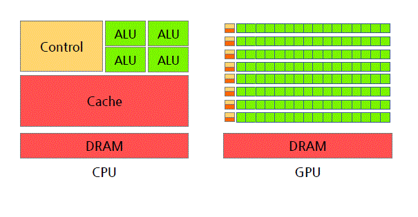
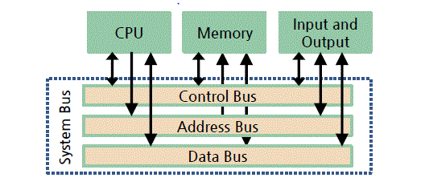
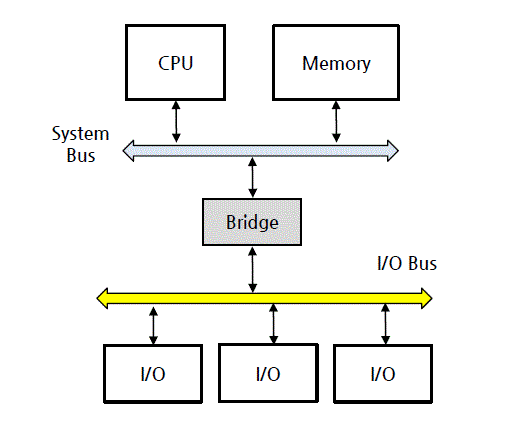
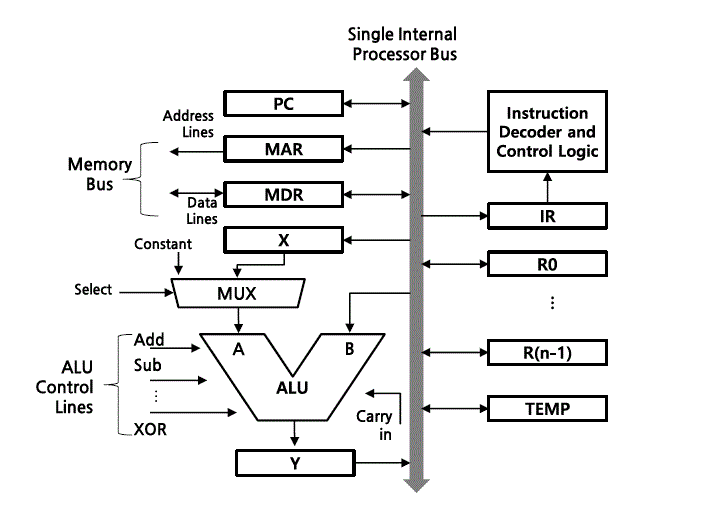
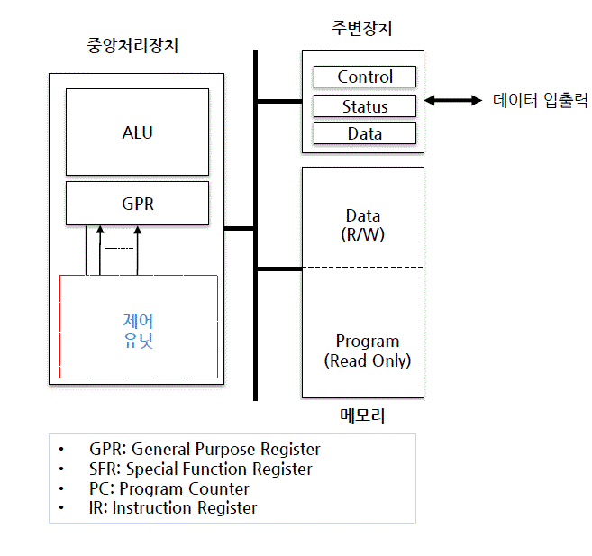
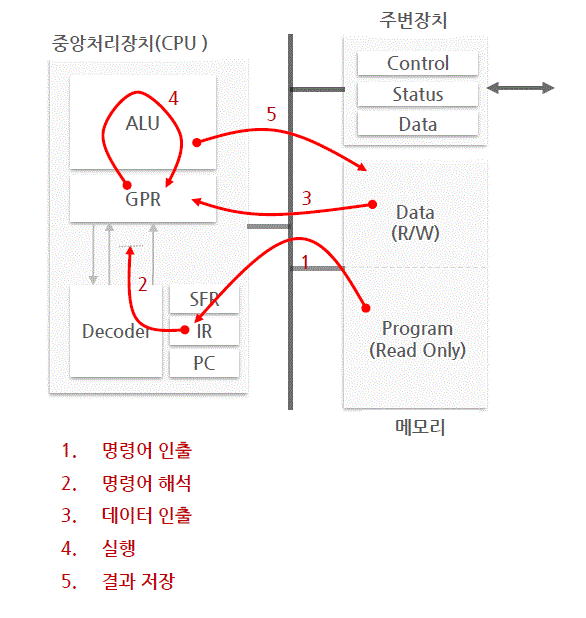

# 전자계산기 소개 (1주차 PART 1 )

학습목표

- 전자계산기의 발전과정, 기능, 응용분야에 대해 설명하기
- 컴퓨터의 기능 구성요소에 대해 설명하기
- 컴퓨터의 데이터 처리 방식과 사용목적 등에 따라 분류하기

##  1. 전자계산기 소개

### 1. 전자 계산기의 정의와 진화과정

- 기계식 계산기에서 -> EDSP(Electronic Data Processing Sysyem) -> AI 까지 진화
- 현대 전자 계산기는 컴퓨터로 총칭

```
Abacus -> Difference Engine -> Electronic Calculator -> Computer ->
-> Mobile Device -> Internet of Things (IoT) -> Artificail intelligence(AI)
```

### 2. 컴퓨터의 기능

- 데이터 입출력 기능
- 데이터 저장 기능
- 데이터 처리 기능

### 3. 컴퓨터 응용 분야

- 범용 컴퓨터 (General-Purpose Computer)
  - PC, Workstation, Main-fram
  - Getnerality, Flexibility 강조
- 특정 용도 컴푸터 (Applicaion-Specific Computer)
  - Embedded Sysyem(특저 용도에 맞게 SW/HW가 최적화 되어 있음)
  - 실생활에서 보면 가정용 전자제품, 공장 자동화, 항공, 우주 , 군자 장비 등이 포함

## 2. 컴퓨터의 구성
### 1. 컴퓨터의 구성

- HW/SW로 구성

### 2. 컴퓨터 하드웨어

- cpu, memory, bus(구성요소 상호 연결), Peripherals

### 2-1 마이크로 프로세서

- CPU를 내장한 IC(Integrated Circuit)

|CPU/Memory|
|:-:|
|Peripherals|

CPU + Mem + Peripherals가 단일 Chip으로 구성되어 있다면? => one-chip computer  
CPU가 하나의 IC로 구현 되어있다면? => Micro-processor  

### 3. 소프트웨어

소프트웨어

- 특정 목적을 달성하기 위해 순서적으로 배치된 CPU명령어들의 집합

- 시스템 소프트웨어, 응용 소프트웨어로 구성

### 3-1 System Software

- 하드웨어 관리, 프로그램 개발에 필요한 프로그램
- 초기화 프로그램 (botloader)
- OS
- Translator 

### 3-2 Application software
- APP
- bundle, package, SaaS, web download, 등 있음

### 3-3 Platform
- 실행 환경을 제공하는 HW/SW
- HW Platform 
  - 윈도우, 리눅스, 모바일 플랫폼
- SW Platform
  - java Platform
  - BREW :모바일 실행 횐경
  - IDLE (Integration Develpment Language Envinorment)
### 3-4 Middle-Ware
  - 소프트웨어 프레임 워크
    - 추상화된 소프트웨어 구조체
    - EX) API, Labrary program, Utility program
### 3-5 Firm-Ware
  - ROM memory
  - BIOS
  - 소프트웨어보다 유연성 부족

### 3-6 공조설계(co-design)
  - HW/SW 특성, 최적의 시스템 설계, 고수준 설계자 필요

## 3. 컴퓨터의 분류 

### 1. 분류법
- 세대별
- 데이터 처리방식
- 마이크로 프로세서의 유형

### 2. 세대별 분류

- 1세대 : 진공관 컴퓨터
- 2세대 : 트랜지스터를 사용한 컴퓨터
- 3세대 : IC 컴퓨터 
- 4세대 : LSI (Large Scale Integration)
- 5세대 : VLSI (Very Large Scale Integration)
- 6세대 : ULSI (Ultra Large Scale Integration)

### 3. 데이터 처리 방식에 따른 분류

- 일괄 처리 방식 (Batch Processing)
- 시분할 처리 방식 (Time Sharing)
- 실시간 처리 방식 (Real-time Processing)
- 시간 제약 여부의 따른 처리방식 
  - Hard Real-time System : 미사일 제어
  - Soft Real-time System : 동영상 제어

### 4. 마이크로프로세서 유형에 따른 분류 

- MPU (Micro Processing Unit)
  - 계산용 프로세서 (Computation oriented)
  - 고속의 연산 및 데이터 처리 : 여러 개의 고성능 ALU , H/W 곱셈 , FPU (Floating Point Unit)…
  - x86 (Intel ), MIPS(MIPS Technologies), SH (Hitachi)…
- MCU (MIcro Controller Unit)
  - 제어용 프로세서 (Control oriented)
  - 제어에 특화된 마이크로 프로세서 
  - 비트 단위 (bit wise) 연산 지원 , 빠른 인터럽트 처리 , 다양한 입출력 포트 제공 …
  - 주로 On chip/ SoC Micro processor, 8 bit 프로세서 AVR , 8051, PIC
- DSP (Digital Signal Processor)
  - 디지털 신호처리 (Audio, Video) 전용 프로세서 (DSP specific)
  - MAC(Multiply Accumulator ), FPU , Multi port 메모리 인터페이스 , etc
  - TMS320C6xxx (Texas Instruments), MSC81xx (Freescale), SHARC (Analog Devices)…
- ASP (Application Specific Processor)
  - 특정 용도에 최적화된 프로세서
  - Graphics Processor: GeForce( nVidia ), HD(Intel), Radeon(
  - Java Processor: ARM926EJ (ARM), picoJava (Sun
  - Network Processor: IXP (Intel), PowerQUICC NXP
  - Crypto Processor: C29x NXP ), SC300 (
- Embedded Processor
  - 소형, 소비전력 최적화 프로세서
  - 임베디드 시스템 전용 프로세서
- Mobile AP (Application Processor)
  - CPU 뿐만 아니라 시스템 구현에 필요한 주변장치들을 SoC(system on a chip) 형태로 집적화한 모바일 디바이스용 프로세서
  - GPU , 모바일 통신 모듈 ( HSDPA , WCDMA ) 내장
  - Snapdragon(Qualcomm ), Exynos (Samsung), TEGRA Nvidia ), Helio MediaTek ), A10 (Apple), Atom Z(Intel), OMAP (TI) ....
- GPGPU (General Puerpose Computiong on Graphic Processor Unit)
  -그래픽 전용 프로세서 ( 를 일반 응용프로그램 실행에 활용하는 기법
  - 많은 코어를 내장하고 있어서 병렬 처리가 가능 )
  - Radeon (AMD), Quadro Telsa / nVidia
  - CUDA , openCL , DirectCompute API 를 사용하여 프로그래밍함
  - Graphic card가 여기 해당됨!



# 컴퓨터 구조의 개요 (1주차 Part 2)

```
컴퓨터 구조와 조직에 대해 설명할 수 있다  
컴퓨터 하드웨어 구조에 대해 설명할 수 있다    
폰 노이만 구조에 대해 설명할 수 있다 .  
프로그램이 실행되는 순서와 명령어 사이클에 대해 설명할 수 있다  
```
## 1. 컴퓨터 구조와 조직 (외울게 없음 큰 틀이랑 흐름만 이해하자)

### 1. 컴퓨터 구조 

컴퓨터 구조 (Computer Architecture)

- SW 측면에서 바라보는 컴퓨터 특성
- **프로그램의 논리적 수행에 직적접 영향을 주는 시스템 특성**

컴퓨터 구조적 특성 

- 명령어 구조 세트(ISA : Instruction Set Architecture)
  - Register에서 명령어를 받아오거나 데이터 주소를 받아와서 처리하는 것
- 데이터 표현에 사용되는 비트 수
  - 8,16,32,64-bit 등
  - 문자열 ascii나 utf, unicode, 숫자나 문자 모두 다양한 비트 표현
- 메모리 어드레싱 방법
  - 메모리 저장공간에 대한 접근법
  - MAR이 maim mem에 접급해서 MBR로 보내는 과정을 생각해보면 됨
 - I/O 데이터 처리 방법
   - 입출력 데이터 처리 방법

### 2. 컴퓨터 조직

컴퓨터 조직 (Computer Organization)

- HW 측면에서 바라보는 컴퓨터 특성
- **Computer Architecture를 구현한 HW 구성품**, 그들의 연결 방식
- 프로그래머에게 보이지 않는 세부 하드웨어

컴퓨터의 조직적 특성

- 구성품의 제어신호
  - 컴퓨터 하드웨어 구성품을 제어하기 위한 제어신호
- 컴퓨터와 주변기기(peripherals) 사이의 인터페이스 방식
  - 데이터 전달 방식 및 데이터 흐름제어
- 컴퓨터에서 사용하는 메모리 기술
  - 전기적 특성 및 제어 방법
## 2. 컴퓨터 하드웨어 구조 
### 1. 컴퓨터 하드웨어 구성요소

- CPU : 데이터 처리, 컴퓨터 동작 제어
- 메모리 : 프로그램, 데이터 저장
- 주변장치(peripherals) : 컴퓨터 외부와의 데이터 입출력
- 버스 : 구성요소 상호 연결 통로

🚗🚗 하드웨어 구성요소에 대한 다른 설명은 컴퓨터 시스템 강의 하드웨어 파트를 참조

## 2. CPU

CPU (Central Processing Unit)

- 중앙 처리장치, 컴퓨터 핵심 구성품

> ALU, Reg, CU에 대한 설명을 아래에 시작함 
> 특수 용도로 사용하는 Register와 CU (control Unit)이 어떻게 동작하는지는 
> 컴퓨터 시스템 하드웨어 CPU에서 볼 수 있음

```
| ALU | Reg |  Memory |
|    CU     |  Memory |
--------------------------- BUS
|      Peripherals    |
|      Peripherals    |
```
## 2-1 ALU

ALU (Arithmetic & Logical Unit)

- 산술, 논리 연산을 실행하는 Functional Unit
- 여러 산술/논리 연산을 선택 실행함
- 제어신호 === Function Select

ALU 보조 연산장치

- 시프터(Shifter)
- HW 곱셈기/나눗셈기
- FPU: Floating Point Unit (부동 소숫점 연산 유닛)

```
              ( Register )↓        ↓( Register )
                          ↓        ↓
Fuctnion Select ==>    |     ALU     |         ==> Status
                              ↓
                        (  Register )   
```

### 2-2 Register(레지스터)

Register

- ALU 연산에 필요한 데이터와 연산 결과 값을 임시 저장

레지스터 유형

- 범용 레지스터 : 다양한 용도로 사용하는 일반 레지스터
- 특수 기능 레지스터 : 특정 목적을 위해 사용하는 레지스터
  - ACC(Accumulator) : 연산 결과 저장
  - SR (State Register) : 연산 결과에 대한 상태 정보
  - PR (Pointer Register) : 어드레스 정보를 저장
  - SP (Stack Register) : 스택의 최상의 정보를 저장
  - LR (Link Register) : return 어드레스를 저장(결과 값을 말하는 듯..?)
  - 레지스터는 이외에도 엄청 많고 알고리즘이 복잡함 (한번 외워보면 이름보고 어떤 뜻이겠구나 하면 맞음!)
### 2-3 제어유닛(CU)

CU(Control Unit)은  명령어, 상태 정보를 해석하여 컴퓨터 구성 요소에 필요한 제어 신호를 발생시킴

인출 사이클 =>  명령어 + 상태 정보 => CU => 제어신호 발사

```
인출 사이클↓                                    ->   제어신호
(MAR->Main Memory->MBR->IR)| => 명령어  =>| CU |->   제어신호
Program state Register(PSR)| => 상태정보=>| CU |->   제어신호
                                                ->   제어신호...

```
 
### 3. 메모리

데이터 저장장치

- 자기(magnetic) 광학(Optical) 저장 매체를 사용한 데이터 저장

### 3-1 주기억장치

- SRAM, DRAM
- CPU main mem 속도차이극복 -> Cash mem사용
- CPU <-> registor <-> cash <-> main mem <-> secondary mem

### 3-2 보조 기억장치

- maginetic을 사용 : HHD, CD/DVD, magnetic tape
- Semiconductor를 사용 : Flash Mem SSD

### 3-3 메모리 계층 구조 
```
고속,저용량,비쌈                            저속,고용량,쌈
CPU -> Register -> Cash -> main mem -> secondary mem
```

### 4. peripherals (주변 장치쓰)

cpu와 메모리 주변에 위치, cpu보조, I/O 데이터를 관리하는 장치

- 시스템 동작에 필요한 회로
- 데이터 입출력 장치
- cpu보조 장치

### 4-1 시스템 동장에 필요한 주변장치

- 시스템 동작에 필요한 회로
- 클럭 발생 장치 
- 전원 제어 장치
- 리셋 장치 ( 리셋 신호를 생성 )
- 타이머
  - 이벤트 발생, 카운트, 시간 간격 측정

### 4-2 데이터 입출력 관련 주변장치

- 신호 변환장치
  - ADC/DAC: 디지털 -아날로그 신호 변환
- 디바이스 컨트롤러
- 통신 장치
  - router

### 4-3 cpu 보조 장치

- 연산 작업 부담을 덜어주는 회로
- 보조 프로세서(Co-processor)
- FPU (Floating Poing Unit)
- MMU (Memory Management Unit)
- MPU (Memory Protection Unit)
- 등등.. 

### 5. 🚌🚌 버스

cpu, mem, periphrals 상호 연결하는 배선 집합쓰

- 버스를 통해 데이터, 제어신호 송수신
- 벼스 유형
  - Adress bus : 주소 정보를 I/O, cpu 전달 (단방향)
  - Data bus : 데이터 정보를 I/O, cpu 전달 (양방향)
  - Control Bus : 제어신호를 모두 전달 (양방향)



### 5-1 시스템 버스 

cpu, 주변장치, 메모리를 연결하는 주요 버스 (고속)

### 5-2 I/O 버스

주변장치, 주로 입 출력 장치를 연결하는 버스, (고속/저속)



## 📱폰 노이만 구조

### 1. 마이크로 아키텍쳐

- 주어진 명령어 세트에 최적화된 구조(ISA)
- 동일한 명령어 세트에 여러 가지 마이크로 아키텍쳐를 설게할 수 있음 이게 머선 말이냐면
- 컴퓨터 구조 = 명령어 세트 구조(ISA) + Mico-Arichitecture 라는 것임

### 1-1 마이크로 아키텍쳐의 구성

데이터 경로와 제어 유닛으로 구성



### 2 Stored-Program 방식 컴퓨터 

`1945s 이전 ENIAC에서 프로그램 입력과 변경할 땐 수작업으로 스위치, 케이블을 연결해서 함`

폰 노이만이 Stroed-Program 방식을 제안 함  
주요 개념은
- 프로그램 데이터를 저장해서 실행 
- 프로그램 입력 : 메모리 저장
- 프로그램 변경 : 매모리에 저장된 내용을 변경

## 2-1 IAS computer

폰 노이만이 Princeton의 IAS(Institute for Advenced Studies)에서  
Stored-Program 방식 전자 컴퓨터를 설계 현대 범용 컴퓨터의 원형이 됨
- Von Neumann Machine, Von Neumann 구조로 알려짐
```
메모리와 I/O 장치가 CPU를 거쳐서 전달되는 구조를 가짐 (양방향 통신)
CPU는 Arichmetic Logical Unit(CA)와 Program Contorl Unit(CC)로 구성
```

### 2-2 IAS 컴퓨터 구조

- 1000 x 40bit의 메모리 공간 ( 완전 작음 )
- 데이터
  - 1 bit 부호 비트, 39-bit의 데이터값
- 명령어
  - 8 bit Op-code, 12 bit Address 로 구성
```
메모리 1 워드에 하나에 39bit 데이터 2개의 명령어를 저장할 수 있음
```

- MAR : Memory Address Register
- MBR : Memory Buffer Register
- PC : Program Counter
- IR : Instruction Register(Op-code,Operation말하는듯)
- IBR : Instruction Buffer Register(Right Inst.)
- AC : Accumulator
- MQ : Multiplier Quotient
  - 보조 누산기 (Multiplier : 제곱의 승수를 기억하고, Quotient : 나누기 몫을 기억함)

 구조

- 프로그램 코드와 데이터가 묶여있던 메모리 구조를 따로 분리한 메모리로 바꿈
- 명령어 병렬 실행이 가능해짐 => 파이프라이닝을 통한 성능 향상까지!

## 프로그램 실행

### 1. 프로그램 실행

프로그램이란
- 순서적으로 나열된 명령어 들의 집합!
- 메모리에 저장된 순서대로 실행됨
- 재어 명령어 if, loop문을 사용해 실행 흐름을 변경


### 2. 명령어 사이클 (instruction cycle)

- instruction cycle
  - one instruction cycle consist of Operation cycles

### 3. 명령어 사이클 구성

> computer system 강의에 명령어 사이클, interrupt, 간접 직접 인출에 대한 상세한 내용 
> operaion system 강의에 구조, 알고리즘 상세한 내용

Instruction Fetch(FI) : 프로그램 메모리에서 명령어 가져오기
Instruction Decode : cpu 제어장치에서 명령어 해독
Operand Fetch : 명령어 실행에 필요한 데이터를 데이터 메모리에서 가져오기
Excute Instruction(EX,Ei) : ALU에서 데이터 처리
Write Back(WB): 데이터 처리결과를 레지스터나 메모리에 저장

### 3-1 컴퓨터 기본 모델



### 3-2 명령어 사이클 실행 흐름




